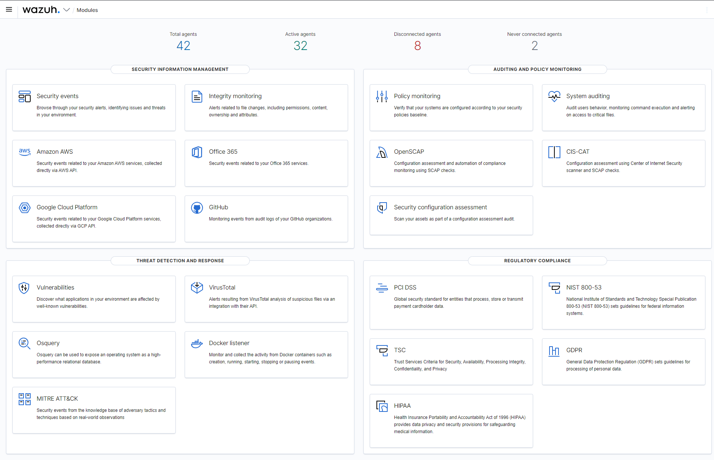

<p align="center">
    
</p>
<p align="center">
    <a href="https://wazuh.com/community/join-us-on-slack">
        
    </a>
    <a href="https://groups.google.com/forum/#!forum/wazuh">
        
    </a>
    <a href="https://documentation.wazuh.com">
        
    </a>
    <a href="https://wazuh.com">
        
    </a>
</p>

- [Welcome!](#welcome)
- [Project resources](#project-resources)
- [Wazuh UI](#wazuh-ui)
- [Contribute](#contribute)
- [License](#license)
- [Copyright](#copyright)   

<!-- 
[](https://wazuh.com/community/join-us-on-slack/)
[](https://groups.google.com/forum/#!forum/wazuh)
[](https://documentation.wazuh.com)
[](https://wazuh.com)
-->

## Welcome

This repository contains a set of plugins for [Wazuh dashboard][dashboard].

Wazuh is a security detection, visibility, and compliance open source project. Wazuh helps 
you to gain deeper security visibility into your infrastructure by monitoring hosts at an 
operating system and application level.

You can learn more about it at [wazuh.com][web]

## Project resources

- [Project website][web]
- [Documentation][docs]
- [Installation guide][install]
- Need help? Join us on [Slack][slack]!
- [Contributing](CONTRIBUTING.md)
- [Styleguide](STYLEGUIDE.md)
- [Security](SECURITY.md)
<!-- - [Contributing](CONTRIBUTING.md) -->
<!-- - [Maintainer Responsibilities](MAINTAINERS.md) -->
<!-- - [Release Management](RELEASING.md) -->
<!-- - [Testing](TESTING.md) -->

## Wazuh UI

**Overview**

<p align="center">
    
</p>

**Security events**

<p align="center">
    
</p>

**Integrity monitoring**

<p align="center">
    
</p>

**Vulnerability detection**

<p align="center">
    
</p>

**Regulatory compliance**

<p align="center">
    
</p>

**Agents overview**

<p align="center">
    
</p>

**Agent summary**

<p align="center">
    
</p>

## Branches

- `stable` corresponds to the latest Wazuh app stable version.
- `master` branch contains the latest code, be aware of possible bugs on this branch.

## Requisites

- Wazuh HIDS 4.5.1
- Kibana 7.10.2
- Elasticsearch 7.10.2

## Installation

Ensure that the directory `/usr/share/kibana/data` exists
If not create it:

```
mkdir /usr/share/kibana/data
chown -R kibana:kibana /usr/share/kibana/data
```

Install the Wazuh app plugin for Kibana

```
cd /usr/share/kibana
sudo -u kibana bin/kibana-plugin install https://packages.wazuh.com/4.x/ui/kibana/wazuh_kibana-4.5.1_7.10.2-1.zip
```

Restart Kibana

- Systemd:

```
systemctl restart kibana
```

- SysV Init:

```
service kibana restart
```

## Upgrade

Note: Since Wazuh 4.0.4 release revision 4016 (regardless of the Elastic Stack version) the location of the wazuh.yml has been moved from `/usr/share/kibana/optimize/wazuh/config/wazuh.yml` to `/usr/share/kibana/data/wazuh/config/wazuh.yml`.

Since Wazuh 3.12.0 release (regardless of the Elastic Stack version) the location of the wazuh.yml has been moved from `/usr/share/kibana/plugins/wazuh/wazuh.yml` to `/usr/share/kibana/data/wazuh/config/wazuh.yml`.

Stop Kibana

- Systemd:

```
systemctl stop kibana
```

- SysV Init:

```
service kibana stop
```

Ensure that the directory `/usr/share/kibana/data` exists
If not create it:

```
mkdir /usr/share/kibana/data
```

### From 3.11.x

Copy the `wazuh.yml` to its new location.

```
mkdir -p /usr/share/kibana/data/wazuh/config
cp /usr/share/kibana/plugins/wazuh/wazuh.yml /usr/share/kibana/optimize/wazuh/config/wazuh.yml
```

### From 4.0.4 - 4016

Copy the `wazuh.yml` to its new location.

```
mkdir -p /usr/share/kibana/data/wazuh/config
cp /usr/share/kibana/optimize/wazuh/config/wazuh.yml /usr/share/kibana/data/wazuh/config/wazuh.yml
```

```
mkdir -p /usr/share/kibana/data/wazuh/config
cp /usr/share/kibana/optimize/wazuh/config/wazuh.yml /usr/share/kibana/data/wazuh/config/wazuh.yml
```

Remove the Wazuh app using the kibana-plugin tool

```
cd /usr/share/kibana/
sudo -u kibana bin/kibana-plugin remove wazuh
```

Remove generated bundles

```
rm -rf /usr/share/kibana/optimize/bundles
```

Update file permissions. This will prevent errors when generating new bundles or updating the app:

```
chown -R kibana:kibana /usr/share/kibana/data
chown -R kibana:kibana /usr/share/kibana/plugins
```

Install the Wazuh app

```
cd /usr/share/kibana/
sudo -u kibana bin/kibana-plugin install https://packages.wazuh.com/4.x/ui/kibana/wazuh_kibana-4.5.1_7.10.2-1.zip
```

Update configuration file permissions.

```
sudo chown kibana:kibana /usr/share/kibana/data/wazuh/config/wazuh.yml
sudo chmod 600 /usr/share/kibana/data/wazuh/config/wazuh.yml
```

Restart Kibana

- Systemd:

```
systemctl restart kibana
```

- SysV Init:

```
service kibana restart
```

## Wazuh - Kibana - Open Distro version compatibility matrix

The compatibility matrix is avaliable in the repository [wiki](https://github.com/wazuh/wazuh-kibana-app/wiki/Compatibility).

## Contribute

If you want to contribute to our project please don't hesitate to send a pull request. 
Take a look at the [branches and tags][branches] page in our Wiki, and also to our 
[contributing](CONTRIBUTING.md) guidelines.

## License

This project is licensed under the [GNU General Public License v2.0](LICENSE).

This program is free software; you can redistribute it and/or modify it under the terms 
of the GNU General Public License as published by the Free Software Foundation; either 
version 2 of the License, or (at your option) any later version.

## Copyright

- Copyright &copy; Wazuh, Inc.


[dashboard]: https://github.com/wazuh/wazuh-dashboard
[web]: https://wazuh.com
[docs]: https://documentation.wazuh.com
[install]: https://documentation.wazuh.com/current/installation-guide/index.html
[slack]: https://join.slack.com/t/wazuh/shared_invite/zt-1lgu531ur-7M_k_ZQbpdo4QCn_pHee3w
[branches]: https://github.com/wazuh/wazuh-kibana-app/wiki/About-our-branches-and-tags
[wiki]: https://github.com/wazuh/wazuh-kibana-app/wiki