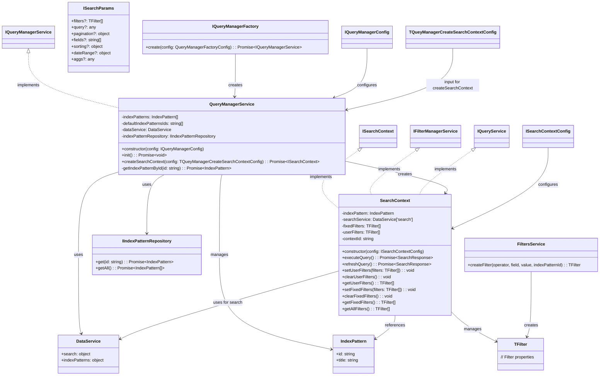
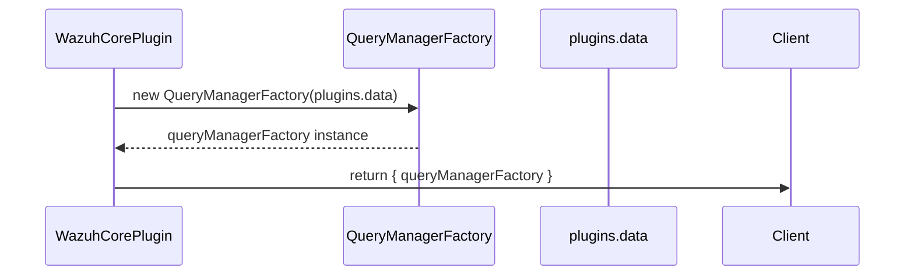
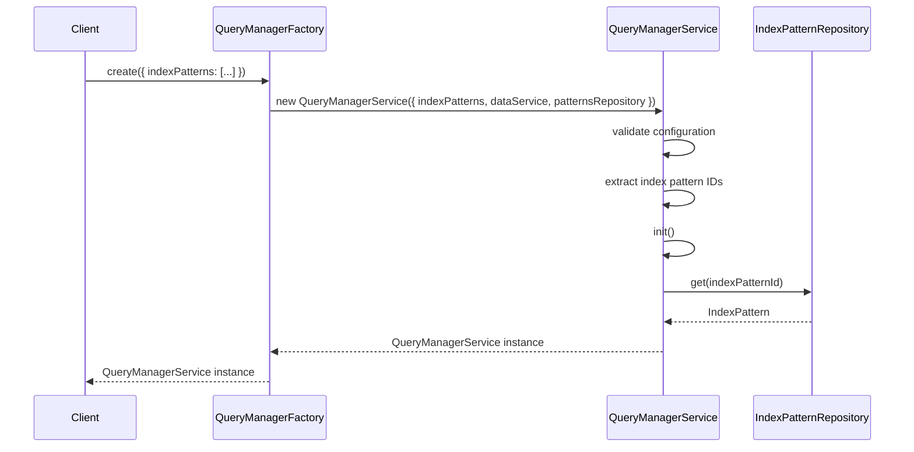
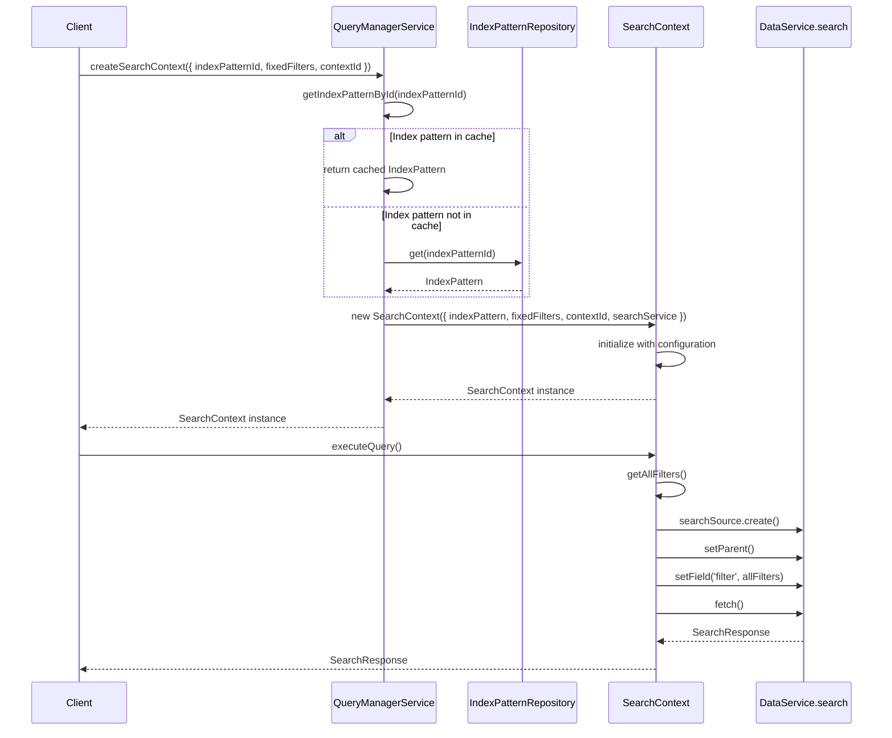
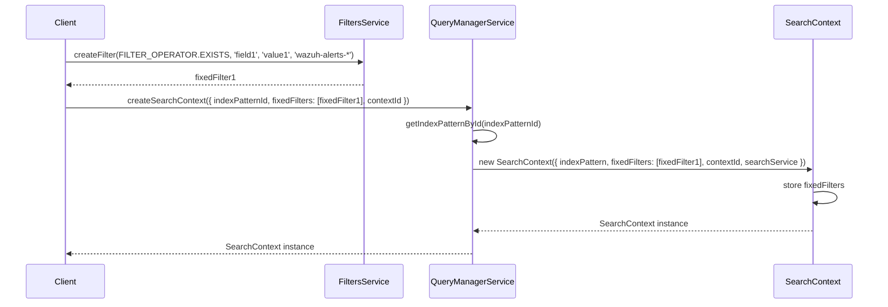
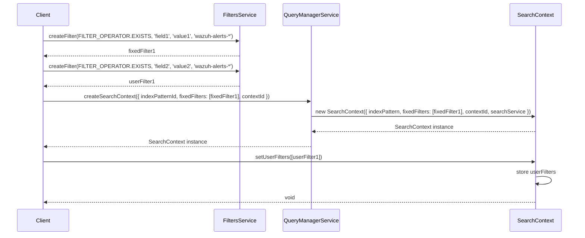
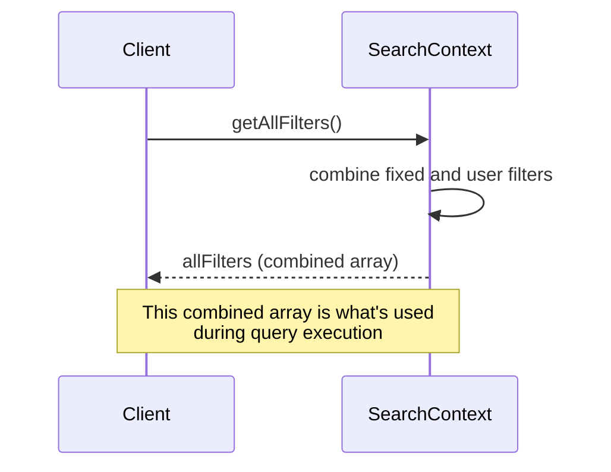

# Query Manager Service

## Overview

The Query Manager Service is a utility designed to facilitate and optimize data retrieval from Elasticsearch index patterns. It provides an interface for creating search contexts, managing filters, and executing queries.

## Key Features

- **Index Pattern Caching**: Stores commonly used index patterns in memory to reduce redundant requests and improve performance
- **Search Context Creation**: Generates context-specific search environments for executing queries
- **Filter Management**: Supports both fixed (persistent) and user (temporary) filters

## Scope

The Query Manager Service provides the following capabilities:

- **Default Index Pattern Management**:

  - Configure default index patterns by ID during instantiation
  - Load and cache index patterns to optimize performance
  - Avoid redundant requests for previously loaded index patterns

- **Search Context Operations**:

  - Create search contexts targeting specific index patterns
  - Associate a context ID with each search context for better organization
  - Access cached index patterns or fetch new ones when needed
  - Execute search queries against the target index pattern

- **Filter Handling**:

  - Define fixed (persistent) filters at search context creation
  - Add/update user (temporary) filters to existing search contexts
  - Combine fixed and user filters for query execution
  - Retrieve filters by type (fixed, user) or get all combined filters

- **Query Execution**:
  - Build and execute Elasticsearch queries with proper filtering
  - Return structured search results
  - Handle query execution errors

## Architecture

The Query Manager Service follows a factory pattern where:

1. A central factory creates instances of the service
2. Each service instance is configured with specific index patterns
3. The service creates search contexts that target specific index patterns
4. Search contexts manage filters and execute queries

### Domain Model



El diagrama muestra la separación clara de responsabilidades entre las diferentes clases del sistema:

## Usage Examples

### 1. Creating a Query Manager Factory

The Query Manager Factory is typically exposed by a core plugin:

```typescript
export class WazuhCorePlugin
  implements Plugin<WazuhCorePluginSetup, WazuhCorePluginStart>
{
  constructor(private readonly initializerContext: PluginInitializerContext) {}

  public async start(
    core: CoreStart,
    plugins: AppPluginStartDependencies,
  ): Promise<WazuhCorePluginStart> {
    this.services.queryManagerFactory = new QueryManagerFactory(plugins.data);
    return {
      queryManagerFactory,
    };
  }
}
```

**Sequence Diagram**:



### 2. Creating Query Manager Service Instances

Create service instances with predefined index patterns:

```typescript
const queryManagerFactory = plugins.wazuhCore.queryManagerFactory;

const fleetQueryManager = await queryManagerFactory.create({
  indexPatterns: [
    { id: 'wazuh-agents*' },
    { id: 'wazuh-states-vulnerabilities*' },
  ],
});
```

**Sequence Diagram**:



### 3. Creating Search Contexts

Create a search context to target a specific index pattern:

```typescript
const searchContext = await queryManagerServiceFleet.createSearchContext({
  indexPatternId: 'wazuh-agents*',
  fixedFilters: [],
  contextId: 'fleet-management',
});

const response = await searchContext.executeQuery();
```

**Sequence Diagram**:



### 4. Working with Fixed Filters

Add persistent filters when creating a search context:

```typescript
// Create a custom filter
const fixedFilter1 = FiltersService.createFilter(
  FILTER_OPERATOR.EXISTS,
  'field1',
  'value1',
  'wazuh-alerts-*',
);

const searchContext = await queryManagerServiceFleet.createSearchContext({
  indexPatternId: 'wazuh-agents*',
  fixedFilters: [fixedFilter1],
  contextId: 'fleet-management',
});
```

**Sequence Diagram**:



### 5. Working with User Filters

Add temporary user filters to an existing search context:

```typescript
// Create filters
const fixedFilter1 = FiltersService.createFilter(
  FILTER_OPERATOR.EXISTS,
  'field1',
  'value1',
  'wazuh-alerts-*',
);
const userFilter1 = FiltersService.createFilter(
  FILTER_OPERATOR.EXISTS,
  'field2',
  'value2',
  'wazuh-alerts-*',
);

// Create search context with fixed filters
const searchContext = await queryManagerServiceFleet.createSearchContext({
  indexPatternId: 'wazuh-agents*',
  fixedFilters: [fixedFilter1],
  contextId: 'fleet-management',
});

// Add user filters
searchContext.setUserFilters([userFilter1]);
```

**Sequence Diagram**:



### 6. Retrieving All Filters

Get all active filters (both fixed and user) from a search context:

```typescript
// Get all filters (combines fixed and user filters)
const allFilters = searchContext.getAllFilters();
```

**Sequence Diagram**:



## Implementation Details

### QueryManagerService Class

The `QueryManagerService` class is responsible for:

1. Storing and retrieving index patterns
2. Creating search contexts
3. Managing dependencies (data service, index pattern repository)

It requires proper configuration through its constructor:

- A list of index patterns
- A data service for query execution
- An index pattern repository for fetching patterns not in memory
