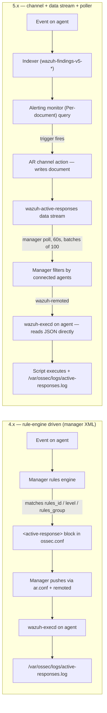

# Active Response migration guide (4.x to 5.x)

This guide covers migrating **Active Response (AR)** from Wazuh 4.x to 5.x. The 4.x implementation lived entirely on the manager and agent: `<command>` and `<active-response>` XML blocks in `ossec.conf`, an agent-side `ar.conf` populated by the manager, rule matching by `<rules_id>` / `<level>` / `<rules_group>`, and a `PUT /active-response` API endpoint. **None of this survives in 5.x.** The 5.x AR pipeline is rebuilt on the OpenSearch Alerting + Notifications stack: channels created in the dashboard, documents emitted into a dedicated `wazuh-active-responses` data stream, a manager-side poller that fans out to agents over the existing `wazuh-remoted` channel, and a WCS/ECS-shaped JSON message that the agent's `wazuh-execd` consumes directly. See the [Active Response 5.0 umbrella issue](https://github.com/wazuh/wazuh/issues/34606) for the full ticket history.

> **No automatic upgrade tooling is provided.** Per [wazuh-dashboard-plugins#8328](https://github.com/wazuh/wazuh-dashboard-plugins/issues/8328), every 4.x AR configuration must be reproduced **manually** in 5.x: read the legacy XML, recreate the equivalent channel in the dashboard UI, and rewrite any custom script to consume the new JSON contract. This guide is the manual recipe; there is no converter, importer, or compatibility shim.

Before starting, complete the stack-wide upgrade described in the general [Migration guide (4.x to 5.x)](../../ref/migration-4x-5x.md) (indexer → manager → dashboard order, backups, certificates). AR cannot be validated until the manager and indexer are on 5.x.

## Overview

The breaking changes introduced by 5.x are listed below. Every claim is anchored to the implementation PR or design issue that proves it.

- **Configuration source removed** — `ossec.conf` `<command>` and `<active-response>` blocks are removed from the manager parser ([wazuh#34663](https://github.com/wazuh/wazuh/issues/34663) / [PR #35054](https://github.com/wazuh/wazuh/pull/35054)), and `ar.conf` is deleted from the agent ([PR #34881](https://github.com/wazuh/wazuh/pull/34881)). 4.x XML blocks have **no effect** in 5.x — they are not parsed, not migrated, and not consumed.
- **Dashboard entity replaces XML** — AR is now a channel created under **Explore → Active Responses** ([wazuh-indexer-notifications#3](https://github.com/wazuh/wazuh-indexer-notifications/issues/3); see also [`index.md`](../../ref/modules/active-response/index.md)). Each channel carries: `name`, `description`, `enabled`, `executable`, `extra_arguments`, `type` (`stateful` / `stateless`), `stateful_timeout` (default `180s`), `location` (`local` / `defined-agent` / `all`), `agent_id` (when `location = defined-agent`).
- **Trigger wiring moves to Alerting** — `<rules_id>` / `<level>` / `<rules_group>` matching is replaced by the query of an Alerting monitor whose action invokes the channel ([wazuh-dashboard-alerting#6](https://github.com/wazuh/wazuh-dashboard-alerting/issues/6) / [PR #7](https://github.com/wazuh/wazuh-dashboard-alerting/pull/7)). See [Attach to an Alerting trigger](../../ref/modules/active-response/alerting-integration.md).
- **Dispatch model is poll-driven** — the 4.x `PUT /active-response` manager API is removed ([wazuh#34783](https://github.com/wazuh/wazuh/issues/34783) / [PR #34879](https://github.com/wazuh/wazuh/pull/34879)) with **no replacement endpoint**. The manager polls the `wazuh-active-responses` data stream every 60 s (default), batches up to 100 documents, filters by agents connected to the local cluster node, and forwards the WCS JSON over the existing `wazuh-remoted` channel ([wazuh#34786](https://github.com/wazuh/wazuh/issues/34786) / [PR #35107](https://github.com/wazuh/wazuh/pull/35107)). Agents older than 5.0 are filtered out ([PR #35127](https://github.com/wazuh/wazuh/pull/35127)).
- **Audit surface changes** — every execution lands as a structured document in the `wazuh-active-responses` data stream (alias pattern `wazuh-active-responses*`, backing index `.wazuh-active-responses-v5`) with a **3-day ISM-driven retention** (`stream-active-responses-policy`, [wazuh-indexer-plugins PR #886](https://github.com/wazuh/wazuh-indexer-plugins/pull/886)). See [Monitor executions](../../ref/modules/active-response/monitor-executions.md).
- **JSON contract for custom scripts changed** — the 4.x `{version, origin, command: add|delete|continue, parameters: {alert, program, extra_args}}` shape is replaced by a WCS-flat shape with `wazuh.active_response.*`, flattened ECS alert fields (`source.ip`, `user.name`, …), and a root-level `command: "enable" | "disable"` ([PR #34881](https://github.com/wazuh/wazuh/pull/34881), [PR #34882](https://github.com/wazuh/wazuh/pull/34882), [PR #35227](https://github.com/wazuh/wazuh/pull/35227)). **Custom scripts that parse the old shape will break.** See [Custom scripts and the JSON stdin contract](#custom-scripts-and-the-json-stdin-contract).
- **Default scripts consolidated** — the firewall-flavored set (`firewall-drop`, `firewalld-drop`, `pf`, `npf`, `ipfw`, `netsh`, `route-null`, `host-deny`) is folded behind a single `block-ip` umbrella ([PR #35227](https://github.com/wazuh/wazuh/pull/35227)); `restart-wazuh` leaves AR for the Control Module; `wazuh-slack` no longer ships. See [Default scripts shipped with the 5.x agent](#default-scripts-shipped-with-the-5x-agent).
- **Location vocabulary** — `local` / `server` / `defined-agent` / `all` (4.x) becomes **Local** / **Defined agent** / **All** (5.x). `server` is gone with no first-class replacement; see [`Location = server` from 4.x has no 5.x equivalent](#location--server-from-4x-has-no-5x-equivalent).
- **`<repeated_offenders>` removed with no direct replacement** — 5.x deduplicates per execution inside `execd`'s in-memory key table ([architecture doc in PR #35227](https://github.com/wazuh/wazuh/pull/35227)); the 4.x notion of escalating timeouts for repeat offenders must be modeled at the monitor or script level.
- **`<timeout_allowed>` removed** — superseded by the per-channel `stateful_timeout` carried in the JSON message; the agent reads it directly ([PR #34881](https://github.com/wazuh/wazuh/pull/34881)).
- **Lifecycle controls** — the 4.x `<disabled>` flag is replaced by the channel-level `enabled` field plus a **Mute / Unmute** runtime toggle on the entity details page ([`create.md` Step 6](../../ref/modules/active-response/create.md#step-6-inspect-edit-mute-or-delete-an-active-response)).
- **Conditional fields in the form** — **Stateful timeout** only appears when `Type = Stateful`; **Agent ID** only appears when `Location = Defined agent` ([`create.md` Step 4](../../ref/modules/active-response/create.md#step-4-fill-the-configurations-panel)).

The diagram below summarizes how the same event flows through the AR pipeline in each major version:



## Compatibility matrix

| Wazuh Version | AR configuration source | Dashboard Platform        | Manager / Indexer |
| ------------- | ----------------------- | ------------------------- | ----------------- |
| 4.x           | `ossec.conf` XML blocks | OpenSearch Dashboards 2.x | Wazuh 4.x         |
| 5.0.x         | Dashboard entity (UI)   | OpenSearch Dashboards 3.x | Wazuh 5.x         |

> **Important**: Active Response depends on coordinated upgrades of the manager and agents. Mixed-version fleets may see commands execute inconsistently — see the general migration guide for upgrade sequencing.

---

## Pre-migration preparation

### 1. Inventory current 4.x AR configuration

Before upgrading, capture the 4.x AR state so you can replay it on 5.x:

```bash
# On the Wazuh manager (4.x)
sudo cp -a /var/ossec/etc/ossec.conf \
  /root/backup-ossec-conf-$(date +%Y%m%d).conf

# AR scripts shipped or customized
sudo cp -a /var/ossec/active-response/bin/ \
  /root/backup-ar-bin-$(date +%Y%m%d)/
```

For each entry in `ossec.conf`, record the values you will need to recreate the equivalent entity in 5.x:

- Every `<command>` block: `<name>`, `<executable>`, `<extra_args>`, `<timeout_allowed>`, `<expect>`.
- Every `<active-response>` block: the linked `<command>`, `<location>`, `<agent_id>`, the matching condition (`<rules_id>` / `<rules_group>` / `<level>`), `<timeout>`, `<repeated_offenders>`, `<disabled>`.
- The full contents of `/var/ossec/active-response/bin/` (default scripts and any custom additions).

### 2. Back up AR execution history

In 4.x, AR signals live inside the alerts index (`wazuh-alerts-*`) plus the per-agent log file `/var/ossec/logs/active-responses.log`. In 5.x they live in the dedicated `wazuh-active-responses*` index.

**4.x execution records are not migrated automatically.** If you need a long-term record, export them before upgrading:

```bash
# Export AR-related events from the 4.x indexer
curl -k -u admin:admin \
  "https://localhost:9200/wazuh-alerts-*/_search?q=command:*&size=10000" \
  -o ar-history-$(date +%Y%m%d).json
```

Keep the per-agent `active-responses.log` files in your existing log-rotation backup path.

### 3. Review breaking changes

Walk through [Breaking changes in 5.x](#breaking-changes-in-5x) before touching the cluster. Every behavior listed there either requires a configuration change or maps to a different surface in 5.x.

---

## Breaking changes in 5.x

### Configuration model: from ossec.conf to dashboard entity

In 4.x, an AR is two cooperating XML blocks in `ossec.conf`: a `<command>` that names the executable, and an `<active-response>` that binds the command to a matching condition. In 5.x both collapse into a single AR entity managed from the dashboard.

**4.x (`/var/ossec/etc/ossec.conf`):**

```xml
<command>
  <name>firewall-drop</name>
  <executable>firewall-drop</executable>
  <timeout_allowed>yes</timeout_allowed>
</command>

<active-response>
  <command>firewall-drop</command>
  <location>local</location>
  <rules_id>5712</rules_id>
  <timeout>600</timeout>
</active-response>
```

**5.x — entity in the Active Responses view:**

| Field                  | Value                                                                  |
| ---------------------- | ---------------------------------------------------------------------- |
| **Name**               | `firewall-drop-ssh-bruteforce`                                         |
| **Description**        | Drops the offending IP for 10 minutes on the agent that saw the alert. |
| **Executable**         | `firewall-drop`                                                        |
| **Extra arguments**    | _(empty)_                                                              |
| **Type**               | `Stateful`                                                             |
| **Stateful timeout**   | `600`                                                                  |
| **Location**           | `Local`                                                                |
| **Agent ID**           | _(not applicable — `Location = Local`)_                                |

The `<rules_id>5712</rules_id>` matching condition does **not** map to a field on the entity. In 5.x it is expressed by the query of the Alerting monitor that invokes this AR — see [Triggering model](#triggering-model).

<!--
  IMAGE SUGGESTION (see active-response-validations.md):
  filename: images/01-config-model-side-by-side.png
  capture:  Two stacked screenshots — top half is the 4.x ossec.conf block
            (terminal / editor), bottom half is the 5.x "Create active response"
            form filled with the equivalent values for firewall-drop-ssh-bruteforce.
-->


Use the table below to mechanically translate each 4.x XML field into its 5.x equivalent. The **Status** column reflects what was actually shipped by the 5.0 work (every claim links to the implementing PR / issue in [umbrella #34606](https://github.com/wazuh/wazuh/issues/34606)).

| 4.x XML                                                                       | 5.x equivalent                                                                                       | Status                                                                                                                                              |
| ----------------------------------------------------------------------------- | ---------------------------------------------------------------------------------------------------- | --------------------------------------------------------------------------------------------------------------------------------------------------- |
| `<command><name>`                                                             | _(no direct field — the channel itself replaces the named command)_                                  | **Collapsed.** The command / response separation disappears; pick a descriptive **Name** that reflects both.                                        |
| `<command><executable>`                                                       | **Executable**                                                                                       | **Renamed only.** Script discovery path is preserved at `/var/ossec/active-response/bin/<executable>` on Unix agents ([PR #34881](https://github.com/wazuh/wazuh/pull/34881)). |
| `<command><extra_args>`                                                       | **Extra arguments**                                                                                  | **Renamed only.** Free-form string passed to the executable.                                                                                        |
| `<command><timeout_allowed>`                                                  | _(no replacement)_                                                                                   | **Removed** from the manager parser ([PR #35054](https://github.com/wazuh/wazuh/pull/35054)). Reversal is now driven exclusively by `type = Stateful` plus **Stateful timeout** on the channel. |
| `<active-response><location>` = `local`                                       | **Location** = `Local`                                                                               | **Preserved.** Default value.                                                                                                                       |
| `<active-response><location>` = `defined-agent`                               | **Location** = `Defined agent`                                                                       | **Preserved.** Reveals the **Agent ID** field.                                                                                                      |
| `<active-response><location>` = `all`                                         | **Location** = `All`                                                                                 | **Preserved.** Pushes the action to every connected agent.                                                                                          |
| `<active-response><location>` = `server`                                      | _(no replacement)_                                                                                   | **Removed** ([wazuh-indexer-notifications#3](https://github.com/wazuh/wazuh-indexer-notifications/issues/3), [PR #35054](https://github.com/wazuh/wazuh/pull/35054)). Manager-side script execution does not exist in 5.x; only agents execute. See workaround at [`Location = server`](#location--server-from-4x-has-no-5x-equivalent). |
| `<active-response><agent_id>`                                                 | **Agent ID**                                                                                         | **Preserved.** Only when `Location = Defined agent`.                                                                                                |
| `<active-response><rules_id>` / `<level>` / `<rules_group>`                   | _(moved to the Alerting monitor query)_                                                              | **Moved.** Matching is now performed by the Alerting monitor that invokes the channel — see [Triggering model](#triggering-model).                  |
| `<active-response><timeout>`                                                  | **Stateful timeout**                                                                                 | **Renamed and relocated.** Same unit (seconds). Setting it forces `Type = Stateful`. Default `180s` ([PR #8345](https://github.com/wazuh/wazuh-dashboard-plugins/pull/8345)). |
| `<active-response><repeated_offenders>`                                       | _(no replacement)_                                                                                   | **Removed** ([PR #35054](https://github.com/wazuh/wazuh/pull/35054)). `execd` keeps an in-memory dedup key table, but the 4.x notion of escalating timeouts has no first-class equivalent. See [`repeated_offenders` is gone](#4x-repeated_offenders-behavior-is-gone). |
| `<active-response><disabled>`                                                 | Channel-level `enabled` field + **Mute / Unmute** toggle                                             | **Replaced.** `enabled` is the persistent flag; **Mute / Unmute** is the runtime toggle on the entity details page.                                 |
| `ar.conf` (agent file pushed by manager)                                      | _(deleted entirely)_                                                                                 | **Removed** ([PR #34881](https://github.com/wazuh/wazuh/pull/34881)). The agent no longer reads any AR configuration file; `wazuh-execd` consumes the JSON message directly. |

### Triggering model

| Aspect              | 4.x                                                                                                   | 5.x                                                                                                                            |
| ------------------- | ----------------------------------------------------------------------------------------------------- | ------------------------------------------------------------------------------------------------------------------------------ |
| Where matching runs | Manager rules engine, on every event                                                                  | Indexer / dashboard plane, via Alerting monitor                                                                                |
| How to express it   | `<rules_id>` / `<level>` / `<rules_group>` inside the `<active-response>` block                       | Query of an Alerting monitor of type **Active Response**, evaluated against the relevant `wazuh-findings-v5-*` index pattern   |
| What invokes the AR | The matching rule fires the AR directly                                                               | The monitor's trigger fires, and the trigger's **Add active response** action invokes the AR entity                            |
| Visibility          | Manager logs only                                                                                     | Trigger evaluation in Alerting + execution record in `wazuh-active-responses*`                                                 |

The practical consequence: every 4.x `<active-response>` block becomes two artifacts in 5.x — an AR entity (the **what**) and an Alerting Active Response monitor (the **when**). The full end-to-end walkthrough lives in [Attach to an Alerting trigger](../../ref/modules/active-response/alerting-integration.md).

<!--
  IMAGE SUGGESTION (see active-response-validations.md):
  filename: images/02-triggering-monitor-query.png
  capture:  Screenshot of the Alerting monitor's Query step with the search
            `wazuh.rule.id: 5712` (or whatever rule the worked example uses),
            so a 4.x operator can see where their old <rules_id> value lands
            in the 5.x UI.
-->


### Audit and visibility

| Surface                | 4.x                                                                                       | 5.x                                                                                                                                                                                                                            |
| ---------------------- | ----------------------------------------------------------------------------------------- | ------------------------------------------------------------------------------------------------------------------------------------------------------------------------------------------------------------------------------ |
| Where executions land  | `/var/ossec/logs/active-responses.log` on the agent + AR-tagged events in `wazuh-alerts-*` | `wazuh-active-responses` **data stream** (alias pattern `wazuh-active-responses*`, backing index `.wazuh-active-responses-v5`) — [PR #886](https://github.com/wazuh/wazuh-indexer-plugins/pull/886). Agent-side `active-responses.log` is unchanged. |
| Structured fields      | Free text in the log line                                                                 | `wazuh.active_response.name` / `.type` / `.executable` / `.extra_arguments` / `.stateful_timeout` / `.location` / `.agent_id` plus `event.doc_id` / `event.index` back-pointers ([PR #886](https://github.com/wazuh/wazuh-indexer-plugins/pull/886)). |
| `@timestamp` semantics | Event time                                                                                | **Indexing time**, not event time — [PR #942](https://github.com/wazuh/wazuh-indexer-plugins/pull/942). For event-time correlation use the linked alert via `event.doc_id`.                                                      |
| Default retention      | Whatever the alerts ILM policy is                                                         | **3 days** — enforced by the ISM policy `stream-active-responses-policy` (priority 100, hot → delete at `min_index_age = 3d`) — [PR #886](https://github.com/wazuh/wazuh-indexer-plugins/pull/886). Ask your administrator to adjust the policy if you need longer retention. |
| Pivot to source alert  | Manual cross-reference between the log line and the original alert                        | `event.doc_id` + `event.index` in the execution record point back to the originating finding (see [`monitor-executions.md` Step 4](../../ref/modules/active-response/monitor-executions.md#step-4-pivot-to-the-source-alert)). |
| Agent lifecycle traces | `/var/ossec/logs/ossec.log` (with `execd.debug=2`)                                        | Unchanged — agent-side logs still live in `ossec.log` and `active-responses.log`.                                                                                                                                              |

### Renamed / removed settings

| 4.x setting                              | 5.x replacement                                                  | Reference                                                                                                |
| ---------------------------------------- | ---------------------------------------------------------------- | -------------------------------------------------------------------------------------------------------- |
| `<command><timeout_allowed>`             | **Removed** — superseded by channel `type = Stateful` + **Stateful timeout** | [wazuh#34663](https://github.com/wazuh/wazuh/issues/34663), [PR #35054](https://github.com/wazuh/wazuh/pull/35054)             |
| `<active-response><location>` = `server` | **Removed** — manager-side script execution does not exist in 5.x | [PR #35054](https://github.com/wazuh/wazuh/pull/35054), [notifications#3](https://github.com/wazuh/wazuh-indexer-notifications/issues/3) |
| `<active-response><rules_id>`            | Alerting monitor query                                           | [wazuh-dashboard-alerting#6](https://github.com/wazuh/wazuh-dashboard-alerting/issues/6)                  |
| `<active-response><level>`               | Alerting monitor query                                           | [wazuh-dashboard-alerting#6](https://github.com/wazuh/wazuh-dashboard-alerting/issues/6)                  |
| `<active-response><rules_group>`         | Alerting monitor query                                           | [wazuh-dashboard-alerting#6](https://github.com/wazuh/wazuh-dashboard-alerting/issues/6)                  |
| `<active-response><repeated_offenders>`  | **Removed** — `execd` dedup is in-memory; no escalating-timeout knob | [PR #35054](https://github.com/wazuh/wazuh/pull/35054), [PR #35227](https://github.com/wazuh/wazuh/pull/35227) |
| `<active-response><disabled>`            | Channel `enabled` field + **Mute / Unmute** toggle               | [`create.md` Step 6](../../ref/modules/active-response/create.md#step-6-inspect-edit-mute-or-delete-an-active-response) |
| `<active-response><timeout>`             | **Stateful timeout** (default `180s`, forces `Type = Stateful`)  | [PR #8345](https://github.com/wazuh/wazuh-dashboard-plugins/pull/8345)                                   |
| `ar.conf` (agent file)                   | **Removed** — agent reads JSON message directly                  | [PR #34881](https://github.com/wazuh/wazuh/pull/34881)                                                   |
| 4.x `<command>` / `<active-response>` blocks in `ossec.conf` | **No longer parsed by the manager**          | [wazuh#34663](https://github.com/wazuh/wazuh/issues/34663), [PR #35054](https://github.com/wazuh/wazuh/pull/35054)             |

> **Note on parser behavior:** the PR that removes the manager-side AR config states "must be removed" but does not document the parser's failure mode for legacy blocks left in place. Plan on deleting the legacy blocks during migration rather than relying on them being silently ignored. If the parser hard-fails, leaving them in causes the manager to fail to start.

### API changes

For Active Response specifically:

- **`PUT /active-response` is removed with no replacement endpoint.** Tracked by [wazuh#34783](https://github.com/wazuh/wazuh/issues/34783), implemented by [PR #34879](https://github.com/wazuh/wazuh/pull/34879). Integrations that previously posted directly to the manager API to fire AR commands must be rewritten to instead emit an alert document and rely on an Alerting Active Response monitor to pick it up.
- The 5.x dispatch model is **document-driven**, not API-driven: write an alert → an Alerting monitor with a `Per-document` trigger emits an AR channel "notification" into the `wazuh-active-responses` data stream → the manager poller fans it out to the target agent via `wazuh-remoted`. See [wazuh#34786](https://github.com/wazuh/wazuh/issues/34786) and [PR #35107](https://github.com/wazuh/wazuh/pull/35107) for the implementation; the manager keeps a bookmark file at `/var/wazuh-manager/queue/cluster/ar_bookmark.json` and polls every 60 s by default.
- Agents older than 5.0 are filtered out of dispatch ([PR #35127](https://github.com/wazuh/wazuh/pull/35127)) — mixed-version fleets do **not** receive AR commands on legacy agents.
- The general migration guide already maps the dashboard-plugin API namespaces (`/api/status` → `/api/wazuh-core/status`, etc.) — see [Migration guide — API changes](../../ref/migration-4x-5x.md#api-changes).

### Custom scripts and the JSON stdin contract

> **Custom AR scripts from 4.x will break on 5.x without code changes.** The JSON delivered to scripts over stdin changed shape entirely. Plan on rewriting every custom script before the cutover.

The discovery path is preserved: the agent still looks for `/var/ossec/active-response/bin/<executable>` on Unix ([PR #34881](https://github.com/wazuh/wazuh/pull/34881)). What changed is the **JSON shape** the script receives over stdin and the **command vocabulary** it must recognize.

#### Old contract (4.x)

```json
{
  "version": 1,
  "origin": { "name": "node01", "module": "wazuh-analysisd" },
  "command": "add",
  "parameters": {
    "extra_args": [],
    "alert": {
      "rule": { "id": "5712", "level": 5 },
      "data": { "srcip": "192.168.1.100", "dstuser": "root" }
    },
    "program": "/var/ossec/active-response/bin/firewall-drop"
  }
}
```

- Root `command` ∈ `add` / `delete` / `continue`.
- Alert payload nested under `parameters.alert.data.*` with Wazuh-internal field names (`srcip`, `dstuser`, …).

#### New contract (5.x)

```json
{
  "wazuh": {
    "active_response": {
      "name": "block-ip",
      "executable": "block-ip",
      "location": "defined-agent",
      "agent_id": "001",
      "type": "stateless"
    },
    "agent": { "id": "001", "name": "test-agent" }
  },
  "source": { "ip": "192.168.1.100" },
  "user": { "name": "username" },
  "command": "enable"
}
```

- Root `command` ∈ `enable` / `disable` only ([PR #35227](https://github.com/wazuh/wazuh/pull/35227)). `disable` messages additionally carry `stateful_timeout` at the root.
- Alert fields are **flattened to WCS / ECS 9.1 paths**: `source.ip`, `source.port`, `user.name`, etc. ([PR #34882](https://github.com/wazuh/wazuh/pull/34882)). The 4.x `parameters.alert.data.*` paths are **gone**.
- AR-specific metadata moves under `wazuh.active_response.*` — the script reads its own `name`, `executable`, `type`, `location`, `agent_id` directly from there.
- `wazuh-execd` reads `wazuh.active_response.executable`, `wazuh.active_response.type`, and `wazuh.active_response.stateful_timeout` from the message before invoking the script ([PR #34881](https://github.com/wazuh/wazuh/pull/34881)).

#### Migration recipe for a custom script

For each custom script under `/var/ossec/active-response/bin/`:

1. **Re-map field reads** — every reference to `parameters.alert.data.srcip` becomes `source.ip`; `parameters.alert.data.dstuser` becomes `user.name`; and so on. Use ECS 9.1 paths consistently.
2. **Re-map the command switch** — replace `case "$COMMAND" in add) ... delete) ... continue)` with `case "$COMMAND" in enable) ... disable)`. There is no `continue` in the public 5.x contract.
3. **Read AR metadata from `wazuh.active_response.*`** rather than expecting it as positional arguments.
4. **Honor `wazuh.active_response.stateful_timeout`** for stateful scripts — the manager no longer pre-computes a timeout; the script receives the value verbatim.
5. **Test against a real 5.x dispatch.** Capture stdin in a wrapper (`tee /tmp/ar-input.json` before exec'ing your script) and confirm the JSON shape matches the expected layout.

Authoritative reference for the new contract: [Active Response developer docs in PR #35227](https://github.com/wazuh/wazuh/pull/35227) (`README.md`, `architecture.md`, `executables.md` under the manager source tree). Also see [`docs/dev/modules/active-responses.md`](../../dev/modules/active-responses.md) on this branch for the channel schema.

### Default scripts shipped with the 5.x agent

The 5.x agent consolidates the long 4.x list of platform-specific firewall scripts behind a single cross-platform `block-ip` umbrella ([PR #35227](https://github.com/wazuh/wazuh/pull/35227)). Use the table below to find the 5.x replacement for each 4.x default script:

| 4.x script                 | 5.x replacement                                                                  | Notes                                                                                                          |
| -------------------------- | -------------------------------------------------------------------------------- | -------------------------------------------------------------------------------------------------------------- |
| `firewall-drop`            | `block-ip`                                                                       | Same intent; one cross-platform executable instead of per-OS variants.                                         |
| `default-firewall-drop`    | `block-ip`                                                                       | Folded.                                                                                                        |
| `firewalld-drop`           | `block-ip` (firewalld backend on Linux)                                          | Backend selection is internal to `block-ip`.                                                                   |
| `pf`                       | `block-ip` (pf backend on macOS / BSD)                                           | Folded.                                                                                                        |
| `npf`                      | `block-ip` (npf backend on NetBSD)                                               | Folded.                                                                                                        |
| `ipfw`                     | `block-ip` (ipfw backend)                                                        | Folded.                                                                                                        |
| `netsh.exe`                | `block-ip` (netsh backend on Windows)                                            | Folded.                                                                                                        |
| `route-null` / `host-deny` | `block-ip` (route / hosts.deny backends as fallbacks)                            | Used by `block-ip` when no native firewall is available.                                                       |
| `ip-customblock`           | `block-ip` (or your own custom script using the new contract)                    | Folded.                                                                                                        |
| `disable-account`          | `disable-account`                                                                | **Retained.** Same name; rewrite required only if you wrap it in a custom script that parses the JSON contract. |
| `restart-wazuh`            | _(moved out of AR entirely — see the Control Module)_                            | **Not an AR script in 5.x.** Agent restart belongs to the new Control Module ([PR #35227](https://github.com/wazuh/wazuh/pull/35227)). |
| `wazuh-slack`              | _(no longer shipped)_                                                            | **Removed.** For Slack notifications, use the dashboard's Notifications channels under **Explore → Notifications → Channels** instead. |
| `kaspersky`                | _(not documented in the 5.x default set)_                                        | If you used it in 4.x, confirm against the 5.0 release contents before relying on it.                          |

For every 4.x AR entry that referenced one of the consolidated scripts, change the **Executable** field of the migrated channel to `block-ip` (or `disable-account`, where applicable). For `restart-wazuh`, drop the AR entry entirely and reproduce the behavior via the Control Module.

---

## Migration steps

This is a fully manual migration — there is no automatic converter or compatibility shim ([wazuh-dashboard-plugins#8328](https://github.com/wazuh/wazuh-dashboard-plugins/issues/8328)). Plan time for each step proportional to the size of your 4.x AR configuration.

### Step 1: Complete the stack migration

Finish the steps in the general [Migration guide (4.x to 5.x)](../../ref/migration-4x-5x.md) through dashboard startup before touching AR. AR cannot be validated until the manager and indexer are on 5.x.

### Step 2: Remove the 4.x AR configuration from the manager

Once the inventory in [Pre-migration preparation](#1-inventory-current-4x-ar-configuration) is captured to backup, delete the legacy AR blocks from `ossec.conf`:

```bash
sudo nano /var/ossec/etc/ossec.conf
# Remove every <command>...</command> and <active-response>...</active-response> block.
# These tags are no longer parsed by the 5.x manager (PR #35054).
```

Do not leave the blocks in place hoping for graceful degradation — the manager source no longer parses them, and the failure mode for stray blocks is not documented. Removing them up front avoids surprises.

### Step 3: Rewrite each custom AR script for the new JSON contract

Skip this step if you only used default scripts. For every script under `/var/ossec/active-response/bin/` that you wrote or modified in 4.x:

1. Apply the recipe in [Custom scripts and the JSON stdin contract](#custom-scripts-and-the-json-stdin-contract): re-map field reads to the ECS-flat paths, switch the command vocabulary to `enable` / `disable`, and read AR metadata from `wazuh.active_response.*`.
2. Re-deploy the rewritten script with the same ownership and permissions:
   ```bash
   sudo chown root:wazuh /var/ossec/active-response/bin/<your-script>
   sudo chmod 750 /var/ossec/active-response/bin/<your-script>
   ```
3. Capture a real stdin payload from a smoke test (wrap the script with `tee /tmp/ar-input.json` for one execution) and confirm the JSON shape matches the 5.x layout before relying on it in production.

### Step 4: Translate every 4.x `<active-response>` block into a 5.x channel

Working from the inventory captured in [Pre-migration preparation](#1-inventory-current-4x-ar-configuration), open the dashboard and recreate each entry under **Explore → Active Responses → Create active response**. Use the mapping table in [Configuration model](#configuration-model-from-ossecconf-to-dashboard-entity) field-by-field, and the [Default scripts](#default-scripts-shipped-with-the-5x-agent) table to translate executable names.

Worked example (the `firewall-drop` block shown earlier):

1. Open the side menu, expand **Explore**, and select **Active Responses**.
2. Click **Create active response**.
3. **Name and description** panel:
   - **Name**: `block-ip-ssh-bruteforce`
   - **Description**: `Drops the offending IP for 10 minutes on the agent that saw the alert.`
4. **Configurations** panel:
   - **Executable**: `block-ip` (was `firewall-drop` in 4.x — see [Default scripts](#default-scripts-shipped-with-the-5x-agent))
   - **Extra arguments**: _(empty)_
   - **Type**: `Stateful` (the 4.x block has `<timeout>`)
   - **Stateful timeout**: `600` (the value from `<timeout>600</timeout>`)
   - **Location**: `Local` (from `<location>local</location>`)
5. Click **Create**. Confirm the entity appears in the list with `Status = Active`.

<!--
  IMAGE SUGGESTION (see active-response-validations.md):
  filename: images/03-ar-list-after-migration.png
  capture:  Screenshot of the Active Responses list view AFTER recreating
            the 4.x entries — at least three rows, mixing Stateful and
            Stateless types, with the filters chips visible (Status,
            Location, Type).
-->

Step-by-step coverage of the form (with field validations and toast messages) is in [Create an active response](../../ref/modules/active-response/create.md).

### Step 5: Wire each translated channel to an Alerting Active Response monitor

The matching condition from 4.x (`<rules_id>` / `<level>` / `<rules_group>`) is expressed as the query of an Alerting monitor in 5.x. For the worked example above, the monitor query selects events matching rule ID `5712` (SSH brute-force) and the trigger calls **Add active response** to invoke `block-ip-ssh-bruteforce`.

Follow [Attach to an Alerting trigger](../../ref/modules/active-response/alerting-integration.md) end-to-end for one of your translated entities, then repeat for the rest.

> **Important:** the monitor type **must** be `Active Response`. No other monitor type exposes the **Add active response** button — that is the most common reason the AR fails to appear in the trigger selector.

<!--
  IMAGE SUGGESTION (see active-response-validations.md):
  filename: images/04-trigger-add-active-response.png
  capture:  Screenshot of the trigger configuration step with the
            "Add active response" action expanded, showing the AR
            selector populated with the migrated entity name.
-->


### Step 6: Restart and run an end-to-end smoke test

```bash
sudo systemctl restart wazuh-manager
```

Confirm the end-to-end path with the SSH-root-login example used throughout the 5.x AR documentation:

1. Generate the triggering event (an SSH root login via password authentication) on the target agent — see [`alerting-integration.md` Step 7](../../ref/modules/active-response/alerting-integration.md#step-7-generate-the-triggering-event).
2. Confirm a new document appears in **Discover** under `wazuh-active-responses*` within about a minute — see [`monitor-executions.md` Step 1](../../ref/modules/active-response/monitor-executions.md#step-1-inspect-the-execution-record-in-discover).
3. Confirm the agent applied the action and (for stateful AR) reverted it after the timeout — see [`monitor-executions.md` Steps 2 and 3](../../ref/modules/active-response/monitor-executions.md#step-2-verify-execution-on-the-agent).

---

## Post-migration validation

### 1. Verify AR entities are registered

- [ ] Every 4.x `<active-response>` block has a matching entity in **Explore → Active Responses**.
- [ ] List filters by **Status** (`Active` / `Muted`), **Location** (`All` / `Defined agent` / `Local`), and **Type** (`Stateful` / `Stateless`) return the expected entries.
- [ ] Opening each entity's details page shows the configuration with the values from the 4.x inventory.

### 2. Trigger a test execution

Use the SSH-root-login smoke test from `create.md` to confirm the full path end-to-end:

- [ ] The Alerting monitor evaluates and the trigger fires.
- [ ] The manager dispatches the command (visible in `/var/ossec/logs/ossec.log` on the target agent with `execd.debug=2`).
- [ ] The agent executes the script (visible in `/var/ossec/logs/active-responses.log` if the executable logs there).
- [ ] An execution document appears in `wazuh-active-responses*` within about one minute.
- [ ] For stateful AR, a second execution document appears after `Stateful timeout` seconds reverting the action.

<!--
  IMAGE SUGGESTION (see active-response-validations.md):
  filename: images/05-discover-execution-record.png
  capture:  Screenshot of Discover with the wazuh-active-responses* index
            pattern selected, one row expanded, showing the wazuh.active_response.*
            fields populated for the migrated entity.
-->


### 3. Validate dashboard visibility

- [ ] The `wazuh-active-responses*` index pattern exists in **Dashboard Management → Index Patterns**.
- [ ] Opening any execution record in **Discover** shows the `wazuh.active_response.*` fields documented in [`monitor-executions.md`](../../ref/modules/active-response/monitor-executions.md#step-1-inspect-the-execution-record-in-discover).
- [ ] `event.doc_id` and `event.index` on each execution record point back to the originating finding.

---

## Troubleshooting common migration issues

For the general AR diagnostic flow, see the [Troubleshooting and FAQ](../../ref/modules/active-response/troubleshooting.md) of the AR module. The items below are specific to the 4.x → 5.x migration.

### AR entities are not visible in **Explore → Active Responses** after upgrade

Likely cause: the dashboard did not finish the first-startup bootstrap (the `wazuh-active-responses*` index pattern is missing). Ask your administrator to inspect the dashboard logs and restart the service. Re-open the view once the index pattern appears under **Dashboard Management → Index Patterns**.

### Custom scripts fail with permission errors

The 5.x agent enforces the same ownership and permission expectations as 4.x. Re-apply:

```bash
sudo chown root:wazuh /var/ossec/active-response/bin/<your-script>
sudo chmod 750 /var/ossec/active-response/bin/<your-script>
```

### 4.x `<repeated_offenders>` behavior is gone

Confirmed removed by [PR #35054](https://github.com/wazuh/wazuh/pull/35054); `execd` keeps an in-memory dedup key table but exposes no escalating-timeout knob ([architecture doc in PR #35227](https://github.com/wazuh/wazuh/pull/35227)). If you relied on this 4.x behavior, the available substitutes are:

- Use the Alerting monitor query to track repeat occurrences (for example, count matches within a sliding window) and only fire the AR once the threshold is met.
- Maintain two AR channels with different **Stateful timeout** values and route to them via two separate monitors.
- Accept the loss for AR entries where the escalation was nice-to-have and not load-bearing.

### `Location = server` from 4.x has no 5.x equivalent

Confirmed removed from both the channel schema ([notifications#3](https://github.com/wazuh/wazuh-indexer-notifications/issues/3)) and the manager parser ([PR #35054](https://github.com/wazuh/wazuh/pull/35054)). In 5.x only agents execute AR scripts; the manager process itself never does. If a 4.x `<active-response>` used `<location>server</location>` to run the action on the manager host:

- If the manager host also runs a Wazuh agent (a common setup), set **Location** = `Defined agent` and use that agent's numeric ID. The script then runs on the manager host via its co-located agent — same machine, different process.
- If the manager host has no agent enrolled, install one and use the approach above, or relocate the action to a different agent that can perform it.
- There is no direct "execute on the manager process" option in 5.x.

### Custom script silently does nothing after upgrade

Almost always caused by the script still parsing the 4.x JSON shape. The script gets called, but `command` is no longer `"add"` (it is `"enable"`), `parameters.alert.data.srcip` no longer exists (use `source.ip`), and the script's case-switch falls through. Re-apply the recipe in [Custom scripts and the JSON stdin contract](#custom-scripts-and-the-json-stdin-contract) before debugging anything else.

### AR fires but the agent never receives the command

Two distinct causes that look identical:

- **Agent version older than 5.0** — the manager poller filters out pre-5.0 agents ([PR #35127](https://github.com/wazuh/wazuh/pull/35127)). Upgrade the agent to 5.0 or later.
- **Manager poll bookmark stuck** — the manager keeps a bookmark at `/var/wazuh-manager/queue/cluster/ar_bookmark.json` and resumes from there on every poll. If the file is unreadable or stale, polling stops. Ask your administrator to inspect the bookmark and the manager logs.

### Manager refuses to start after upgrade

If the manager fails to start with a configuration parse error, check whether `ossec.conf` still has `<command>` or `<active-response>` blocks. Per [wazuh#34663](https://github.com/wazuh/wazuh/issues/34663) / [PR #35054](https://github.com/wazuh/wazuh/pull/35054) those sections are no longer parsed; remove them before retrying.

---

## Rollback considerations

Rolling back AR independently of the rest of the stack is **not supported** — restore AR configuration as part of the full stack rollback described in the general [Migration guide (4.x to 5.x)](../../ref/migration-4x-5x.md#rollback-procedure). The 4.x and 5.x AR pipelines do not coexist: 5.x packages remove the manager parsing of `<active-response>` / `<command>` blocks, remove `ar.conf` from the agent, and remove the `PUT /active-response` endpoint, so partial rollback leaves the stack in an inconsistent state.

If you only need to revert AR config (not packages):

```bash
sudo cp /root/backup-ossec-conf-YYYYMMDD.conf /var/ossec/etc/ossec.conf
sudo cp -a /root/backup-ar-bin-YYYYMMDD/. /var/ossec/active-response/bin/
sudo systemctl restart wazuh-manager
```

This restores the legacy XML blocks and the **un-modified** 4.x custom scripts. If you already rewrote scripts in place for the 5.x JSON contract during [Migration steps](#migration-steps), restore them from the backup taken in step 1 of [Pre-migration preparation](#1-inventory-current-4x-ar-configuration) as part of the same operation.

---

## Additional resources

- General migration guide: [Migration guide (4.x to 5.x)](../../ref/migration-4x-5x.md)
- Active Response overview: [`index.md`](../../ref/modules/active-response/index.md)
- Create an AR command: [`create.md`](../../ref/modules/active-response/create.md)
- Attach to an Alerting trigger: [`alerting-integration.md`](../../ref/modules/active-response/alerting-integration.md)
- Monitor executions: [`monitor-executions.md`](../../ref/modules/active-response/monitor-executions.md)
- Troubleshooting: [`troubleshooting.md`](../../ref/modules/active-response/troubleshooting.md)
- Developer-facing AR docs (channel schema, dispatch path): [`docs/dev/modules/active-responses.md`](../../dev/modules/active-responses.md)
- Wazuh 4.14 Active Response reference: <https://documentation.wazuh.com/4.14/user-manual/capabilities/active-response/>

### Primary sources for 5.x AR design and implementation

- [Umbrella issue — wazuh#34606](https://github.com/wazuh/wazuh/issues/34606)
- [Spike — Server architecture for AR 5.0 (wazuh#34716)](https://github.com/wazuh/wazuh/issues/34716)
- [Indexer channel type spike — wazuh-indexer-notifications#4](https://github.com/wazuh/wazuh-indexer-notifications/issues/4)
- [Indexer channel definition — wazuh-indexer-notifications#3](https://github.com/wazuh/wazuh-indexer-notifications/issues/3)
- [Indexer AR index template + ISM policy — wazuh-indexer-plugins#884 / PR #886](https://github.com/wazuh/wazuh-indexer-plugins/pull/886)
- [Indexer `@timestamp` semantics — PR #942](https://github.com/wazuh/wazuh-indexer-plugins/pull/942)
- [Dashboard AR monitor action — wazuh-dashboard-alerting#6 / PR #7](https://github.com/wazuh/wazuh-dashboard-alerting/pull/7)
- [Remove `PUT /active-response` — wazuh#34783 / PR #34879](https://github.com/wazuh/wazuh/pull/34879)
- [Manager retrieval + dispatch — wazuh#34786 / PR #35107](https://github.com/wazuh/wazuh/pull/35107)
- [Mixed-version agent filter + JSON fix — PR #35127](https://github.com/wazuh/wazuh/pull/35127)
- [Executable inventory + WCS alignment — wazuh#34779 / PR #34882](https://github.com/wazuh/wazuh/pull/34882)
- [Agent execd refactor — wazuh#34780 / PR #34881](https://github.com/wazuh/wazuh/pull/34881)
- [Deprecate ar.conf + remove manager AR config — wazuh#34663 / PR #35054](https://github.com/wazuh/wazuh/pull/35054)
- [Developer docs — README / architecture / executables — PR #35227](https://github.com/wazuh/wazuh/pull/35227)
- [User-facing AR docs — wazuh-dashboard-plugins#8328 / PR #8345](https://github.com/wazuh/wazuh-dashboard-plugins/pull/8345)
- CHANGELOG: [`CHANGELOG.md`](../../../CHANGELOG.md)

## Support

- Community forum: <https://groups.google.com/g/wazuh>
- GitHub issues: <https://github.com/wazuh/wazuh-dashboard-plugins/issues>
- Tracking issue for this guide: wazuh-dashboard-plugins#8328
