# Migrating Mail Forwarding and Reporting to Dashboard Notifications

In previous Wazuh versions (4.x), email alerts and reporting were configured directly in the Wazuh manager's `ossec.conf` file using the `<email_alerts>`, `<reports>`, and related global SMTP configuration blocks.

Starting with Wazuh 5.0, these backend mail forwarding capabilities have been removed from the manager. Mail forwarding and scheduled reporting must now be configured directly through the Wazuh Dashboard using the **Notifications**, **Alerting**, and **Reporting** capabilities.

> **Note:** There is no automatic upgrade tooling to migrate your existing 4.x email configurations. You must manually recreate your alerting and reporting logic in the Wazuh Dashboard.

## Configuration mapping (4.x -> 5.x)

The following table maps each `ossec.conf` element from 4.x to the corresponding feature in the Wazuh 5.x Dashboard:

### Email alerts mapping

| 4.x `ossec.conf`                 | 5.x Dashboard                                                        |
| -------------------------------- | -------------------------------------------------------------------- |
| `<global><smtp_server>`          | Notifications > Email Senders (SMTP host/port)                       |
| `<global><email_from>`           | Notifications > Email Senders (outbound address)                     |
| `<email_alerts><email_to>`       | Notifications > Email Recipient Groups                               |
| `<email_alerts><level>`          | Alerting > Monitor > Query (condition on `wazuh.rule.level`)         |
| `<email_alerts><group>`          | Alerting > Monitor > Query (condition on `wazuh.rule.group`)         |
| `<email_alerts><event_location>` | Alerting > Monitor > Query (condition on `agent.name` or `agent.ip`) |
| `<email_alerts><rule_id>`        | Alerting > Monitor > Query (condition on `wazuh.rule.id`)            |
| `<email_alerts><do_not_delay>`   | Alerting > Monitor > Action > Per execution                          |
| `<email_alerts><do_not_group>`   | Alerting > Monitor > Action > Per alert                              |
| `<alerts><email_alert_level>`    | Alerting > Monitor > Query (condition on `wazuh.rule.level`)         |

> `<format>` is not mapped - in 4.x it only controlled full vs SMS format. In 5.x, the message body is fully customizable via the notification template, so format is determined by your template content, not a toggle.

### Reports mapping

| 4.x `ossec.conf`      | 5.x Dashboard                                            |
| --------------------- | -------------------------------------------------------- |
| `<reports><title>`    | Reporting > Report Definition > Name                     |
| `<reports><email_to>` | Reporting > Report Definition > Notification > Channels  |
| `<reports><showlogs>` | Reporting > Report Definition > (include details toggle) |

> Filters like `<group>`, `<rule>`, `<level>`, `<srcip>`, `<location>`, and `<user>` were used in 4.x to scope the report content. In 5.x, this is achieved by selecting the appropriate source dashboard or visualization - the filtering is inherent to the source, not configured on the report definition itself.

## ossec.conf reference

Below are the typical 4.x configuration blocks you may have in your `ossec.conf`. Use them as a reference when following the migration steps.

```xml
<global>
  <smtp_server>mail.example.com</smtp_server>
  <email_from>wazuh@example.com</email_from>
</global>

<alerts>
  <email_alert_level>10</email_alert_level>
</alerts>

<email_alerts>
  <email_to>security@example.com</email_to>
  <level>12</level>
  <group>sshd,</group>
  <do_not_delay/>
</email_alerts>

<reports>
  <title>Daily Vulnerability Report</title>
  <group>vulnerability-detector,</group>
  <level>10</level>
  <email_to>security@example.com</email_to>
  <showlogs>yes</showlogs>
</reports>
```

## Migration steps

### Prerequisites

Before proceeding, make sure you have:

- Wazuh 5.0 fully deployed (indexer, manager, dashboard)
- Access to the Wazuh Dashboard as an administrator
- SMTP server credentials or Amazon SES configuration
- Recipient email addresses ready

> These steps must be followed **in order**, as each step depends on resources created in the previous one.

## 1. Creating an Email Sender

Before creating an email channel, you must set up an outbound email server by creating a sender. You can choose to configure either an SMTP or an Amazon SES sender.

1. Open the Wazuh Dashboard and navigate to the **Notifications** plugin.
2. Go to **Email senders**.


### Option A: Creating an SMTP Sender

1. Click **Create SMTP sender**.
2. Provide a **Name** for the sender (e.g., `wazuh-security-smtp-sender`).
3. Enter the **Outbound email address** (e.g., `noreply@wazuh.local`).
4. Specify the **Host** (e.g., `mailpit`) and **Port** (e.g., `1025`).
5. Select the **Encryption method** (e.g., `None`).
   > **Note:** SSL/TLS or STARTTLS is recommended for security. To use either one, you must enter each sender account's credentials into the OpenSearch keystore using the CLI.
6. Click **Create** to save the sender.


### Option B: Creating an Amazon SES Sender

1. Click **Create SES sender**.
2. Provide a **Name** for the sender.
3. Enter the **Outbound email address**.
4. Specify your **AWS region** and **Role ARN**.
5. Click **Create** to save the sender.

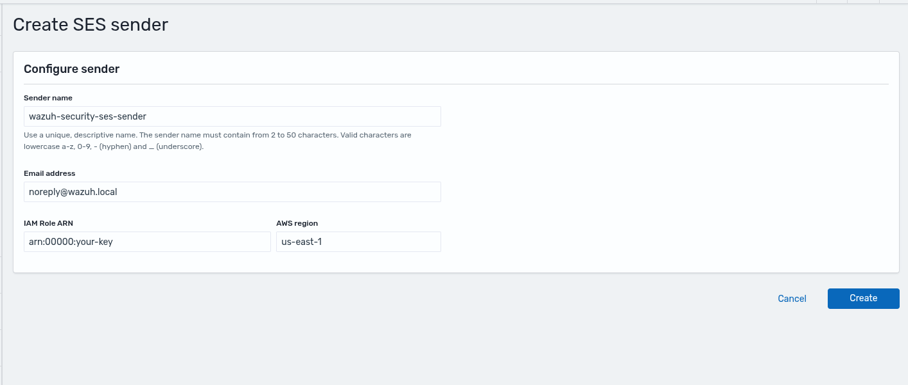

## 2. Creating an Email Recipient Group

To easily manage multiple destination email addresses, you can configure an Email Recipient Group.

1. In the **Notifications** plugin, go to **Email recipient groups**.

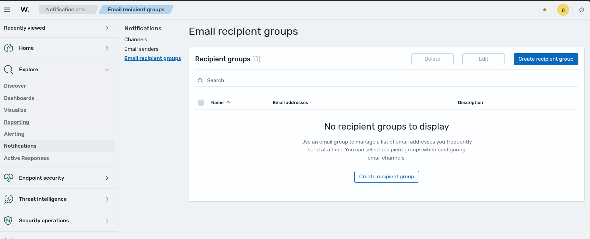

2. Click **Create recipient group**.
3. Enter a **Name** for the group (e.g., `wazuh-security-recipients`).
4. (Optional) Provide a **Description** explaining the purpose of this group (e.g., `Recipients of scheduled security reports and alerts.`).
5. In the **Emails** field, type or select one or more email addresses (e.g., `wazuh-security-recipients@test.com`).

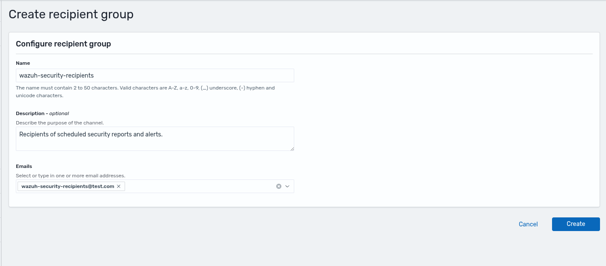

6. Click **Create** to save the recipient group.


## 3. Setting up an Email Notification Channel

With your sender and recipient group created, you can now set up the Notification Channel.

1. In the **Notifications** plugin, go to **Channels** and click **Create channel**.


2. Enter a **Name** for the channel (e.g., `wazuh-security-mail-channel`).
3. (Optional) Provide a **Description** clarifying the purpose of this channel (e.g., `Email channel used to deliver Wazuh security alerts, findings, and incident notifications.`)
4. Under **Configurations**, select **Email** as the **Channel type**.
5. Choose your **Sender type** (e.g., **SMTP sender**).
6. In the **SMTP name** field, select the sender you created in Step 1 (e.g., `wazuh-security-smtp-sender`).
7. Under **Default recipients**, select the recipient group you created in Step 2 (e.g., `wazuh-security-recipients`).

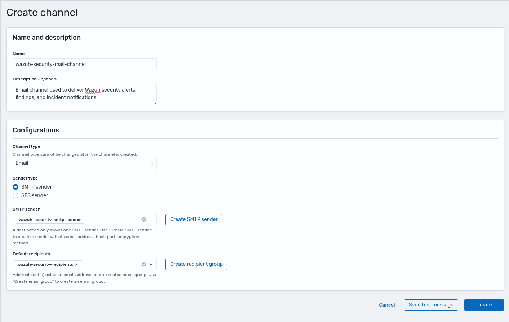

8. (Optional) Click **Send test message** to verify your configuration.
9. Click **Create** to save the channel.

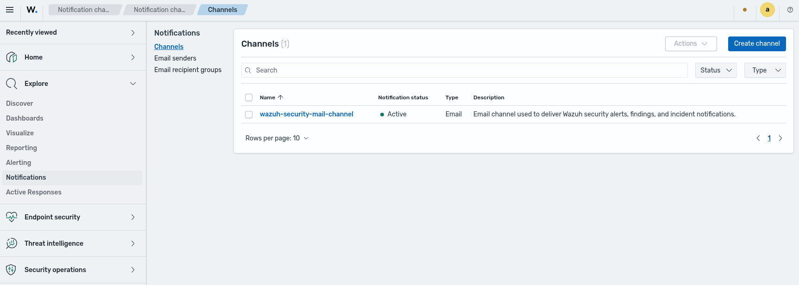

## 4. Recreating Email Alerts with Monitors

In 4.x, alerts were triggered by rule severity, groups, or specific rule IDs via `<email_alerts>`. In 5.0, you create Monitors using the Alerting plugin. A Monitor evaluates findings against a query, and when the trigger condition is met, executes an action - for example, sending an email through your notification channel.

### 4.1. Creating a Monitor

1. Navigate to the **Alerting** plugin and under **Monitors** tab click **Create monitor**.

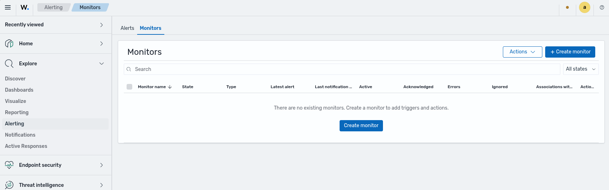

2. Give your monitor a descriptive name (e.g., `SSH root login` if alerting on SSH events).
3. Under **Monitor type**, select your monitor type (e.g., **Per document monitor**).
4. Under **Monitor defining method**, select your defining method (e.g., **Visual editor**).
5. Set the **Schedule** frequency (e.g., By interval, **1 Minute(s)**).


6. In **Select data**, choose the index pattern that contains your findings (e.g., `wazuh-findings-v5-system-activity`).
7. Define your **Query** using the fields relevant to your use case (the image below shows an SSH rule example):
   - **Query name**: A descriptive name for the query
   - **Field**: e.g., `wazuh.rule.title`, `wazuh.rule.level`, `wazuh.rule.group`
   - **Operator**: `is`, `is not`, `is greater than`, etc.
   - **Value**: The value to match

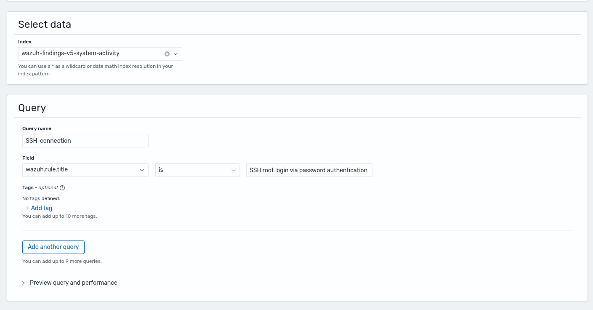

### 4.2. Configuring Triggers and Actions

Triggers define the condition that must be met to send a notification.

1. Scroll down to the **Triggers** section and click **Add trigger**.

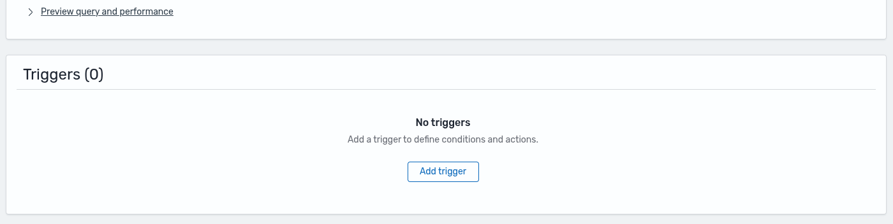

2. Provide a **Trigger name** (e.g., `SSH-trigger` for an SSH alert).
3. Set the **Severity level** (1 to 5).
4. Under **Trigger conditions**, specify the query you defined.
5. Under **Actions**, click **Add notification**.


6. Give it an **Action name** (e.g., `SSH-alert`).
7. For the **Channel**, select the email channel you created in Step 3.
8. Enter a **Message subject** (e.g., `SSH Root Connection`) and customize the **Message** body using Mustache templates or plain text.
9. Set the **Action configuration** (e.g., `Per execution` or `Per alert`).

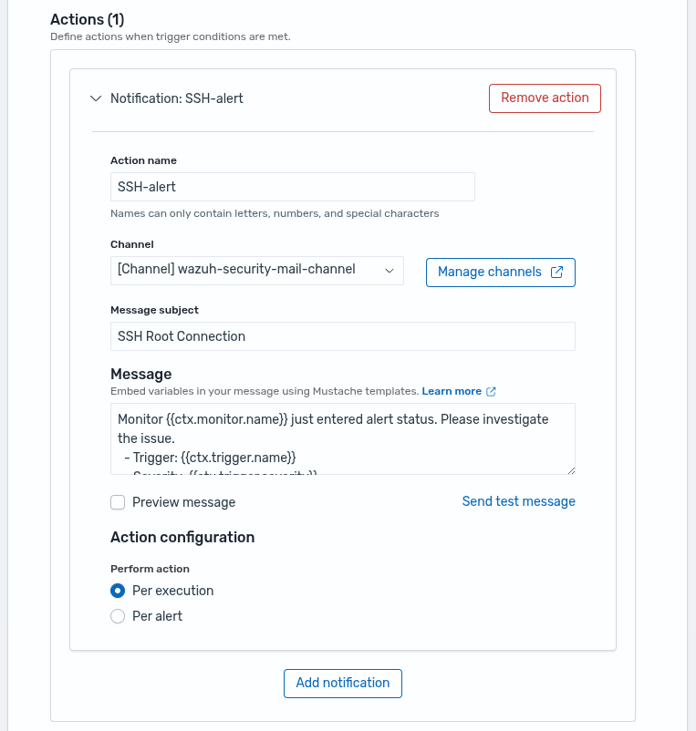

10. Click **Create** to save the monitor and its triggers.

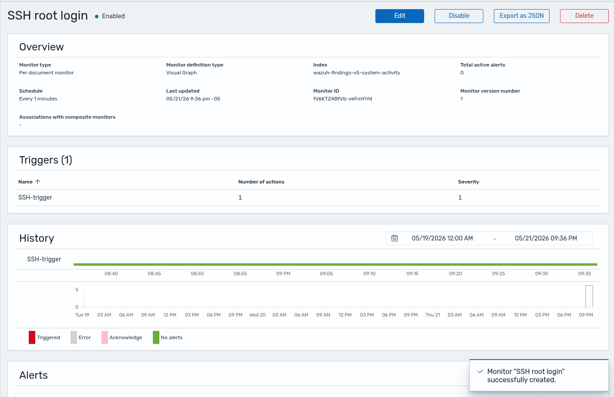

### 4.3. Testing the Monitor

1. Trigger the condition by generating an event that matches your query.
2. Navigate to the **Alerting** plugin and under the **Alerts** tab to verify the alert was created.


3. Check the recipient's inbox for the email notification.

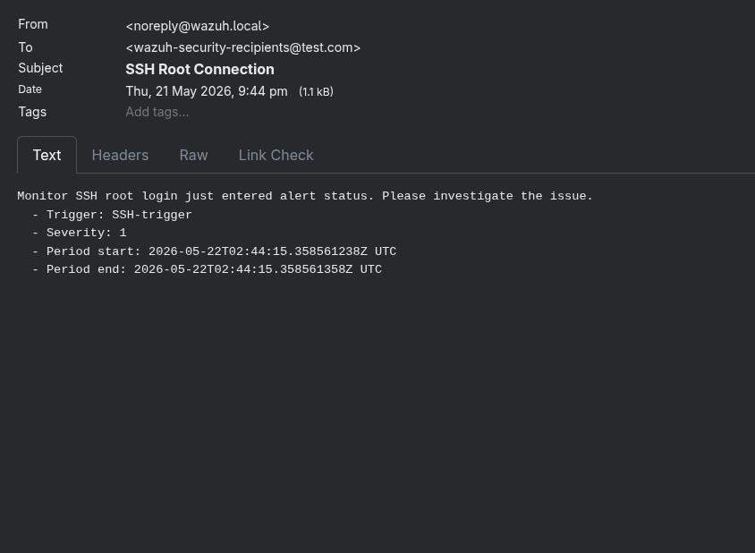

<details>
<summary>Example: recreating an `sshd` rule from 4.x</summary>

If your 4.x `ossec.conf` had a block like:

```xml
<email_alerts>
  <email_to>security@example.com</email_to>
  <level>12</level>
  <group>sshd,</group>
  <do_not_delay/>
</email_alerts>
```

You can recreate it with the following monitor configuration:

**Monitor:**

- **Name**: `SSH root login`
- **Type**: Per document monitor
- **Schedule**: Every 1 minute
- **Index pattern**: `wazuh-findings-v5-system-activity`
- **Query**: `wazuh.rule.title` is `SSH root login via password authentication`

**Trigger:**

- **Name**: `SSH-trigger`
- **Severity**: `1 (Highest)`

**Action:**

- **Channel**: Your email channel from Step 3
- **Subject**: `SSH Root Connection`
- **Configuration**: Per execution (equivalent to `do_not_delay`)

</details>

## 5. Recreating Scheduled Reports

If you previously used the `<reports>` block in `ossec.conf` to generate daily or weekly summaries, you can replicate this behavior using the Reporting plugin. For this example, we will configure a daily PDF report for the **Vulnerability detection - Overview** dashboard and set up an email notification using an HTML template.

1. Navigate to the **Reporting** plugin in the Wazuh Dashboard.


2. Click **Create report definition**.
3. Under **Report settings**, configure the following:
   - **Name**: `Vulnerability Detection Daily Report`
   - **Description**: `Morning daily reports for vulnerability detection overview`
   - **Report source**: Select **Dashboard** (and choose `Vulnerability detection - Overview` from the list).
   - **Time range**: `Last 24 hours`
   - **File format**: `PDF`
4. Under **Report trigger**, select **On demand**.


5. In **Notification settings**:
   - Check the **Send notification when report is available** option.
   - **Channels**: Select the Email channel you created in Step 3 (e.g., `[Channel] wazuh-security-mail-channel`).
   - **Notification subject**: `Vulnerability Detection Report`
6. Configure your notification message using the text editor or use the default HTML template provided.


7. Click **Create** to save the report definition.
8. After creating the report definition, the application will open a new browser tab with the report being generated.


### 5.1. Viewing Generated Reports

1. Once the report is generated (either on-demand or by schedule), it will be listed in the **Reporting** plugin.


2. The email with the custom HTML format and report link button will be delivered to the recipients.


By completing this migration, you have moved from a static, file-based notification system to a fully dynamic, dashboard-driven approach. The Wazuh 5.0 notification stack - built on top of the **Notifications**, **Alerting**, and **Reporting** plugins - gives your security team real-time alerting with fine-grained query control, reusable channel and recipient configurations, and rich HTML email templates with direct report links. Unlike the rigid `ossec.conf` approach, this setup can be updated, tested, and extended without restarting any backend service.
