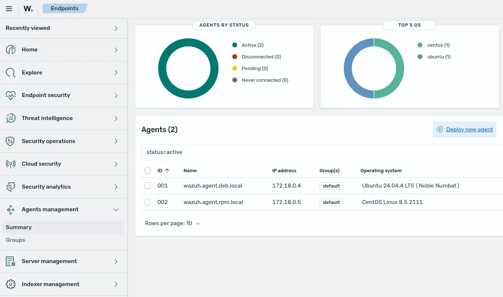
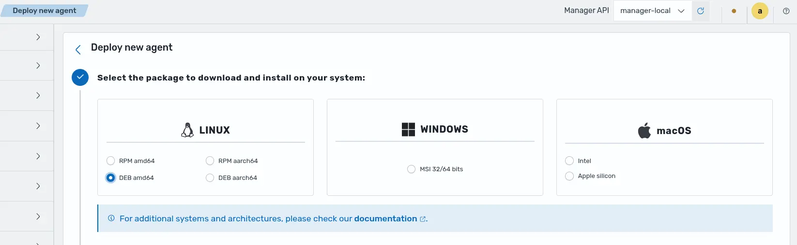
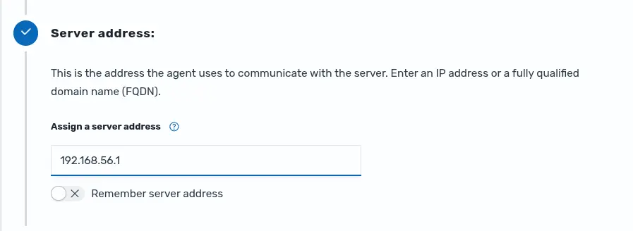
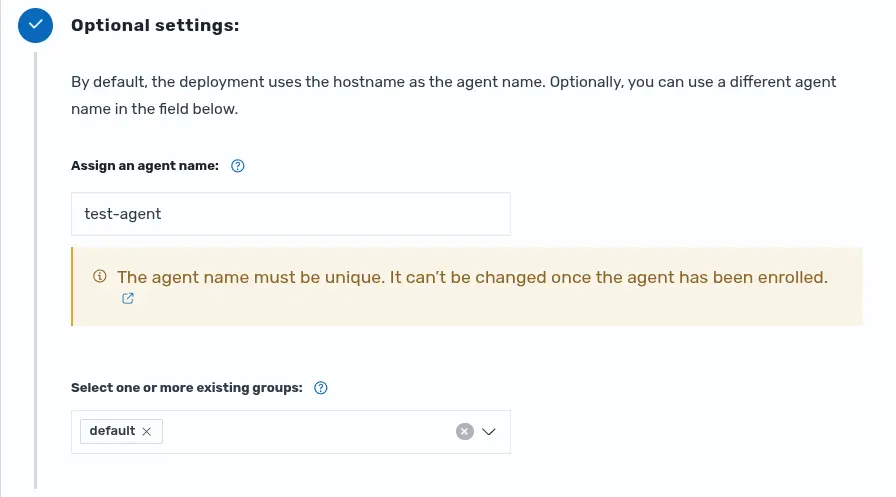
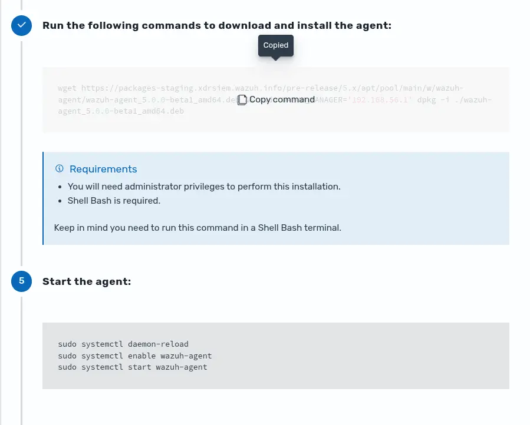
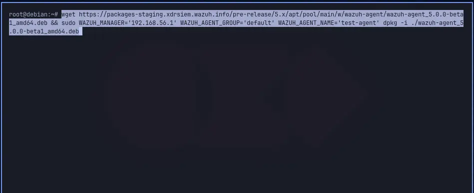
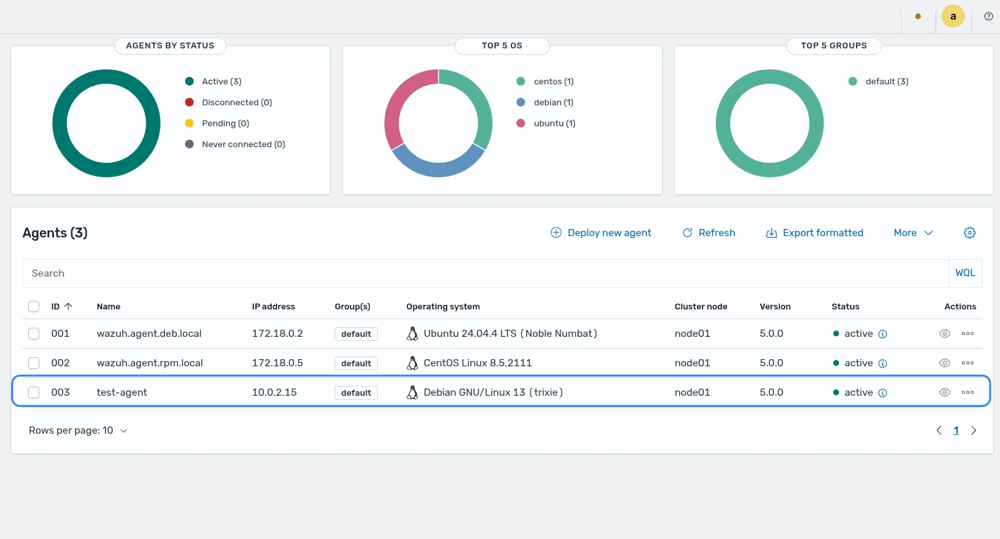

# Agent deploy one-liner (FQDN and group)

The Wazuh dashboard provides a **Deploy new agent** wizard that guides to the user in the process
of installing, registering and initializing an agent in a host.

## Generate the one-liner from the dashboard UI

Use these steps when the deployment command must be obtained through the
interface, for example in end-to-end testing scenarios.

1. Sign in to the Wazuh dashboard and open **Agents management** > **Summary**.
2. Select **Deploy new agent** above the agents table.



3. Choose the operating system and package format that match the endpoint (for example, **Linux** > **DEB amd64**).



4. In **Server address**, enter the hostname or IP address of the Wazuh manager the agent will register against.



5. **Optional configuration** (when required):
   - **Agent name**: define how the agent is identified.
   - **Agent group**: assign the agent to an existing group (for example, `default`).



6. Copy the command generated by the wizard, run it in a terminal session on the endpoint, then enable and start the Wazuh agent service for that platform.




7. Enable and start the Wazuh agent service

Choose the procedure that matches the endpoint operating system.

**Systemd**

```bash
systemctl daemon-reload
systemctl enable wazuh-agent
systemctl start wazuh-agent
```

**SysV init**

RPM-based operating systems:

```bash
chkconfig --add wazuh-agent
service wazuh-agent start
```

Debian-based operating systems:

```bash
update-rc.d wazuh-agent defaults 95 10
service wazuh-agent start
```

**No service manager**

On some systems, start the agent manually:

```bash
/var/ossec/bin/wazuh-control start
```

8. Open **Agents management** > **Summary** again and verify that the agent is listed with the expected status.



## Notes

Use the manager FQDN for both `WAZUH_MANAGER` and `WAZUH_REGISTRATION_SERVER`
when enrollment is performed through DNS. Add additional variables as needed,
for example `WAZUH_AGENT_NAME` or `WAZUH_REGISTRATION_PASSWORD`. See [Deployment variables](#deployment-variables).

## How the download URL and package name are built

The wizard generates the install command at runtime in the browser. The
download URL and package filename change depending on the build stage declared
in the `wazuh-dashboard` repository `VERSION.json`

### Routing rules

| Stage value                     | Repository                                                    | Package name                                                         |
| ------------------------------- | ------------------------------------------------------------- | -------------------------------------------------------------------- |
| Starts with `alpha` or `beta`   | `https://packages-staging.xdrsiem.wazuh.info/pre-release/5.x` | Includes `-{stage}` suffix. e.g. `wazuh-agent_5.0.0-beta3_amd64.deb` |
| `rc`, empty, or any other value | `https://packages.wazuh.com/production/5.x`                   | No suffix. e.g. `wazuh-agent_5.0.0_amd64.deb`                        |

The detection combines two signals in order:

1. If `isProduction` is `true` (set by the package build scripts via `--production`), the build always routes to production regardless of `stage`.
2. Otherwise, `stage` prefix matching applies: `alpha` or `beta` routes to staging, everything else routes to production.

### Stage value source

The `stage` field originates from `VERSION.json` at the `wazuh-dashboard` repository and is
injected into the browser at startup via the dashboards plugin
lifecycle (`initWazuhBuildInfoFromCore`).

To test a different routing locally, change `"stage"` in `VERSION.json` before
starting the dev server:

```json
{ "version": "5.0.0", "stage": "rc1" }
```

## References

### Deployment variables

| Option                         | Description                                                                                                                                                                                                                                                                                |
| ------------------------------ | ------------------------------------------------------------------------------------------------------------------------------------------------------------------------------------------------------------------------------------------------------------------------------------------ |
| WAZUH_MANAGER                  | This is the primary Wazuh manager that the Wazuh agent will connect to for ongoing communication and security data exchange. Specifies the Wazuh manager IP address or FQDN (Fully Qualified Domain Name). If you want to specify multiple managers, you can add them separated by commas. |
| WAZUH_MANAGER_PORT             | Specifies the Wazuh manager connection port.                                                                                                                                                                                                                                               |
| WAZUH_PROTOCOL                 | Sets the communication protocol between the Wazuh manager and the Wazuh agent. Accepts UDP and TCP. The default is TCP.                                                                                                                                                                    |
| WAZUH_REGISTRATION_SERVER      | Specifies the Wazuh enrollment server, used for the Wazuh agent enrollment. If empty, the value set in WAZUH_MANAGER will be used.                                                                                                                                                         |
| WAZUH_REGISTRATION_PORT        | Specifies the port used by the Wazuh enrollment server.                                                                                                                                                                                                                                    |
| WAZUH_REGISTRATION_PASSWORD    | Sets password used to authenticate during enrollment, stored in etc/authd.pass.                                                                                                                                                                                                            |
| WAZUH_KEEP_ALIVE_INTERVAL      | Sets the time between Wazuh agent checks for Wazuh manager connection.                                                                                                                                                                                                                     |
| WAZUH_TIME_RECONNECT           | Sets the time interval for the Wazuh agent to reconnect with the Wazuh manager when connectivity is lost.                                                                                                                                                                                  |
| WAZUH_REGISTRATION_CA          | Host SSL validation need of Certificate of Authority. This option specifies the CA path.                                                                                                                                                                                                   |
| WAZUH_REGISTRATION_CERTIFICATE | The SSL agent verification needs a CA signed certificate and the respective key. This option specifies the certificate path.                                                                                                                                                               |
| WAZUH_REGISTRATION_KEY         | Specifies the key path completing the required variables with WAZUH_REGISTRATION_CERTIFICATE for the SSL agent verification process.                                                                                                                                                       |
| WAZUH_AGENT_NAME               | Designates the Wazuh agent's name. By default, it will be the computer name.                                                                                                                                                                                                               |
| WAZUH_AGENT_GROUP              | Assigns the Wazuh agent to one or more existing groups (separated by commas).                                                                                                                                                                                                              |
| ENROLLMENT_DELAY               | Assigns the time that agentd should wait after a successful enrollment.                                                                                                                                                                                                                    |
