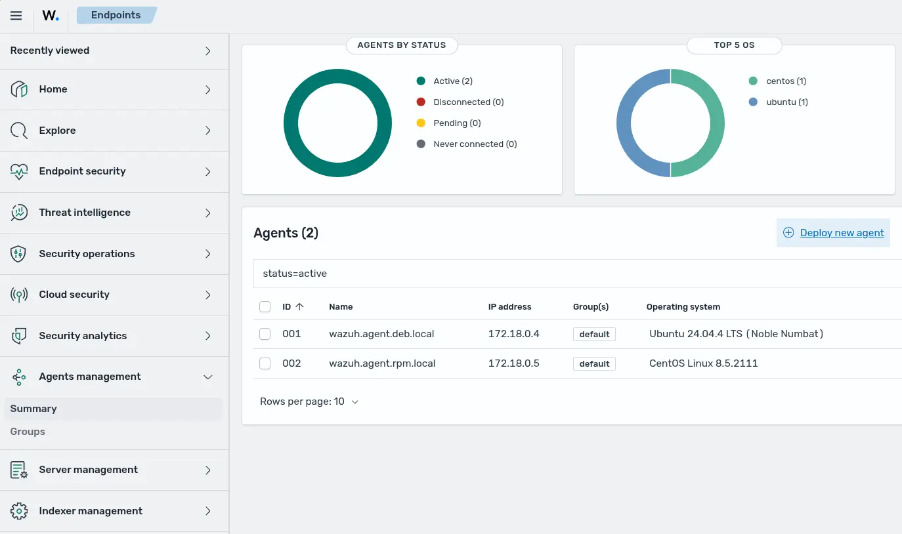
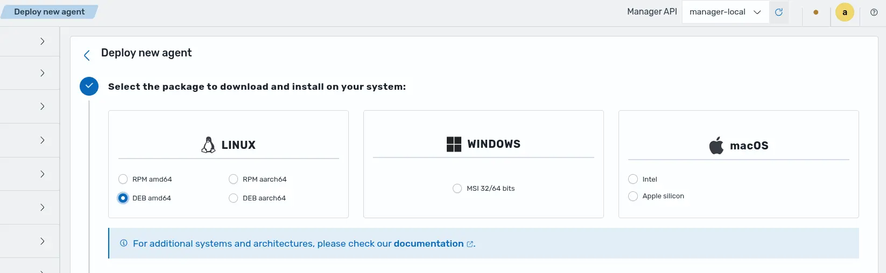
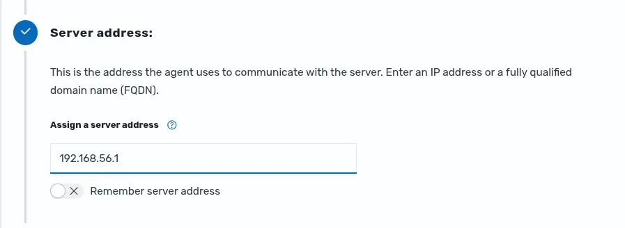
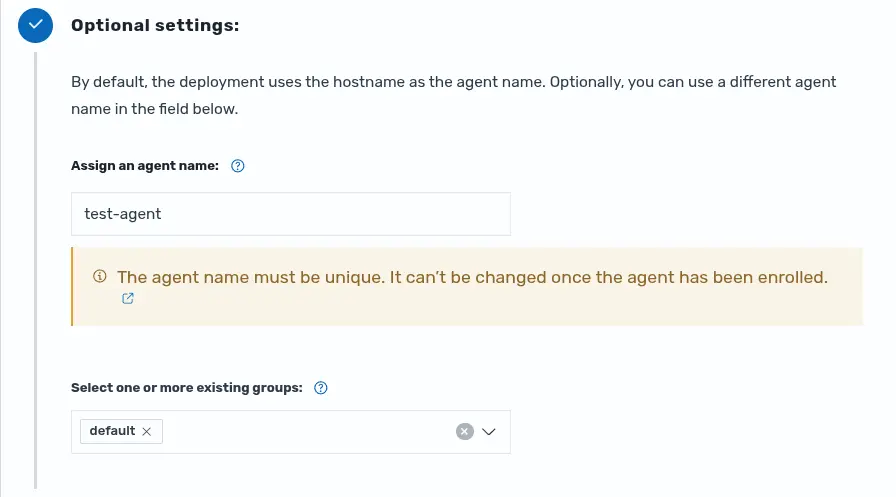
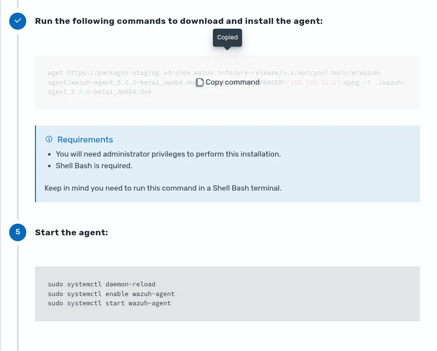
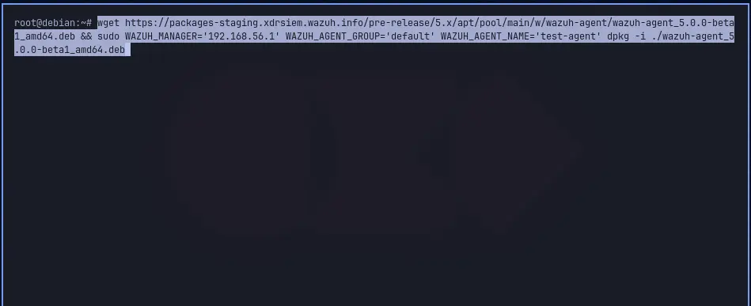
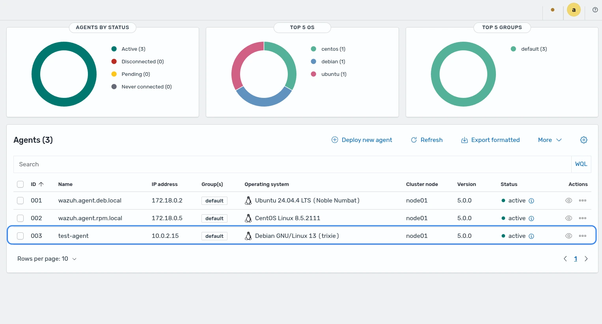

# Agent deploy one-liner (FQDN and group)

The Wazuh dashboard provides a **Deploy new agent** wizard that guides to the user in the process
of installing, registering and initializing an agent in a host.

## Generate the one-liner from the dashboard UI

Use these steps when the deployment command must be obtained through the
interface, for example in end-to-end testing scenarios.

1. Sign in to the Wazuh dashboard and open **Agents management** > **Summary**.
2. Select **Deploy new agent** above the agents table.



3. Choose the operating system and package format that match the endpoint (for example, **Linux** > **DEB amd64**).



4. In **Server address**, enter the hostname or IP address of the Wazuh manager
   the agent will register against. The port and the path prefix sit behind
   **View advanced options** and are only needed when the manager does not
   listen on the defaults.



5. In **Enrollment token**, select **Generate token**. The server mints one for
   the address typed in the previous step, with its own defaults -- a 30 day
   lifetime and unlimited enrollments -- and answers with its identifier and
   expiry.

   **View advanced options** opens the rest of the step: **Use existing token**,
   to deploy with a token kept from an earlier deployment instead of minting a
   new one, and **Lifetime**, **Enrollments allowed** and **Description**, which
   parameterize the mint request. The two paths exclude each other, so filling
   **Use existing token** disables the other three, and using any of them
   disables **Use existing token**.

6. **Optional configuration** (when required):
   - **Agent name**: define how the agent is identified.
   - **Agent group**: assign the agent to an existing group (for example, `default`).



7. Copy the command generated by the wizard, run it in a terminal session on the endpoint, then enable and start the Wazuh agent service for that platform.




8. Enable and start the Wazuh agent service

Choose the procedure that matches the endpoint operating system.

**Systemd**

```bash
systemctl daemon-reload
systemctl enable wazuh-agent
systemctl start wazuh-agent
```

**SysV init**

RPM-based operating systems:

```bash
chkconfig --add wazuh-agent
service wazuh-agent start
```

Debian-based operating systems:

```bash
update-rc.d wazuh-agent defaults 95 10
service wazuh-agent start
```

**No service manager**

On some systems, start the agent manually:

```bash
/var/ossec/bin/wazuh-control start
```

9. Open **Agents management** > **Summary** again and verify that the agent is listed with the expected status.



## Enrollment token

The wizard does not build the enrollment credentials itself: it asks the server
to mint an **enrollment token** for the address the operator typed
(`POST /agents/enrollment-tokens`) and shows whatever the server answers,
including its refusal when the address is not one of the names in the listener
certificate. **Lifetime**, **Enrollments allowed** and **Description**
parameterize that request only; the description is kept with the token on the
server so it can be told apart from the others when they are listed later, and
none of the three reaches the agent. The token is returned by that response only
and is never listed again, so the deployment command has to be copied before
leaving the page.

An operator who kept a token from an earlier deployment can reuse it through
**Use existing token** instead of minting a new one. Only the token text is
known in that case -- the manager returns the metadata once, at mint time -- so
the wizard shows neither the address it names nor its expiry, and it is the
manager that refuses an expired or exhausted token at enrollment time. The field
is checked only for what would break the generated command apart, a space or a
single quote, since the manager is what decides whether the text is a token it
issued.

The token names the manager and pins its certificate authority, and it carries
the credential the agent enrolls with. The installer refuses a token supplied
together with a value that contradicts it, so with a token in hand the wizard
emits `WAZUH_ENROLLMENT_TOKEN` alone and no `WAZUH_MANAGER_ENDPOINT`,
`WAZUH_REGISTRATION_PASSWORD`, `WAZUH_REGISTRATION_CA` or `SSL_VERIFICATION`
beside it. Editing the server address after generating a token discards it,
since the address the agent would reach comes from the token. A token supplied
through **Use existing token** is left alone, because it was not minted from
those fields and they say nothing about the manager it names.

A section that holds a value opens by itself rather than hiding it: the port and
the path prefix arrive from the app configuration, so a deployment that sets
them shows them. So does a section holding a field in error, since an error that
cannot be seen cannot be corrected and the deployment commands stay blocked
until it is.

Minting requires the `enrollment_token:create` permission. Where it is missing --
including against a server whose RBAC policy predates the action -- the wizard
falls back to the enrollment password, and the **Enrollment token** step is not
shown.

## Notes

Use the manager FQDN for both `WAZUH_MANAGER_ENDPOINT` and
`WAZUH_REGISTRATION_SERVER` when enrollment is performed through DNS. Add
additional variables as needed, for example `WAZUH_AGENT_NAME` or
`WAZUH_REGISTRATION_PASSWORD`. See [Deployment variables](#deployment-variables).

The agent connects to exactly one manager: there is no server rotation and no
failover between several, so `WAZUH_MANAGER_ENDPOINT` takes a single endpoint
rather than a list. High availability is provided by a load balancer in front
of the managers, which the agent reaches through one endpoint.

The wizard fills the endpoint from three separate fields -- address, port and
path prefix -- and joins them into the value it generates. The port and the
path prefix are optional: left empty, they are omitted from the command and the
agent applies its own defaults. **Remember server address** stores all three, so
the next visit is prefilled with the whole endpoint.

## How the download URL and package name are built

The wizard generates the install command at runtime in the browser. The
download URL and package filename change depending on the build stage declared
in the `wazuh-dashboard` repository `VERSION.json`

### Routing rules

| Stage value                     | Repository                                                    | Package name                                                         |
| ------------------------------- | ------------------------------------------------------------- | -------------------------------------------------------------------- |
| Starts with `alpha` or `beta`   | `https://packages-staging.xdrsiem.wazuh.info/pre-release/5.x` | Includes `-{stage}` suffix. e.g. `wazuh-agent_5.0.0-beta3_amd64.deb` |
| `rc`, empty, or any other value | `https://packages.wazuh.com/production/5.x`                   | No suffix. e.g. `wazuh-agent_5.0.0_amd64.deb`                        |

The detection is case-insensitive prefix matching on the `stage` field.
Anything that is not clearly `alpha` or `beta` defaults to the production
repository as a safe fallback.

### Stage value source

The `stage` field originates from `VERSION.json` at the `wazuh-dashboard` repository and is
injected into the browser at startup via the dashboards plugin
lifecycle (`initWazuhBuildInfoFromCore`).

To test a different routing locally, change `"stage"` in `VERSION.json` before
starting the dev server:

```json
{ "version": "5.0.0", "stage": "rc1" }
```

## References

### Deployment variables

| Option                         | Description                                                                                                                                                                                                                                                                                                                                                                                              |
| ------------------------------ | -------------------------------------------------------------------------------------------------------------------------------------------------------------------------------------------------------------------------------------------------------------------------------------------------------------------------------------------------------------------------------------------------------- |
| WAZUH_MANAGER_ENDPOINT         | The Wazuh manager the agent connects to, as a single connection target: `host[:port][/path]`. `host` is an IP address or FQDN; the port and the path prefix are optional and default to `1517` and `/wazuh-manager/` when omitted. The path prefix must match the manager's `<remote><https><global_prefix>`, or every request the agent sends answers `404`. This is the variable the wizard generates. |
| WAZUH_REGISTRATION_SERVER      | Specifies the Wazuh enrollment server, used for the Wazuh agent enrollment. If empty, the host from WAZUH_MANAGER_ENDPOINT will be used.                                                                                                                                                                                                                                                                 |
| WAZUH_REGISTRATION_PORT        | Specifies the port used by the Wazuh enrollment server.                                                                                                                                                                                                                                                                                                                                                  |
| WAZUH_REGISTRATION_PASSWORD    | Sets password used to authenticate during enrollment, stored in etc/authd.pass.                                                                                                                                                                                                                                                                                                                          |
| WAZUH_KEEP_ALIVE_INTERVAL      | Sets the time between Wazuh agent checks for Wazuh manager connection.                                                                                                                                                                                                                                                                                                                                   |
| WAZUH_TIME_RECONNECT           | Sets the time interval for the Wazuh agent to reconnect with the Wazuh manager when connectivity is lost.                                                                                                                                                                                                                                                                                                |
| WAZUH_REGISTRATION_CA          | Host SSL validation need of Certificate of Authority. This option specifies the CA path.                                                                                                                                                                                                                                                                                                                 |
| WAZUH_REGISTRATION_CERTIFICATE | The SSL agent verification needs a CA signed certificate and the respective key. This option specifies the certificate path.                                                                                                                                                                                                                                                                             |
| WAZUH_REGISTRATION_KEY         | Specifies the key path completing the required variables with WAZUH_REGISTRATION_CERTIFICATE for the SSL agent verification process.                                                                                                                                                                                                                                                                     |
| WAZUH_AGENT_NAME               | Designates the Wazuh agent's name. By default, it will be the computer name.                                                                                                                                                                                                                                                                                                                             |
| WAZUH_AGENT_GROUP              | Assigns the Wazuh agent to one or more existing groups (separated by commas).                                                                                                                                                                                                                                                                                                                            |
| ENROLLMENT_DELAY               | Assigns the time that agentd should wait after a successful enrollment.                                                                                                                                                                                                                                                                                                                                  |
