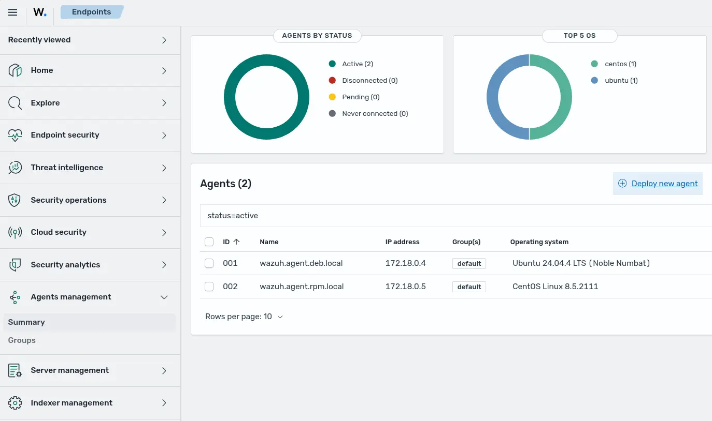
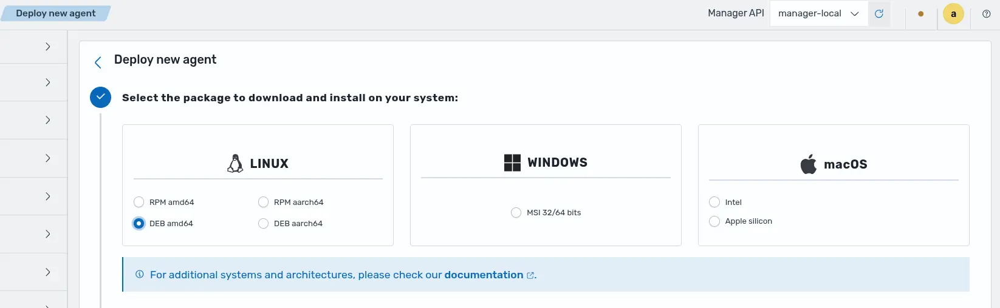
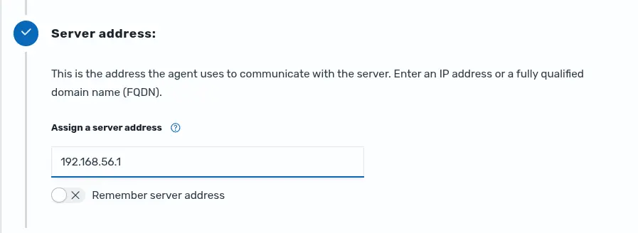
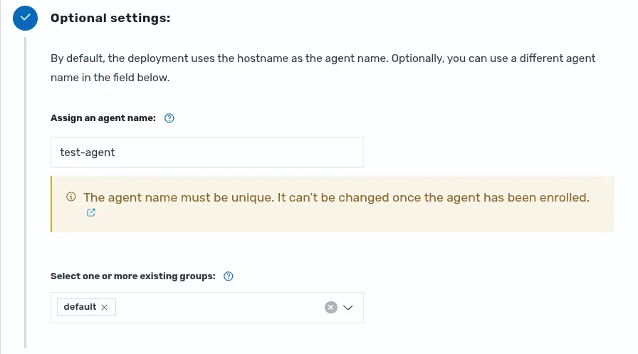
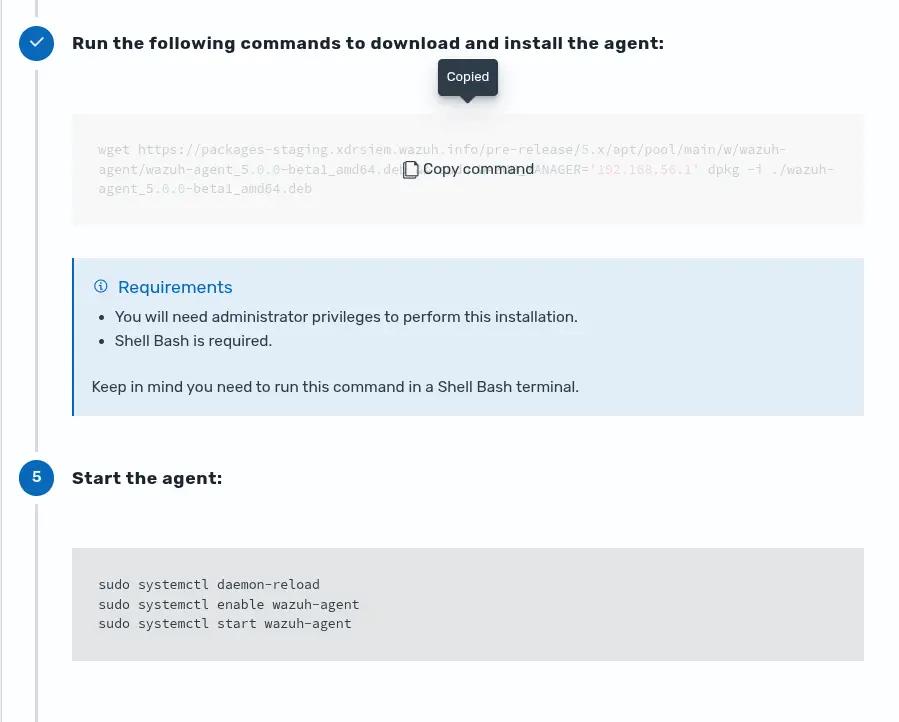
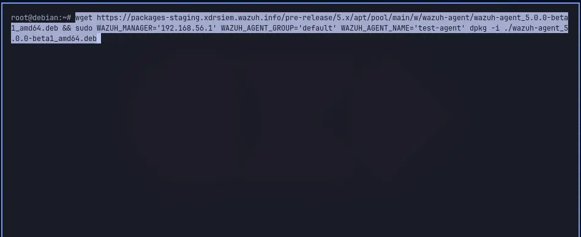
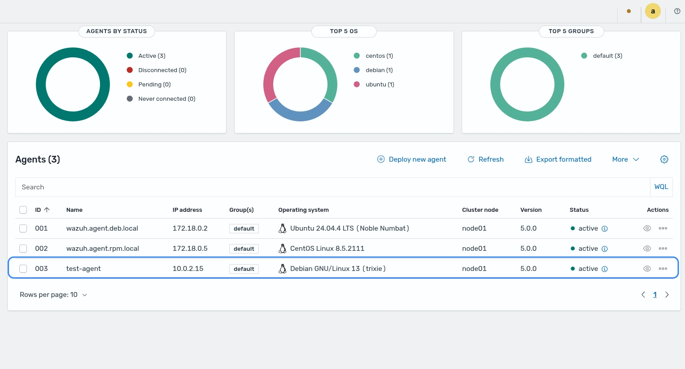

# Agent deploy one-liner (FQDN and group)

The Wazuh dashboard provides a **Deploy new agent** wizard that guides to the user in the process
of installing, registering and initializing an agent in a host.

## Generate the one-liner from the dashboard UI

Use these steps when the deployment command must be obtained through the
interface, for example in end-to-end testing scenarios.

1. Sign in to the Wazuh dashboard and open **Agents management** > **Summary**.
2. Select **Deploy new agent** above the agents table.



3. Choose the operating system and package format that match the endpoint (for example, **Linux** > **DEB amd64**).



4. In **Server address**, enter the hostname or IP address of the Wazuh manager
   the agent will register against. The port and the path prefix sit behind
   **View advanced options** and are only needed when the manager does not
   listen on the defaults.



5. In **Enrollment token**, select **Generate token**. The server mints one for
   the address typed in the previous step, with its own defaults -- a 30 day
   lifetime and unlimited enrollments -- and answers with its identifier and
   expiry.

   The step offers the two ways of obtaining a token as tabs, since they
   exclude each other and only the open one is in effect. **Generate a new
   token** is the tab the step opens on; **Use an existing token** takes a token
   kept from an earlier deployment instead of minting a new one. On the
   generate tab, **View advanced options** opens **Lifetime**, **Enrollments
   allowed** and **Description**, which parameterize the mint request, together
   with the **Embed CA** and **Without credential** flags.

   What was entered on a tab is kept when the other one is opened, so the work
   is not lost by looking at the alternative. The token in hand always belongs
   to the open tab: one obtained on the tab that is closed is set aside, and it
   is restored when that tab is opened again.

6. **Optional configuration** (when required):
   - **Verify the manager certificate**: leave it enabled unless the endpoint
     cannot verify the manager listener. A token install needs no certificate
     authority path: the agent obtains its trust anchor through the token. See
     [Manager certificate verification](#manager-certificate-verification).
   - **Agent name**: define how the agent is identified.
   - **Agent group**: assign the agent to an existing group (for example, `default`).



7. Copy the command generated by the wizard, run it in a terminal session on the endpoint, then enable and start the Wazuh agent service for that platform.




8. Enable and start the Wazuh agent service

Choose the procedure that matches the endpoint operating system.

**Systemd**

```bash
systemctl daemon-reload
systemctl enable wazuh-agent
systemctl start wazuh-agent
```

**SysV init**

RPM-based operating systems:

```bash
chkconfig --add wazuh-agent
service wazuh-agent start
```

Debian-based operating systems:

```bash
update-rc.d wazuh-agent defaults 95 10
service wazuh-agent start
```

**No service manager**

On some systems, start the agent manually:

```bash
/var/ossec/bin/wazuh-control start
```

9. Open **Agents management** > **Summary** again and verify that the agent is listed with the expected status.



## Enrollment token

The wizard does not build the enrollment credentials itself: it asks the server
to mint an **enrollment token** for the address the operator typed
(`POST /agents/enrollment-tokens`) and shows whatever the server answers,
including its refusal when the address is not one of the names in the listener
certificate. **Lifetime**, **Enrollments allowed** and **Description**
parameterize that request only; the description is kept with the token on the
server so it can be told apart from the others when they are listed later, and
none of the three reaches the agent. The token is returned by that response only
and is never listed again, so the deployment command has to be copied before
leaving the page.

An operator who kept a token from an earlier deployment can reuse it on the
**Use an existing token** tab instead of minting a new one. Only the token text is
known in that case -- the manager returns the metadata once, at mint time -- so
the wizard shows neither the address it names nor its expiry, and it is the
manager that refuses an expired or exhausted token at enrollment time. The field
is checked only for what would break the generated command apart, a space or a
single quote, since the manager is what decides whether the text is a token it
issued.

`WAZUH_ENROLLMENT_TOKEN` is the only way the 5.0 agent installer registers an
agent. The token names the manager, pins the certificate authority of the
manager it was minted on, and carries the credential the agent enrolls with, so
the installer takes the manager address and the trust anchor from it. The 4.x
registration variables -- `WAZUH_MANAGER_ENDPOINT`,
`WAZUH_REGISTRATION_PASSWORD`, `WAZUH_REGISTRATION_SERVER` and the rest of the
family -- were removed in 5.0: the installer still reads them, logs that each
one "is not supported in 5.0 and was ignored", and writes nothing. With a token
in hand the wizard therefore emits neither `WAZUH_MANAGER_ENDPOINT` nor
`WAZUH_REGISTRATION_PASSWORD` beside `WAZUH_ENROLLMENT_TOKEN`. See
[Variables removed in 5.0](#variables-removed-in-50).

Editing the server address after generating a token discards it, since the
address the agent would reach comes from the token. A token supplied on the
**Use an existing token** tab is left alone, because it was not minted from
those fields and they say nothing about the manager it names.

The **Optional settings** step still decides whether the endpoint verifies the
manager certificate, with or without a token. See
[Manager certificate verification](#manager-certificate-verification).

A section that holds a value opens by itself rather than hiding it: the port and
the path prefix arrive from the app configuration, so a deployment that sets
them shows them. So does a section holding a field in error, since an error that
cannot be seen cannot be corrected and the deployment commands stay blocked
until it is.

Minting requires the `enrollment_token:create` permission. Where it is missing --
including against a server whose RBAC policy predates the action -- the
**Enrollment token** step is not shown and the wizard falls back to the 4.x
variables, `WAZUH_MANAGER_ENDPOINT` and `WAZUH_REGISTRATION_PASSWORD`. A 5.0
agent installer ignores both, so the command installs the agent but does not
register it: the agent is left with no manager to connect to. Grant the
permission and generate the command again, or register the installed agent
afterwards with a token minted on the manager, as described in the manager
documentation, _Wazuh Manager > Getting Started > Installation > Installing
without a token_.

The tokens the server has minted are listed, revoked and purged in the
[Enrollment tokens](modules/enrollment-tokens/README.md) module, reachable from
**Manage the minted tokens** in this step.

## Manager certificate verification

Enrollment authenticates the agent to the manager, not the manager to the
agent. What establishes that the endpoint is talking to the real manager is the
TLS certificate its listener presents, and the **Optional settings** step
decides how that certificate is verified through two controls, both shown
whether or not the deployment uses an enrollment token:

- **Verify the manager certificate**, enabled by default.
- **Manager CA file path on the endpoint**, shown while verification is
  enabled. It takes the path of a certificate authority already present on the
  endpoint.

A token install needs neither. The token carries a **pin**, the SHA-256 digest
of the public key of the certificate authority that signs the manager's
agent-facing certificate. On its first start the agent fetches that authority
from the manager, checks it against the pin, installs it as its trust anchor at
`etc/certs/root-ca.pem`, and enrolls over a fully verified connection. The
verification mode then resolves to `full` against that anchor, and
`WAZUH_SSL_VERIFICATION` only overrides it.

Three combinations are possible, and each generates a different command:

| Wizard state                           | What the generated command carries                                                                                                                                                                                                                                                                                          |
| -------------------------------------- | --------------------------------------------------------------------------------------------------------------------------------------------------------------------------------------------------------------------------------------------------------------------------------------------------------------------------- |
| Verification enabled, no CA path       | Nothing. After a token install the agent verifies the manager against the trust anchor the token delivered.                                                                                                                                                                                                                 |
| Verification enabled, CA path supplied | `WAZUH_REGISTRATION_CA='<path>'`. This variable was removed in 5.0 and the installer ignores it, so the path has no effect. A token install does not need it; on an agent configured by hand, place the authority at `etc/certs/root-ca.pem` or name it in `<agent><ssl><certificate_authorities>` in `ossec.conf` instead. |
| Verification disabled                  | `WAZUH_SSL_VERIFICATION='none'`, and the CA path input is hidden, since an authority to verify against means nothing once nothing is verified. The agent accepts any certificate the manager presents and the connection can be intercepted, so disable verification in trusted networks only.                              |

`WAZUH_SSL_VERIFICATION` also accepts `full`, `certificate` and `system`, which
the wizard does not generate. `system` suits a manager fronted by a publicly
trusted certificate. See the manager documentation, _Wazuh Manager > Getting
Started > Installation > TLS verification_.

## Notes

Use the manager FQDN as the **Server address** when the agents reach the
manager through DNS. The token is minted for that address, and the manager
refuses to mint one for an address that is not a subject alternative name of
its listener certificate (`remote.https.certificate`); see the manager
documentation, _Wazuh Manager > Modules > Authd > Enrollment tokens_. Add
further variables as needed, for example `WAZUH_AGENT_NAME` or
`WAZUH_AGENT_GROUP`. See [Deployment variables](#deployment-variables).

The agent connects to exactly one manager: there is no server rotation and no
failover between several, so a token names a single manager address rather
than a list. High availability is provided by a load balancer in front of the
managers, which the agent reaches through one address.

The wizard takes the manager address from three separate fields -- address,
port and path prefix -- and sends all three with the mint request, so the
token carries the whole endpoint. The port and the path prefix are optional:
left empty, the agent applies its own defaults, `1517` and `/wazuh-manager/`.
The path prefix must match the manager's `<remote><https><global_prefix>`, or
every request the agent sends answers `404`. **Remember server address** stores
all three, so the next visit is prefilled with the whole endpoint.

## How the download URL and package name are built

The wizard generates the install command at runtime in the browser. The
download URL and package filename change depending on the build stage declared
in the `wazuh-dashboard` repository `VERSION.json`

### Routing rules

| Stage value                     | Repository                                                    | Package name                                                         |
| ------------------------------- | ------------------------------------------------------------- | -------------------------------------------------------------------- |
| Starts with `alpha` or `beta`   | `https://packages-staging.xdrsiem.wazuh.info/pre-release/5.x` | Includes `-{stage}` suffix. e.g. `wazuh-agent_5.0.0-beta3_amd64.deb` |
| `rc`, empty, or any other value | `https://packages.wazuh.com/production/5.x`                   | No suffix. e.g. `wazuh-agent_5.0.0_amd64.deb`                        |

The detection is case-insensitive prefix matching on the `stage` field.
Anything that is not clearly `alpha` or `beta` defaults to the production
repository as a safe fallback.

### Stage value source

The `stage` field originates from `VERSION.json` at the `wazuh-dashboard` repository and is
injected into the browser at startup via the dashboards plugin
lifecycle (`initWazuhBuildInfoFromCore`).

To test a different routing locally, change `"stage"` in `VERSION.json` before
starting the dev server:

```json
{ "version": "5.0.0", "stage": "rc1" }
```

## References

### Deployment variables

The 5.0 agent installer reads the variables below. The wizard generates
`WAZUH_ENROLLMENT_TOKEN`, `WAZUH_SSL_VERIFICATION`, `WAZUH_AGENT_NAME` and
`WAZUH_AGENT_GROUP`; the others can be added to the command by hand. The
manager documentation is the reference for the installer: _Wazuh Manager >
Getting Started > Installation > Options_.

| Option                    | Description                                                                                                                                                                                                                                                                                                                        |
| ------------------------- | ---------------------------------------------------------------------------------------------------------------------------------------------------------------------------------------------------------------------------------------------------------------------------------------------------------------------------------- |
| WAZUH_ENROLLMENT_TOKEN    | The enrollment token minted on the manager, and the only way to register an agent. It names the manager, pins its certificate authority and carries the enrollment credential. The installer writes the address it carries into `<agent><manager><endpoint>` and leaves the token for the agent to enroll with on its first start. |
| WAZUH_SSL_VERIFICATION    | Writes `<agent><ssl><verification_mode>`: one of `full`, `certificate`, `system` or `none`. Omitted, a token install verifies the manager in `full` mode against the trust anchor the token delivered. The wizard generates only `none`, which leaves the connection open to interception.                                         |
| WAZUH_AGENT_NAME          | Designates the Wazuh agent's name. By default, it will be the computer name.                                                                                                                                                                                                                                                       |
| WAZUH_AGENT_GROUP         | Assigns the Wazuh agent to one or more existing groups (separated by commas).                                                                                                                                                                                                                                                      |
| WAZUH_KEEP_ALIVE_INTERVAL | Sets the time, in seconds, between the Wazuh agent keep-alive notifications to the Wazuh manager.                                                                                                                                                                                                                                  |
| WAZUH_TIME_RECONNECT      | **No effect.** Targets `<agent><time-reconnect>`, an option that is deprecated and ignored in 5.0.                                                                                                                                                                                                                                 |
| ENROLLMENT_DELAY          | Assigns the time, in seconds, that the agent waits after a successful enrollment before its first connection attempt.                                                                                                                                                                                                              |

### Variables removed in 5.0

The enrollment token replaced the whole registration family. The installer
still reads the names below, so a 4.x-era command or an untouched playbook is
told what happened, but none of them writes anything:

```console
wazuh-agent: WAZUH_MANAGER_ENDPOINT is not supported in 5.0 and was ignored: registration is configured by WAZUH_ENROLLMENT_TOKEN alone; this variable no longer has any effect.
```

A command that relies on them installs the agent but leaves it unregistered.

| Removed variable                                           | Replacement                                                                                                                                         |
| ---------------------------------------------------------- | --------------------------------------------------------------------------------------------------------------------------------------------------- |
| `WAZUH_MANAGER_ENDPOINT`                                   | `WAZUH_ENROLLMENT_TOKEN`: the manager address travels inside the token.                                                                             |
| `WAZUH_REGISTRATION_PASSWORD`                              | `WAZUH_ENROLLMENT_TOKEN`: the token carries its own credential, scoped and revocable.                                                               |
| `WAZUH_REGISTRATION_SERVER`, `WAZUH_REGISTRATION_PORT`     | Nothing. Enrollment uses the manager's own HTTPS endpoint; there is no separate enrollment listener to address.                                     |
| `WAZUH_REGISTRATION_CA`                                    | Nothing on a token install, since the trust anchor arrives with the token. On an agent configured by hand, `<agent><ssl><certificate_authorities>`. |
| `WAZUH_REGISTRATION_CERTIFICATE`, `WAZUH_REGISTRATION_KEY` | `<agent><ssl><certificate>` and `<agent><ssl><key>` in `ossec.conf`.                                                                                |

The manager documentation lists every removed name, including the older
aliases and the Windows MSI spellings: _Wazuh Manager > Getting Started >
Installation > Variables removed in 5.0_.
