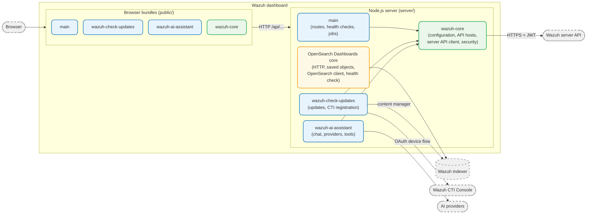

# Architecture

The Wazuh dashboard is built on top of [OpenSearch Dashboards](https://opensearch.org/docs/latest/dashboards/)
and extends it with a set of plugins that provide the Wazuh user interface, the connection to the
Wazuh server API, update notifications and the AI assistant. This repository holds four of those
plugins. The platform itself, the fork of OpenSearch Dashboards the plugins are installed into, is
the `wazuh-dashboard` repository.

## Component overview

The four plugins are loaded by OpenSearch Dashboards like any other plugin. Each one has a browser
side and a server side, and each one declares the plugins it needs in its
`opensearch_dashboards.json` manifest. OpenSearch Dashboards loads them in dependency order, so
`wazuh-core` is always set up and started before the plugins that depend on it.

## Plugins

| Folder                        | Plugin id           | Depends on                            | Role                                                                                    |
| ----------------------------- | ------------------- | ------------------------------------- | --------------------------------------------------------------------------------------- |
| `plugins/wazuh-core`          | `wazuhCore`         | —                                     | Shared services: configuration, Wazuh server API hosts and client, security abstraction |
| `plugins/wazuh-check-updates` | `wazuhCheckUpdates` | `wazuhCore`                           | Available-updates notification and CTI registration                                     |
| `plugins/main`                | `wazuh`             | `wazuhCore`, `wazuhCheckUpdates`      | The Wazuh application: overview, agents, modules, server management, Dev Tools          |
| `plugins/wazuh-ai-assistant`  | `wazuhAiAssistant`  | `wazuhCore` (and `wazuh` as optional) | AI assistant chat over Wazuh indexer and Wazuh server API data                          |

### wazuh-core

`wazuh-core` is the base plugin. It provides no application of its own; instead it exposes
services that the other plugins consume through its `setup()` and `start()` contracts.

- **Configuration**: reads the `wazuh_core.*` settings from `opensearch_dashboards.yml` and
  registers the user-editable settings as OpenSearch Dashboards advanced settings. The same
  `Configuration` service, in `common/`, backs both the server and the browser. See
  [Configuration](configuration.md).
- **API hosts** (`ManageHosts`): holds the Wazuh server API hosts defined in
  `wazuh_core.hosts` and caches, per host, the data read from the server API itself: the cluster
  and node names, whether the configured user can use `run_as`, and whether the CA is verified.
  The cache is filled in the background at start, so an unreachable host does not block the
  dashboard from starting.
- **Server API client** (`ServerAPIClient`): authenticates against each host and sends requests
  to it over HTTPS, with the client certificates configured for that host. It offers two clients:
  `asInternalUser`, which uses the credentials in `wazuh_core.hosts` and caches the token per
  host, and `asScoped`, which uses the token of the current browser session.
- **Dashboard security**: a factory that answers "who is the current user" and "is this user a
  Wazuh administrator". It uses the OpenSearch security plugin when `securityDashboards` is
  installed and a default implementation otherwise.

On the server, `wazuh-core` also registers the `wazuh_core` route handler context, so any route of
any plugin reaches the server API client as `context.wazuh_core.api.client.asCurrentUser`.

### wazuh-check-updates

`wazuh-check-updates` provides two features:

- **Available updates**: checks the latest published Wazuh version through the content manager
  of the Wazuh indexer (`GET /_plugins/_content_manager/version/check`), stores the result in a
  shared saved object and exposes the `UpdatesNotification` component that `main` renders at the
  bottom of the interface. See [Available Updates](modules/available-updates.md).
- **CTI registration**: registers the environment with the Wazuh CTI Console through the OAuth
  2.0 device authorization grant, then hands the resulting subscription to the content manager of
  the Wazuh indexer (`/_plugins/_content_manager/subscription`). The browser side exposes the
  `CtiRegistration` header control, which `main` mounts when `ctiRegistrationUiEnabled` is set.

Its server routes live under `/api/wazuh-check-updates/`.

### main

`main` (plugin id `wazuh`) is the Wazuh application. Its browser side registers the Wazuh
applications in the OpenSearch Dashboards navigation, grouped in categories such as **Home**,
**Endpoint security**, **Threat intelligence**, **Security operations**, **Cloud security**,
**Agents management** and **Server management**, and renders them with React, Redux and EUI. Its server side:

- Registers the routes the application calls: the Wazuh server API proxy (`/api/login`,
  `/api/request`, `/api/csv`, `/api/check-api`, `/api/check-stored-api`), the Wazuh indexer
  helpers (`/elastic/...`, `/indexer/...`) and the host listing (`/hosts/apis`).
- Registers the health checks that validate the server API connection and `run_as`, report the
  server certificate validity, create the index patterns, provision the bundled dashboards and
  visualizations, and create the default notification channels. See
  [Health check](modules/healthcheck.md).
- Runs two jobs at start: an initialization job that logs the environment and ensures the
  OpenSearch Dashboards index and its template exist, and an in-memory queue, scheduled with
  `node-cron`, that sends the server API requests a user asked to delay.
- Adds the `x-frame-options`, `x-content-type-options` and, over HTTPS,
  `strict-transport-security` headers to every response.

`main` also integrates with the optional plugins it lists in its manifest (security,
notifications, alerting, reporting), which come from other repositories. See
[Related plugins](#related-plugins).

### wazuh-ai-assistant

`wazuh-ai-assistant` is a self-contained plugin with its own application, settings and saved
objects. The browser renders the chat and streams the answer; every provider call, tool
execution and guardrail runs on the server, which queries the Wazuh indexer and the Wazuh server
API as the current user. It declares `wazuh` as optional: it joins the **Home** navigation
category that `main` also uses, and works without it. See
[AI Assistant > Architecture](modules/ai-assistant/architecture.md).

## Plugin layers

Every plugin is split into three folders that are bundled separately:

| Folder    | Runs in             | Contents                                                                          |
| --------- | ------------------- | --------------------------------------------------------------------------------- |
| `public/` | Browser             | React components, Redux state, client services, calls to the server through HTTP  |
| `server/` | Node.js             | Routes, controllers, health checks, background jobs, clients to external services |
| `common/` | Browser and Node.js | Constants, types and pure services shared by both sides                           |

The layers never import each other across the browser/server boundary: `public/` and `server/`
both import from `common/`, and they talk to each other only over HTTP. Code shared between
plugins goes through the `setup()` and `start()` contracts of the providing plugin, layer to layer
(`public/` to `public/`, `server/` to `server/`).

## Communication between plugins

Plugins share code and state through two mechanisms, both provided by OpenSearch Dashboards:

- **Lifecycle contracts**: the object a plugin returns from `setup()` or `start()` is handed to
  every plugin that lists it in `requiredPlugins` or `optionalPlugins`. For example, `main` reads
  `plugins.wazuhCore` for the configuration and the server API client, and
  `plugins.wazuhCheckUpdates.CtiRegistration` for the CTI registration header control.
- **Route handler contexts**: a server plugin can attach values to the `context` argument of
  every route handler. `wazuh-core` registers `context.wazuh_core`, `main` registers
  `context.wazuh`, and `wazuh-check-updates` registers `context.wazuh_check_updates`.

## Data flows

1. **Server API session**: when the user opens the Wazuh application, the browser calls
   `POST /api/login` with the selected host. The server authenticates against
   `POST /security/user/authenticate` of that host, or against
   `POST /security/user/authenticate/run_as` with the current user's authentication context when
   `run_as` is enabled and allowed, and returns the token in the `wz-token` cookie, together with
   `wz-user` and `wz-api`. All three cookies are `HttpOnly`. See
   [Session cookies](configuration.md#session-cookies).
2. **Server API request**: the browser does not reach the Wazuh server API directly. `main` sends
   every request through `WzRequest` to `POST /api/request`, with the host, method, path and body.
   The route validates the request and forwards it with
   `context.wazuh_core.api.client.asCurrentUser`, which reads the token from the `wz-token` cookie.
   The server API applies its own RBAC to that token, so the user sees only what their Wazuh role
   allows.
3. **Wazuh indexer query**: dashboards, visualizations and the Discover-based views query the
   Wazuh indexer through the OpenSearch Dashboards data plugin, which sends the search to the
   dashboard server and from there to the indexer as the current user. The indexer security
   plugin applies the user's roles and tenant. Index patterns for every Wazuh index (events,
   findings, states, metrics, active responses) are created by the health check.
4. **Health check at start**: OpenSearch Dashboards runs the checks registered by `main` under
   the dashboard internal user. A failing critical check keeps the dashboard in the "not ready
   yet" view until it is solved, and the checks are repeated on a schedule afterward. See
   [Health check](modules/healthcheck.md).
5. **Available updates**: the notification asks `GET /api/wazuh-check-updates/updates`. The
   server queries the content manager of the Wazuh indexer as the dashboard internal user and
   stores a successful result in a saved object shared by every user. See
   [Available Updates](modules/available-updates.md).
6. **AI assistant chat turn**: the browser posts the conversation to the chat route and reads the
   answer as a stream. The server calls the configured AI provider, runs the tools the model
   requests against the Wazuh indexer and the Wazuh server API as the current user, and streams
   the answer and result tables back. See
   [AI Assistant > Architecture](modules/ai-assistant/architecture.md).

## Persistence

The plugins keep no database of their own. What they store lives in the Wazuh indexer, in the
OpenSearch Dashboards index, as saved objects:

| Saved object                                  | Plugin                | Contents                                                          |
| --------------------------------------------- | --------------------- | ----------------------------------------------------------------- |
| `index-pattern`, `visualization`, `dashboard` | `main`                | Index patterns and bundled dashboards created by the health check |
| `wazuh-check-updates-available-updates`       | `wazuh-check-updates` | Last successful result of the available-updates check (hidden)    |
| `wazuh-check-updates-user-preferences`        | `wazuh-check-updates` | Per-user preferences, such as a dismissed notification (hidden)   |
| `wazuh-ai-assistant-provider`                 | `wazuh-ai-assistant`  | Configured AI providers (hidden)                                  |
| `wazuh-ai-assistant-settings`                 | `wazuh-ai-assistant`  | Assistant settings (hidden)                                       |
| `wazuh-ai-assistant-conversation`             | `wazuh-ai-assistant`  | Conversations, scoped to their owner (hidden)                     |

Hidden types are not listed in **Saved objects** management and are not exported from there, so
they are backed up with the OpenSearch Dashboards index, at the index or snapshot level.

The Wazuh server API hosts are not saved objects: they are read from `wazuh_core.hosts` in
`opensearch_dashboards.yml`, with passwords optionally stored in the OpenSearch Dashboards
keystore.

## Related plugins

The Wazuh dashboard also ships plugins that are developed in their own repositories: security,
alerting, notifications, reporting and security analytics. `main` lists some of them as optional
plugins and integrates with them when they are installed, for example to create the default
notification channels and sample monitors. The local development environment in
`docker/osd-dev` can mount those repositories next to the plugins of this one; its options are
described in `docker/osd-dev/README.md`. See [Run from Sources](../dev/run-sources.md).
