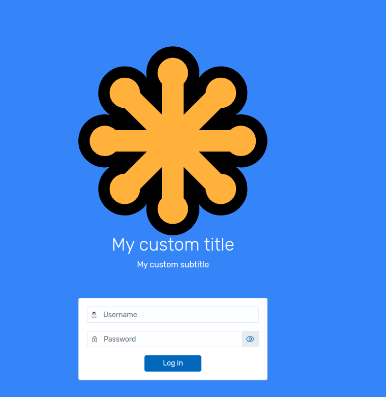

# Custom branding

This guide summarizes how to replace logos and branding assets in the Wazuh
dashboard.

## UI

### Loading and header logos

Edit `opensearch_dashboards.yml` and set the branding URLs:

```yml
opensearchDashboards.branding:
  logo:
    defaultUrl: 'https://domain.org/default-logo.png'
    darkModeUrl: 'https://domain.org/dark-mode-logo.png'
  loadingLogo:
    defaultUrl: 'https://domain.org/default-logo.png'
    darkModeUrl: 'https://domain.org/dark-mode-logo.png'
  mark:
    defaultUrl: 'https://domain.org/default-logo.png'
    darkModeUrl: 'https://domain.org/dark-mode-logo.png'
```

- **logo**: home and expaneded header logo.
- **loadingLogo**: logo used while loading.
- **mark**: used in other views.

Restart the service after changes:

```bash
systemctl restart wazuh-dashboard
```

Home logo:


Expanded header logo:

> visible when `opensearchDashboards.branding.useExpandedHeader: true`


## Application title

Edit `opensearch_dashboards.yml` and set the branding URLs:

```yml
opensearchDashboards.branding:
  applicationTitle: 'my custom application'
```

> This sets the tab name. Some applications in the Wazuh dashboard could redefine the tab name.

Restart the service after changes:

```bash
systemctl restart wazuh-dashboard
```


## Favicon

Edit `opensearch_dashboards.yml` and set the branding URLs:

```yml
opensearchDashboards.branding:
  faviconUrl: 'https://domain.org/favicon.png'
```

Restart the service after changes:

```bash
systemctl restart wazuh-dashboard
```


### Login page

#### Basic authentication

```yml
opensearch_security.ui.basicauth:
  login:
    title: 'My custom title' # Define the title, displayed under the logo
    subtitle: 'My custom subtitle' # Define a subtitle
    showbrandimage: true # Enable or disable if the logo should be displayed
    brandimage: 'https://domain.org/login_logo.png' # Customize the logo
    buttonstyle: '' # class name to apply to the button, the class should be defined by some style file
```

Restart the service after changes:

```bash
systemctl restart wazuh-dashboard
```



<!--
#### Provider authentication

TODO: define settings for SSO, refer to: https://github.com/wazuh/wazuh-security-dashboards-plugin/blob/main/server/index.ts#L258-L281

-->

# Reporting

## Wazuh app custom logos

If the App Settings UI is available in your build:

1. Open **Dashboard management** > **App Settings**.
2. Set the following properties in the Custom branding section:

- `customization.logo.app`
- `customization.logo.healthcheck`
- `customization.logo.reports`

Assets are stored in:
`/usr/share/wazuh-dashboard/plugins/wazuh/public/assets/custom/images/`

> Note: In-file `customization.logo.*` settings are deprecated. Use the UI to
> update these values. If the App Settings UI is not present in your version,
> rely on the `opensearchDashboards.branding` settings only.
