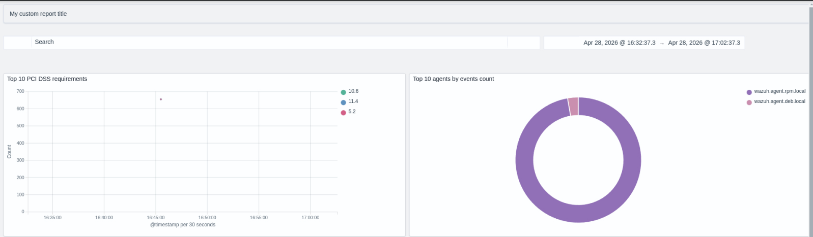

# Custom branding

This guide summarizes how to replace logos and branding assets in the Wazuh
dashboard.

## UI

<!-- Reference: https://docs.opensearch.org/3.6/dashboards/branding/ -->

### Loading and header logos

Edit `opensearch_dashboards.yml` and set the branding URLs:

```yml
opensearchDashboards.branding:
  logo:
    defaultUrl: 'https://domain.org/default-logo.png'
    darkModeUrl: 'https://domain.org/dark-mode-logo.png'
  loadingLogo:
    defaultUrl: 'https://domain.org/default-logo.png'
    darkModeUrl: 'https://domain.org/dark-mode-logo.png'
  mark:
    defaultUrl: 'https://domain.org/default-logo.png'
    darkModeUrl: 'https://domain.org/dark-mode-logo.png'
```

- **logo**: home and expanded header logo. Allowed formats: PNG, GIF, SVG.
- **loadingLogo**: logo used while loading. Allowed formats: PNG, GIF, SVG.
- **mark**: used in other views. Allowed formats: PNG, GIF, SVG.

Restart the service after changes:

```bash
systemctl restart wazuh-dashboard
```

Home logo:


Expanded header logo:

> visible when `opensearchDashboards.branding.useExpandedHeader: true`


## Application title

Edit `opensearch_dashboards.yml` and set the branding URLs:

```yml
opensearchDashboards.branding:
  applicationTitle: 'my custom application'
```

> This sets the tab name. Some applications in the Wazuh dashboard could redefine the tab name.

Restart the service after changes:

```bash
systemctl restart wazuh-dashboard
```


## Favicon

Edit `opensearch_dashboards.yml` and set the branding URLs:

```yml
opensearchDashboards.branding:
  faviconUrl: 'https://domain.org/favicon.png'
```

Allowed formats: PNG, GIF, SVG.

Restart the service after changes:

```bash
systemctl restart wazuh-dashboard
```


### Login page

#### Basic authentication

```yml
opensearch_security.ui.basicauth:
  login:
    title: 'My custom title' # Define the title, displayed under the logo
    subtitle: 'My custom subtitle' # Define a subtitle
    showbrandimage: true # Enable or disable if the logo should be displayed
    brandimage: 'https://domain.org/login_logo.png' # Customize the logo
    buttonstyle: '' # CSS class name to apply to the button, the class should be defined by some style file
```

Restart the service after changes:

```bash
systemctl restart wazuh-dashboard
```


<!--
#### Provider authentication

TODO: define settings for SSO, refer to: https://github.com/wazuh/wazuh-security-dashboards-plugin/blob/main/server/index.ts#L258-L281

-->

# Reporting

The PDF reports can be customized through a report definition that allows to define a custom header and footer.

1. Go to **Explore** > **Reporting**
2. Click on **Create** button.
3. Define the report name and description, source and other settings.
4. In the **Report definition** section, click on the **Add header** option to customize it.

> ⚠️ The UI allows to configure the footer using the **Add footere** button but the generated report does not include the footer. This is a known issue.

<!-- Footer known issue: https://github.com/opensearch-project/dashboards-reporting/issues/53-->

For example, for the header, you can add the following HTML code to set a custom title:

```html
<p><strong>My custom report title</strong></p>
```

5. Click on the **Save** button to save the report definition and click on the **Generate** button to create a report with the custom header and footer.



# Host the images in the dashboard server

To host the images in the dashboard server, place them in the `src/core/server/core_app/assets` folder of the Wazuh dashboard installation. For example, if you place an image named `custom-logo.png` in the `src/core/server/core_app/assets` folder, you can reference it in the configuration as follows:

```yml
opensearchDashboards.branding:
  logo:
    defaultUrl: '/ui/custom-logo.png'
    darkModeUrl: '/ui/custom-logo.png'
```

> The files should have the permissions of the Wazuh dashboard server user.

From the root of the Wazuh dashboard installation, run the following command to set the correct ownership for the images:

```bash
chown wazuh-dashboard:wazuh-dashboard src/core/server/core_app/assets/custom-logo.png
```

After placing the images and updating the configuration, restart the Wazuh dashboard service to apply the changes.

```bash
systemctl restart wazuh-dashboard
```

> ⚠️ The images hosted in the dashboard server could be lost in the upgrades. Ensure to take a backup of the images and reapply them after the upgrade if necessary.
