# Active Response

The **Active Response** module automates remediation actions on Wazuh agents when an alert meets a condition. Typical use cases include blocking an offending IP, isolating a compromised host, killing a suspicious process, or running a custom containment action.

The feature is fully integrated with the Wazuh Dashboard: each active response is defined from the **Active Responses** view (under **Explore**), invoked from an **Alerting** monitor trigger, and audited from **Discover**.

This module exposes the following views:

- **Active responses** — Lists the active responses available, with filters by status, location, and type.
- **Create / Edit active response** — Form used to define an active response (executable, type, location, timeout).
- **Active response details** — Per-entry view that shows the configuration in read-only mode, the current status (`Active` / `Muted`), a **Mute active response** / **Unmute active response** button, and an **Actions** menu with **Edit** and **Delete**.
- **Alerting integration** — The **Add active response** action inside a Per document monitor trigger.

---

## Concepts

### Active responses

An **active response** is an entry in the Active Responses view that describes a remediation: **what** to run, **how** to run it, and **where**. It is kept strictly separate from generic notifications (Slack, Email, Webhook): Alerting triggers expose two distinct selectors — one for notifications and one for active responses — and an entry never crosses over.

Each active response has the following fields:

| Field                | Description                                                                            |
| -------------------- | -------------------------------------------------------------------------------------- |
| **Name**             | Visible identifier. Required, must not be empty.                                       |
| **Description**      | Free-form description. Optional.                                                       |
| **Executable**       | Name or path of the executable to run on the target agent. Required.                   |
| **Extra arguments**  | Free-form string passed to the executable. Optional.                                   |
| **Type**             | `Stateless` (run once) or `Stateful` (run and revert after a timeout).                 |
| **Stateful timeout** | Integer in seconds. Only applies when `Type = Stateful`. Must be `> 0`. Default `180`. |
| **Location**         | `All`, `Defined agent`, or `Local`. Default `Local`.                                   |
| **Agent ID**         | Numeric agent identifier. Only applies when `Location = Defined agent`.                |

### Stateful vs stateless

A **stateless** active response runs the action once and does not revert anything. A **stateful** active response runs the action, waits `Stateful timeout` seconds, and then asks the agent to **revert** it (for example, unblocking an IP that had been blocked).

| Mode          | When to use it                                                              | Main risk                                                                  |
| ------------- | --------------------------------------------------------------------------- | -------------------------------------------------------------------------- |
| **Stateless** | Definitive or idempotent actions (kill process, notify, restart).           | If fired on a false positive, there is no automatic reversal.              |
| **Stateful**  | Temporary enforcement with automatic reversal (block an IP for 10 minutes). | Works only if the action itself supports reversal; ask your administrator. |

> **Important:** `Stateful timeout` is expressed in **seconds**. Ask your administrator to verify, in a non-production environment, that the chosen executable can be both applied and reverted before enabling it in production.

### Location and targeting

The **Location** field controls where the command is executed:

- **All** — Every agent in the environment must run the script. Use this option with caution. Incorrect configuration can cause problems in your environment.
- **Defined agent** — The command is always executed on the agent whose numeric ID is set in the **Agent ID** field.
- **Local** — The command is executed on the agent that generated the event.

### About the executable

The Active Responses view only references the executable by name; the executable itself is managed on the agent side, outside the dashboard. If you are not sure whether a given executable is available on the target agent, check with your administrator before using it in production.

### Alerting integration

An active response does not run on its own. It is invoked from a **trigger** inside an Alerting monitor. The monitor type **must** be _Per document_; no other monitor type exposes the **Add active response** button.

When the trigger fires, the active response action does the following:

1. A record of the execution is written to the `wazuh-active-responses*` index, which you can inspect from **Discover**.
2. The manager picks it up within about one minute and forwards the command to the target agent.
3. The target agent carries out the action.

Execution records are retained for **3 days** by default. For longer forensic retention, ask your administrator to adjust the retention policy or export the records to another index.

---

## Use Case: Creating an active response

The following walkthrough shows how to create an active response that blocks the offending IP for 10 minutes when an SSH brute-force alert fires, and automatically unblocks it afterwards.

**Prerequisites:**

- Wazuh indexer, manager, and dashboard running version **5.0.0** or later.
- The `wazuh-active-responses*` index pattern available in **Stack Management → Index Patterns**. The dashboard creates it automatically at startup; contact your administrator if it is missing.

> **Note:** creating the active response only stores the executable name. For the remediation to actually run when the monitor fires, the executable must be available on the target agent — see [Concepts → About the executable](#about-the-executable).

---

### Step 1: Open the Active Responses view

Inside the Wazuh Dashboard, open the side menu (top-left hamburger icon), expand **Explore**, and select **Active Responses**.


If no active responses have been created yet, the view shows an empty state with a **Create active response** button. Otherwise, the main screen is the list of existing active responses (see [Step 5](#step-5-verify-the-active-response-in-the-list)).

---

### Step 2: Open the creation form

Click **Create active response**. The form is organized in two panels: **Name and description** and **Configurations**.

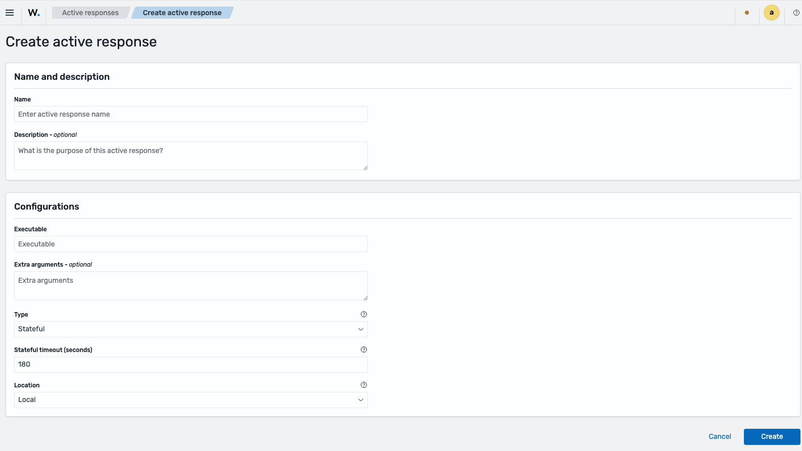

---

### Step 3: Fill the **Name and description** panel

- **Name** — required. For this example: `block-ip-10min`. An empty value shows the error `Active response name cannot be empty.`
- **Description** — optional. For this example: `Blocks the offending IP for 10 minutes via firewalld`.

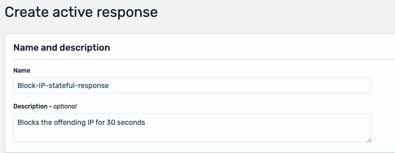

---

### Step 4: Fill the **Configurations** panel

Complete the fields in order:

- **Executable** — `firewalld-drop`. Required. An empty value shows the error `Executable name cannot be empty.`
- **Extra arguments** — leave empty for this example. Optional.
- **Type** — select `Stateful`. This makes the **Stateful timeout (seconds)** field appear.
- **Stateful timeout (seconds)** — `600` (ten minutes). Default: `180`. Validations: non-numeric values show `Stateful timeout must be a number.`; values `≤ 0` show `Stateful timeout must be greater than 0.`
- **Location** — select `All`. Default: `Local`. Switching to `Defined agent` makes the **Agent ID** field appear; it accepts only digits.

> **Important:** **Stateful timeout** and **Agent ID** are conditional. If you don't see them, check the value of **Type** or **Location** respectively.


The **Type** dropdown lets you choose between `Stateless` and `Stateful`:

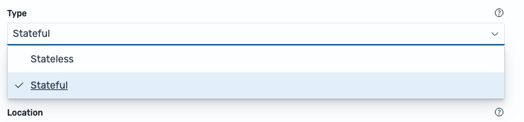

The **Location** dropdown exposes the three targeting modes:

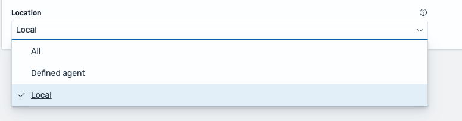

Selecting `Defined agent` reveals the **Agent ID** field, which must be a numeric agent identifier:

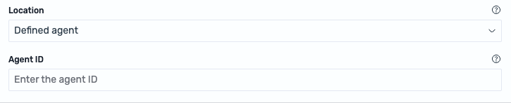

Selecting `Stateless` hides the **Stateful timeout** field, since it no longer applies:

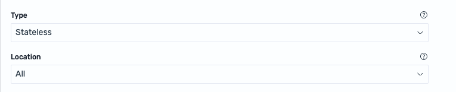

> **Note:** the **Extra arguments** field is also labeled **Extra args** on the details page, and appears as `extra_arguments` when you inspect an execution record in **Discover**. They all refer to the same value.

---

### Step 5: Verify the active response in the list

Click **Create**. If any field is invalid, the toast `Some fields are invalid. Fix all highlighted error(s) before continuing.` is shown. When validation succeeds, a confirmation toast `Active response <name> successfully created.` appears and you are returned to the list.

The list exposes five columns: **Name**, **Status**, **Location**, **Type**, and **Description**. The filters above the table let you narrow results by **Status** (`Active` / `Muted`), **Location** (`All` / `Defined agent` / `Local`), and **Type** (`Stateful` / `Stateless`).

> **Note:** an active response with `Status = Muted` remains selectable inside triggers but will not execute until unmuted. Muting is a safer way to pause one temporarily than deleting it.

---

### Step 6: Inspect, edit, mute, or delete an active response

Clicking the **Name** in the list opens the details page. The header shows the name, the current status badge (`Active` / `Muted`), an **Actions** dropdown and a **Mute active response** / **Unmute active response** button. Below the header, two read-only panels reproduce the configuration:

- **Name and description** — shows **Active Response name**, **Description**, and **Last updated**.
- **Configurations** — shows **Executable**, **Extra args**, **Type**, **Location**, and (when applicable) **Stateful timeout** or **Agent ID**.

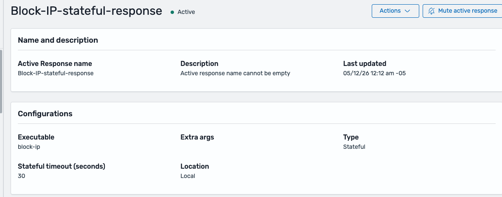

Available actions from this page:

- **Mute active response / Unmute active response** (header button) — toggles the status. Muting opens a confirmation dialog: _"This active response will stop sending responses to its recipients. However, the active response will remain available for selection."_
- **Actions → Edit** — opens the edit form with the current values pre-filled.
- **Actions → Delete** — opens a confirmation dialog that requires typing the literal word `delete` before the confirmation button is enabled.

> **Important:** deleting an active response does **not** remove references to it from Alerting. Any trigger that still points to the deleted entry becomes a broken action. Review your monitors after every deletion, or prefer **Mute** for short pauses.

---

## Use Case: Attaching an active response to a monitor trigger

The active response created above only runs when an Alerting trigger invokes it. This walkthrough connects `block-ip-10min` to a Per document monitor that detects SSH brute-force attempts.

**Prerequisites:** the `block-ip-10min` active response exists and has `Status = Active`.

---

### Step 1: Open Alerting and create a monitor

Navigate to **Alerting → Monitors → Create monitor**. If no monitors exist yet, the Alerts tab looks like this:

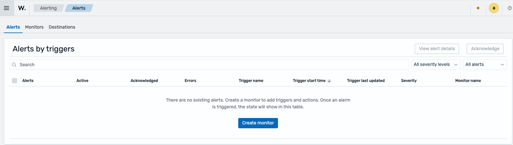

---

### Step 2: Select **Per document monitor**

In the **Monitor type** selector, choose **Per document monitor**. This is mandatory: any other monitor type (Per query, Per bucket, Per cluster metrics, Composite) will hide the **Add active response** button in the trigger step.

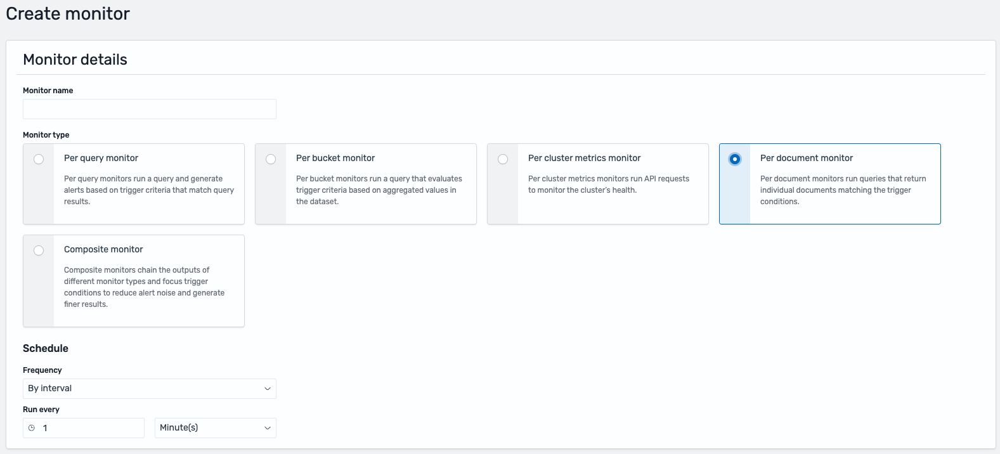

Give the monitor a name and pick a **Schedule** (for example, `By interval`, every `1` minute).

---

### Step 3: Configure the data source

Under **Select data**, pick the index or alias that holds the alerts to watch. For this example, select `wazuh-alerts-*` (or a more specific alias, such as the one that carries authentication events).

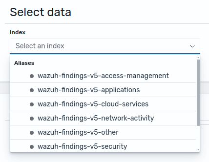

---

### Step 4: Define the query

In the **Query** section, describe the conditions that the incoming alerts must meet. Typical fields used for SSH brute-force detection are `wazuh.agent.name`, `rule.level`, and `data.srcip`. Add a **Query name** (required) and fill the **Field**, operator, and **Search term**.

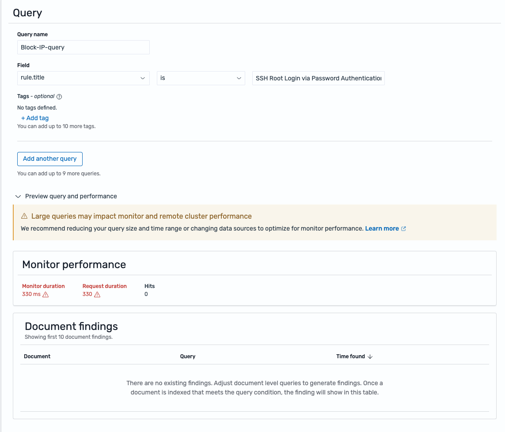

> **Tip:** use **Preview query and performance** to confirm the query returns the expected document shape before moving on.

---

### Step 5: Add a trigger with an active response action

Click **Add trigger**. In the trigger editor, scroll to the **Actions** section: two buttons are available — **Add notification** (generic notifications) and **Add active response** (active responses).

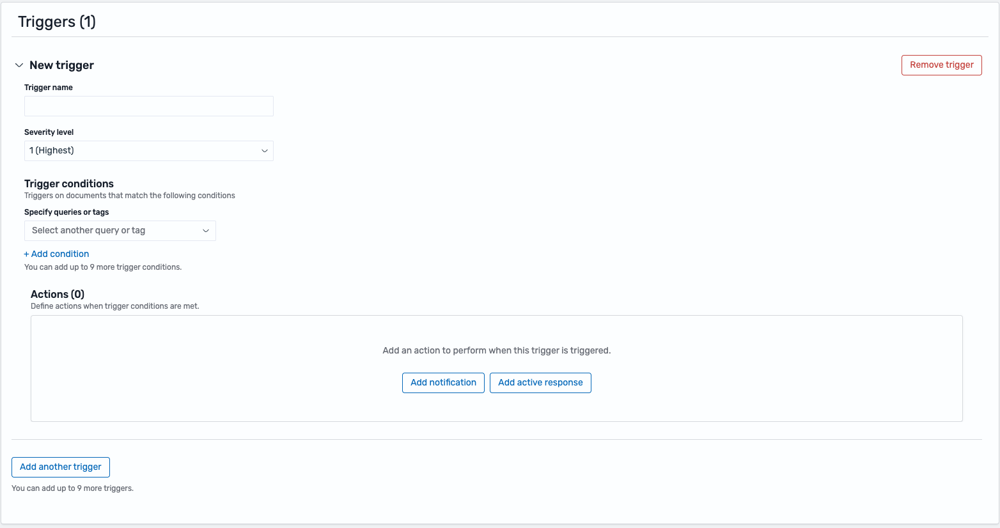

Click **Add active response**. The action exposes:

- A required **Action name** (letters, numbers, and special characters only).
- An **Active response** selector with the placeholder `Select active response to execute`.
- A **Manage active responses** button that opens the Active Responses view in a new tab.

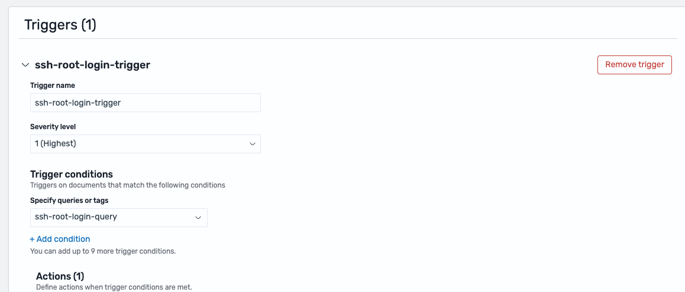

Open the **Active response** dropdown and pick the one created earlier. The dropdown only lists active responses and labels them with the `[Active response]` prefix.

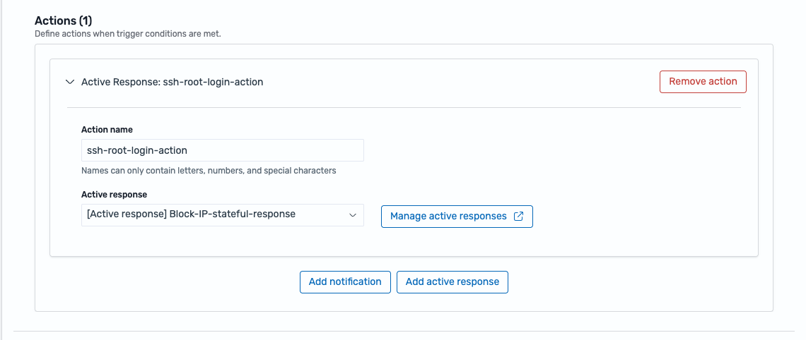

> **Important:** if the action has nothing selected in the **Active response** field, Alerting blocks the save with a validation error. Always confirm an active response is selected before saving.

---

### Step 6: Save the monitor

Save the monitor. The overview page summarizes the configuration, the triggers, the history, and any alerts produced so far.

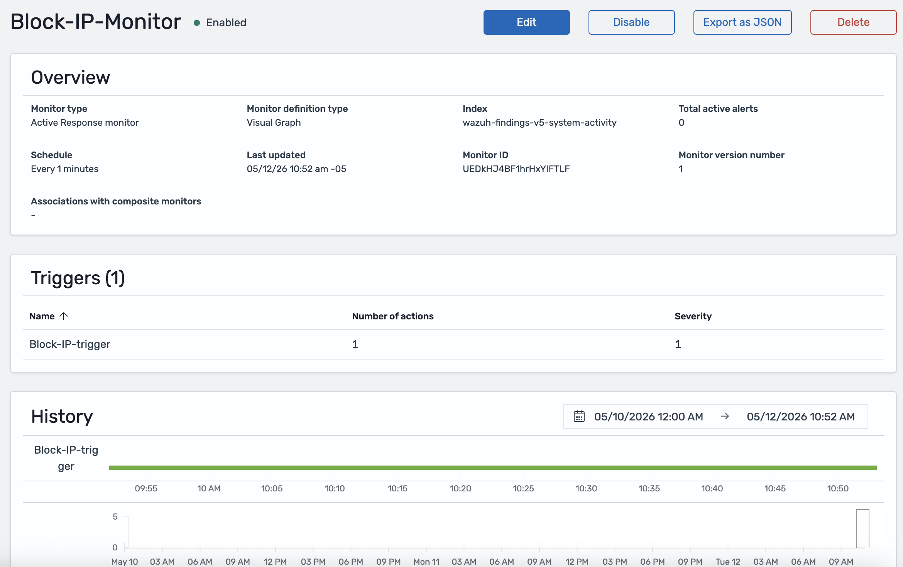

The action automatically wires the triggering alert to the active response, so there is nothing else to configure on the trigger side.

> **Note:** a single trigger can contain several **Add active response** actions. Each one produces an independent execution record in **Discover** and runs separately.

---

## Use Case: Monitoring active response executions

Every time an active response fires, two traces are produced: an execution record in **Discover** (under the `wazuh-active-responses*` index pattern) and an entry in `/var/ossec/logs/active-responses.log` on the target agent.

---

### Step 1: Inspect the execution record in Discover

Open **Discover** and select the `wazuh-active-responses*` index pattern from the index selector. Before any trigger has fired, the view is empty — that is expected.

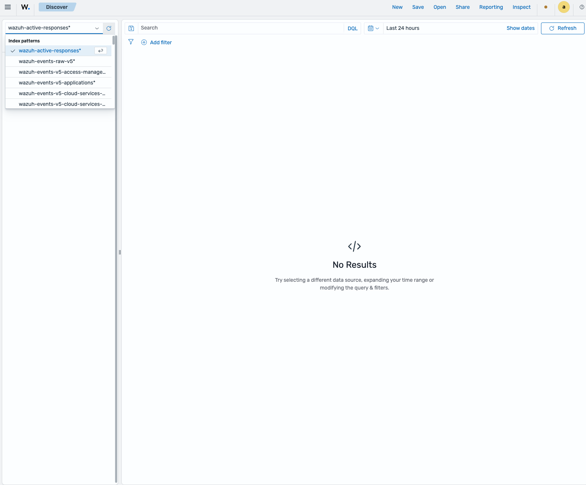

When a monitor trigger fires an active response, a new document appears here within about a minute. Click the caret on the left of a row to open the **Expanded document** panel and inspect the full record. The panel lists every `wazuh.active_response.*` field, so you can confirm exactly what was executed, where, and against which agent.


The most useful fields for investigation are:

| Field                                    | Content                                                         |
| ---------------------------------------- | --------------------------------------------------------------- |
| `@timestamp`                             | Time the execution was recorded.                                |
| `wazuh.active_response.name`             | Active response name.                                           |
| `wazuh.active_response.type`             | `stateful` or `stateless`.                                      |
| `wazuh.active_response.executable`       | Executable that was run.                                        |
| `wazuh.active_response.extra_arguments`  | Extra arguments passed to the executable.                       |
| `wazuh.active_response.stateful_timeout` | Timeout in seconds (stateful active responses only).            |
| `wazuh.active_response.location`         | `all`, `defined-agent`, or `local`.                             |
| `wazuh.active_response.agent_id`         | Target agent ID (only when `location = defined-agent`).         |
| `wazuh.agent.id`, `.name`                | Agent that reported the original alert.                         |
| `event.doc_id`, `event.index`            | Original alert that triggered the action (useful for pivoting). |

> **Tip:** to narrow the list to a specific active response, filter by `wazuh.active_response.name: "<your-name>"` and sort by `@timestamp` descending.

---

### Step 2: Verify execution on the agent

On the target agent, tail the active response log:

```bash
sudo tail -f /var/ossec/logs/active-responses.log
```

Every execution produces a line with a timestamp and the arguments received. Correlate that timestamp with `@timestamp` in Discover (expect a delay of up to ~1 minute).

---

### Step 3: Pivot to the source alert

From any execution record, `event.doc_id` and `event.index` point back to the alert that fired the action. Switch the Discover index pattern to the value of `event.index` and filter by `_id == event.doc_id` to open the original alert. This closes the loop between **detection → activation → execution**.

> **Note:** execution records are retained for **3 days** by default. If you need longer forensic retention, ask your administrator to adjust the retention policy or export the records to another index.

---

## Troubleshooting

| Symptom                                                                          | Likely cause                                                                    | Action                                                                                   |
| -------------------------------------------------------------------------------- | ------------------------------------------------------------------------------- | ---------------------------------------------------------------------------------------- |
| The active response is not listed in the trigger selector                        | The monitor is not _Per document_, or the active response is muted              | Recreate the monitor as _Per document_; unmute the active response from its details page |
| No execution record shows up in **Discover**                                     | The indexer notifications or alerting plugins are missing                       | Ask your administrator to verify the plugin installation                                 |
| The execution record is present but the action does not take effect on the agent | The manager did not deliver the command, or the agent is disconnected           | Check the manager service and the agent connection                                       |
| The target agent reports that the executable is missing                          | The executable is not available on that agent                                   | Ask your administrator to make it available on the target agent                          |
| A stateful active response does not revert after the timeout                     | Timeout too large, or the executable does not support reversal                  | Confirm the timeout value; ask your administrator to verify reversal support             |
| The `wazuh-active-responses*` index pattern is missing from Discover             | The dashboard did not create it on startup                                      | Ask your administrator to inspect the dashboard logs and restart                         |
| Execution records disappear after 3 days                                         | Expected — default retention                                                    | Ask your administrator to extend retention or export records to another index            |
| The active response runs on an unexpected agent                                  | `Location = All` with an overly broad monitor query, or an incorrect `Agent ID` | Narrow the monitor query; review the `Agent ID`                                          |

---

## FAQ

**How do I change the 3-day retention?**
Ask your administrator to adjust the retention policy on the indexer side.

**Why are there two separate buttons, _Add notification_ and _Add active response_?**
Because notifications and active responses have different lifecycles, permissions, and traceability. Each selector only lists entries of its own type.

**Can I chain multiple active responses in the same trigger?**
Yes. Each **Add active response** action runs independently and produces its own execution record in **Discover**.

**What happens if I change the _Executable_ of an active response that is already in use?**
The change applies to future executions only. Past executions keep the previous value in their records.

**The _Add active response_ button does not appear in my monitor — is this a bug?**
No. It is only shown when **Monitor type = Per document monitor**. Change the monitor type.

**How do I manually revert a stateful active response that should have expired but is still active?**
Ask your administrator to revert the action directly on the target agent — the dashboard cannot trigger a manual reversal.

---

## Related Sections

- [Detection](../security-analytics/detection.md) — Detection rules that produce the alerts consumed by active response triggers.
- [Normalization](../security-analytics/normalization.md) — Decoders and integrations that prepare the events upstream.
