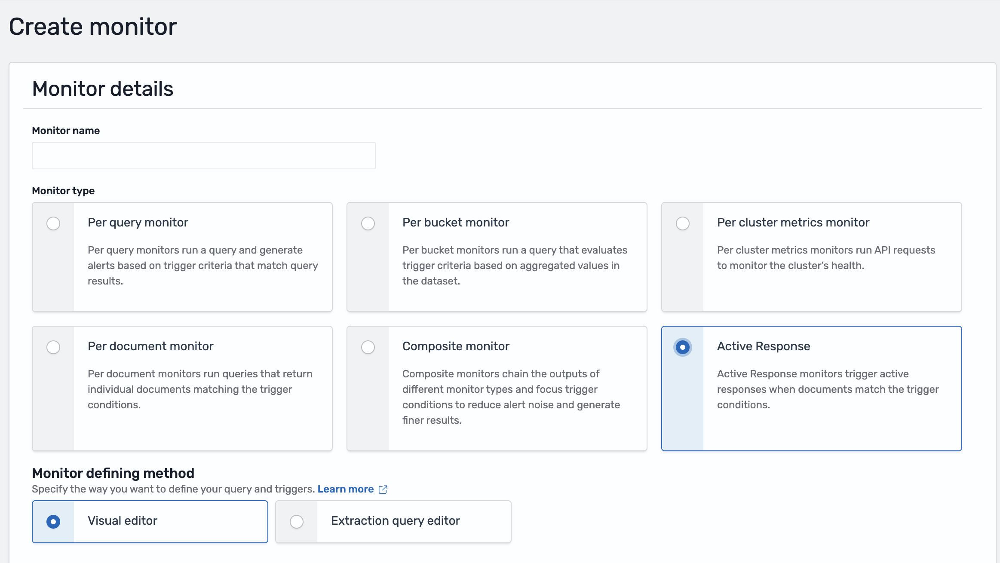
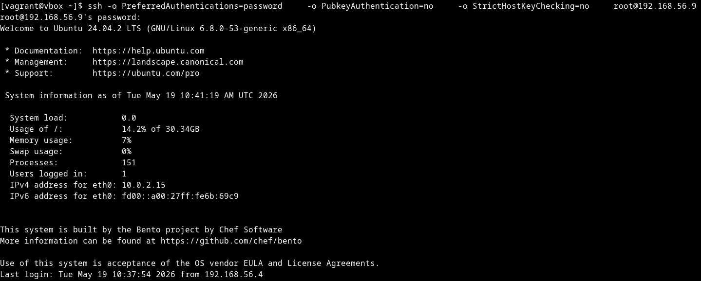

# Attach an active response to a monitor trigger

An active response only runs when an Alerting trigger invokes it. This walkthrough connects the `Block-IP-stateful-response` active response (created in [Create an active response](./create.md)) to an Active Response monitor that detects SSH root logins via password authentication.

**Prerequisites:** the `Block-IP-stateful-response` active response exists and has `Status = Active`.

---

## Step 1: Open Alerting and create a monitor

Navigate to **Alerting → Monitors → Create monitor**. If no monitors exist yet, the Alerts tab looks like this:


---

## Step 2: Select **Active Response**

In the **Monitor type** selector, choose **Active Response**. This is mandatory: any other monitor type (Per query, Per bucket, Per cluster metrics, Composite) will hide the **Add active response** button in the trigger step.



Give the monitor a name — for this use case, `Block-IP-monitor` — and pick a **Schedule** (for example, `By interval`, every `1` minute).

---

## Step 3: Configure the data source

Under **Select data**, pick the findings index that holds the events to watch. For this SSH root-login use case, select `wazuh-findings-v5-system-activity*` — the access-management findings index, which carries authentication events such as SSH logins. Other findings indices (`wazuh-findings-v5-security*`, `wazuh-findings-v5-network-activity*`, etc.) cover different categories; pick the one that matches the rules driving your active response.


---

## Step 4: Define the query

In the **Query** section, describe the conditions that the incoming alerts must meet. For this SSH root-login use case, target the built-in Wazuh rule that flags a root login via password authentication on SSH — `rule.title: "SSH Root Login via Password Authentication"`. Add a **Query name** (required, `Block-IP-query` for this use case) and fill in the condition:

- **Field** — `rule.title`
- **Operator** — `is`
- **Search term** — `SSH Root Login via Password Authentication`


> **Tip:** use **Preview query and performance** to confirm the query returns the expected document shape before moving on.

---

## Step 5: Add a trigger with an active response action

Click **Add trigger**. Give the trigger a name — for this use case, `Block-IP-trigger` — and, under **Specify queries or tags**, select `Block-IP-query` (the query defined in the previous step). In the trigger editor, scroll to the **Actions** section: two buttons are available — **Add notification** (generic notifications) and **Add active response** (active responses).


Click **Add active response**. The action exposes:

- A required **Action name** (letters, numbers, and special characters only) — for this use case, `Block-IP-action`.
- An **Active response** selector with the placeholder `Select active response to execute`.
- A **Manage active responses** button that opens the Active Responses view in a new tab.


Open the **Active response** dropdown and pick the one created earlier — `Block-IP-stateful-response` for this use case. The dropdown only lists active responses and labels them with the `[Active response]` prefix.


> **Important:** if the action has nothing selected in the **Active response** field, Alerting blocks the save with a validation error. Always confirm an active response is selected before saving.

---

## Step 6: Save the monitor

Save the monitor. The overview page summarizes the configuration, the triggers, the history, and any alerts produced so far.


The action automatically wires the triggering alert to the active response, so there is nothing else to configure on the trigger side.

> **Note:** a single trigger can contain several **Add active response** actions. Each one produces an independent execution record in **Discover** and runs separately.

---

## Step 7: Generate the triggering event

With the monitor saved, produce a real `SSH Root Login via Password Authentication` alert so the trigger fires and the active response runs end-to-end. The procedure below is intended for a **lab agent** — do not run it against production hosts.

**Pre-requisites on the target agent:**

- A Linux agent enrolled and `Active` in **Endpoint Summary**, with `firewalld` (or `iptables`) running — the `block-ip` script needs one of them present to add and revert the rule.
- Root login via password enabled on the agent, in `/etc/ssh/sshd_config`:
  - `PermitRootLogin yes`
  - `PasswordAuthentication yes`
  - Restart with `systemctl restart sshd` if any value was changed.
- A known root password on the lab agent.
- An attacker host (any Linux or macOS machine with `ssh`) that can reach the agent on TCP/22 and is **not** already firewalled.

> **Warning:** enabling `PermitRootLogin yes` on a non-lab host is a serious security risk. Roll it back in **Step 8: Clean up** as soon as the test has been validated.

From the **attacker host**, perform an SSH login attempt as `root` using password authentication. The goal is to make the agent emit a `SSH Root Login via Password Authentication` event:

```bash
ssh -o PreferredAuthentications=password \
    -o PubkeyAuthentication=no \
    -o StrictHostKeyChecking=no \
    root@<agent_host_ip>
```

Enter the root password at the prompt. The login should succeed (otherwise the rule may not fire — re-check `PermitRootLogin` / `PasswordAuthentication`).



Within about one minute, an alert with `rule.title: SSH Root Login via Password Authentication` is indexed under `wazuh-findings-v5-access-management*`, the monitor fires, and the trigger queues the active response action. Continue to [Monitor active response executions](./monitor-executions.md) to confirm the execution end-to-end.

---

## Step 8: Clean up after the test

Once the use case has been validated, roll back the lab setup:

1. From the monitor overview, **disable** or **delete** `Block-IP-monitor`.
2. From **Explore → Active Responses**, delete `Block-IP-stateful-response`. The confirmation dialog requires typing the literal word `delete`.
3. Restore the original `sshd_config` on the agent — in particular revert `PermitRootLogin yes` and `PasswordAuthentication yes` if you enabled them — and restart `sshd`.
4. Verify on the agent that no leftover firewall rule remains (`firewall-cmd --reload` or `iptables -F WAZUH_ACTIVE_RESPONSE`). The stateful timeout should have reverted the rule, but confirm before closing the session.
