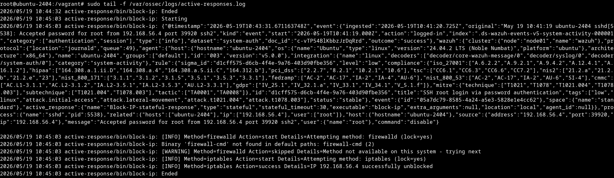
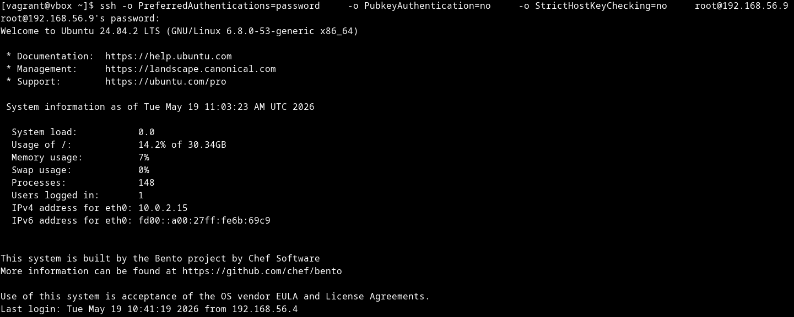

# Monitor active response executions

Every time an active response fires, the **Discover** view (under the `wazuh-active-responses*` index pattern) is the authoritative trace: it records every invocation issued by the dashboard and forwarded by the manager. On the target agent, additional traces may be available depending on the script:

- **Lifecycle events** — the agent service logs receipt and dispatch of the command in `/var/ossec/logs/ossec.log`. To see the command execution was received by the agent, increase the verbosity of `execd.debug` to `2` (require restart if changed) in the internal options (`/var/ossec/etc/local_internal_options.conf` or `/var/ossec/etc/internal_options.conf`).
- **Script output** — if the executable writes to `/var/ossec/logs/active-responses.log` (most built-in scripts do), you will also see a per-execution line there. Custom scripts decide their own logging destination, so absence from this file is not by itself an error.

---

## Step 1: Inspect the execution record in Discover

Open **Discover** and select the `wazuh-active-responses*` index pattern from the index selector. Before any trigger has fired, the view is empty — that is expected.


When a monitor trigger fires an active response, a new document appears here within about a minute. For this SSH root-login use case, narrow the view to the relevant execution by filtering on `wazuh.active_response.name: "Block-IP-stateful-response"` and sorting by `@timestamp` descending. Click the caret on the left of the most recent row to open the **Expanded document** panel and inspect the full record. The panel lists every `wazuh.active_response.*` field, so you can confirm exactly what was executed, where, and against which agent.


The most useful fields for investigation are listed below. The **Expected value** column shows what each field should hold for the SSH root-login use case (`Block-IP-stateful-response` firing on a `SSH root login via password authentication` alert); use it as a quick sanity check against the document that was just written.

| Field                                    | Content                                                         | Expected value (use case)                                                         |
| ---------------------------------------- | --------------------------------------------------------------- | --------------------------------------------------------------------------------- |
| `@timestamp`                             | Time the execution was recorded.                                | Within ~1 min of the original `SSH root login via password authentication` alert. |
| `wazuh.active_response.name`             | Active response name.                                           | `Block-IP-stateful-response`                                                      |
| `wazuh.active_response.type`             | `stateful` or `stateless`.                                      | `stateful`                                                                        |
| `wazuh.active_response.executable`       | Executable that was run.                                        | `block-ip`                                                                        |
| `wazuh.active_response.extra_arguments`  | Extra arguments passed to the executable.                       | _(empty)_                                                                         |
| `wazuh.active_response.stateful_timeout` | Timeout in seconds (stateful active responses only).            | `30`                                                                              |
| `wazuh.active_response.location`         | `all`, `defined-agent`, or `local`.                             | `local`                                                                           |
| `wazuh.active_response.agent_id`         | Target agent ID (only when `location = defined-agent`).         | _(not set — `location = local`)_                                                  |
| `wazuh.agent.id`, `.name`                | Agent that reported the original alert.                         | The agent that received the root SSH login.                                       |
| `event.doc_id`, `event.index`            | Original alert that triggered the action (useful for pivoting). | Points back to the `SSH root login via password authentication` finding.          |

> **Tip:** to narrow the list to a different active response, replace `Block-IP-stateful-response` in the filter with the value of `wazuh.active_response.name` you want to inspect.

---

## Step 2: Verify execution on the agent

On the target agent, two log files are useful, each for a different purpose:

```bash
# Agent service lifecycle (receipt and dispatch of the command)
sudo tail -f /var/ossec/logs/ossec.log

# Script output (only when the executable writes here)
sudo tail -f /var/ossec/logs/active-responses.log
```

`ossec.log` is the reliable source for confirming the agent received and dispatched the command — this is part of the active response lifecycle and does not depend on the script. `active-responses.log` is populated by the executable itself: most built-in scripts write a line with the timestamp and arguments received, but custom scripts may log elsewhere or not at all. Correlate any timestamp you find with `@timestamp` in Discover (expect a delay of up to ~1 minute).

For the SSH root-login use case, `active-responses.log` produces two entries about `Stateful timeout` seconds apart:

1. **Block** — when the trigger fires, an entry mentioning `block-ip` and the source IP that performed the root SSH login.
2. **Unblock** — once the timeout elapses (`30` seconds in the use case), a second entry reverts the rule.



---

## Step 3: Verify the block at the network layer

For stateful active responses that change the firewall (such as `block-ip`), confirm the network effect from the **attacker host** used to generate the alerts:

```bash
# While the block is in effect:
ssh root@<agent_host_ip>
# Expected: the connection times out — the source IP is dropped at the firewall.
```

After the `Stateful timeout` elapses (`30` seconds for `Block-IP-stateful-response`), run the same command again: the TCP handshake must complete and the password prompt must reappear. This is the end-to-end proof that the **stateful reversal** worked.



> **Important:** if the block does not lift after the timeout, do **not** delete the active response from the dashboard — the rule on the agent will not be reverted that way. See [Troubleshooting](./troubleshooting.md) for the recovery path.

---

## Step 4: Pivot to the source alert

From any execution record, `event.doc_id` and `event.index` point back to the alert that fired the action. Switch the Discover index pattern to the value of `event.index` (for the SSH root-login use case, this resolves to `wazuh-findings-v5-access-management*`) and filter by `_id == event.doc_id` to open the original `SSH root login via password authentication` alert. This closes the loop between **detection → activation → execution**.

> **Note:** execution records are retained for **3 days** by default. If you need longer forensic retention, ask your administrator to adjust the retention policy or export the records to another index.
