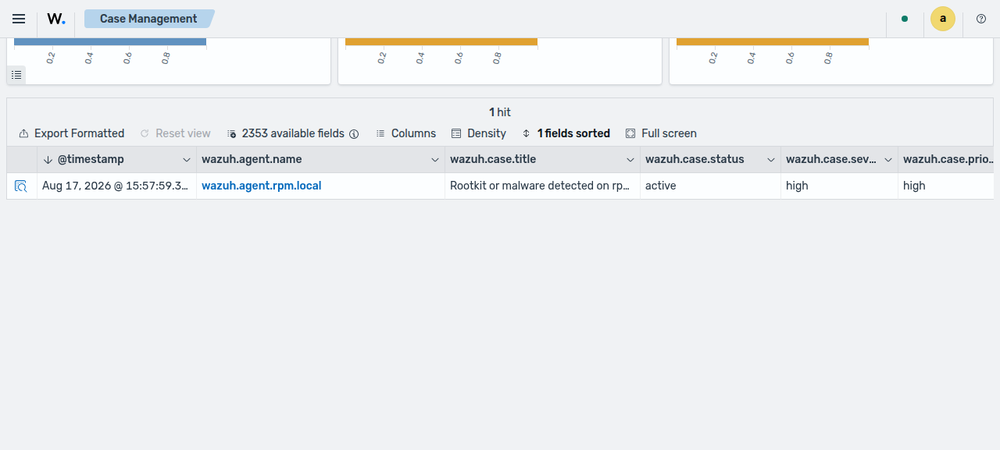
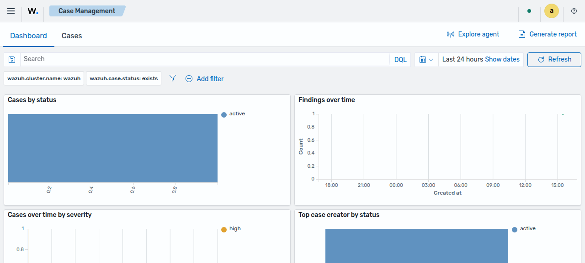
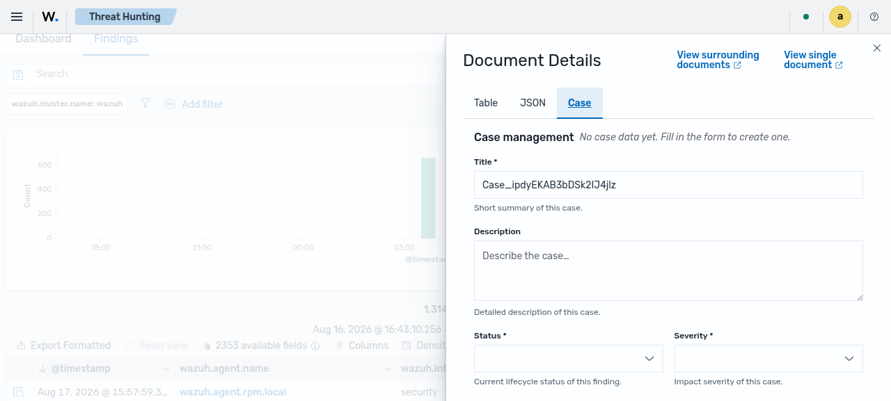
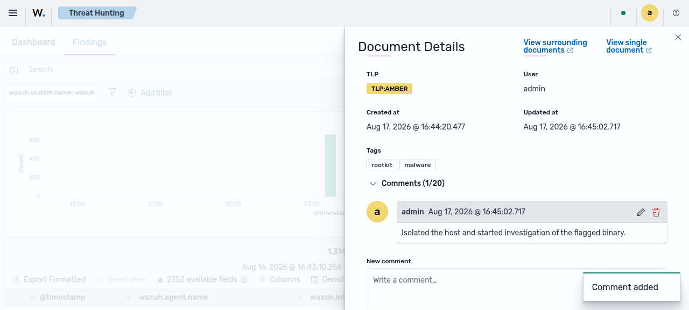
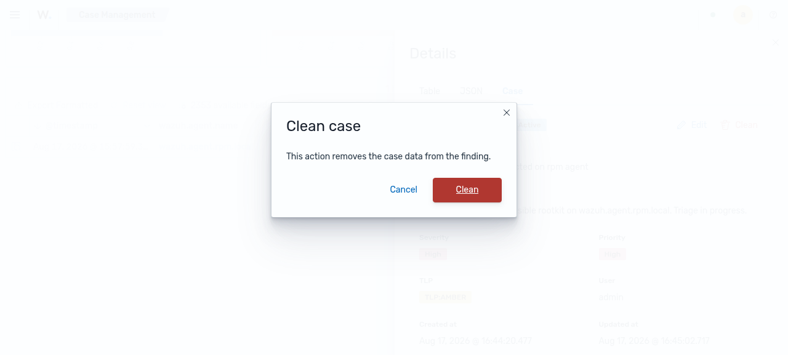
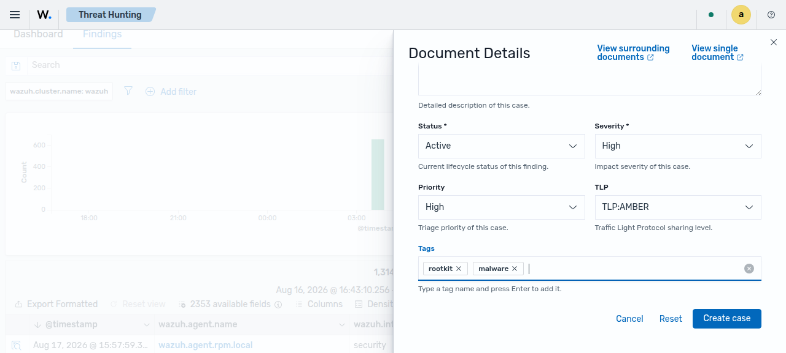
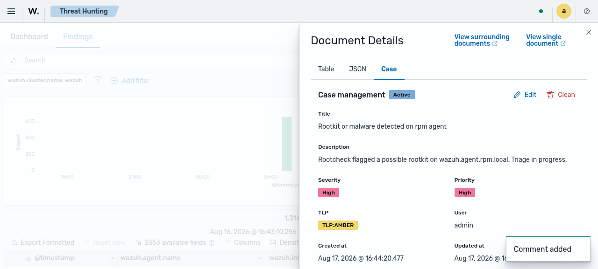

# Case Management

The **Case Management** module helps analysts track and triage security findings. An analyst
turns a finding into a case, sets its status, severity, priority, and sharing level, and records
progress with comments. The module keeps every case in one place, so a team can follow the work
from the first review to the final resolution.

A case is not a separate document. It is a set of `wazuh.case.*` fields that the module adds to a
finding in the `wazuh-findings-v5*` indices. The module shows only the findings that have case
data (the findings where the `wazuh.case.status` field exists).

The module appears in the left navigation as **Case Management**, in the **Threat Intelligence**
category.

This module exposes the following views:

- **Dashboard**: Visualizations that summarize the current cases (counts by status, severity,
  priority, and other case fields).
- **Cases**: A table of the findings that have case data. The table has columns for the time,
  the agent name, the case title, the status, the severity, the priority, the user, and the tags.
  Use the **Status**, **Severity**, **Priority**, and **User** filters to narrow the list. Select
  a row to open the finding details, then open the **Case** tab.

The **Dashboard** view summarizes the same cases with charts.

## How it fits together

Case Management reuses the findings data and the finding details flyout. It does not add a new
index.

| Area                       | Role in Case Management                                                                                                                                                              |
| -------------------------- | ------------------------------------------------------------------------------------------------------------------------------------------------------------------------------------ |
| **Findings**               | The source data. A case is the `wazuh.case.*` fields on a finding in the `wazuh-findings-v5*` indices. The **Cases** view lists the findings that have case data.                    |
| **Finding details flyout** | The **Case** tab in the flyout creates, edits, and removes the case data of a finding. The tab is available on the finding surfaces, such as Threat Hunting and the **Cases** table. |
| **Wazuh Indexer**          | Stores the case data inside the finding document. The server reads and writes it with the requesting user's own permissions.                                                         |

The server sets the user and the timestamps. It sets `wazuh.case.user.name` to the logged-in
user, records when the case is created and updated, and assigns the author and the timestamps of
each comment. The client cannot change these values.

## Reference

- [Incident Response](../incident-response/README.md): The dashboard that audits the active
  response actions that run across the environment. Use Case Management for the manual triage of a
  finding, and use Incident Response to review the automated actions that the finding triggered.

---

## Concepts

### Cases

A **case** records the triage of a finding. You create a case from the **Case** tab in the finding
details flyout. When a finding has no case data, the tab shows an empty form and the message
`No case data yet. Fill in the form to create one.`. The **Title** field starts with a suggested
value (`Case_` followed by the finding identifier). Replace it with a title of your own. When you
save the form, the module writes the case fields to the finding, and the finding starts to appear
in the **Cases** view.

The **Case** tab is shared by every view that shows finding documents. You can create a case from
the Threat Hunting findings and from the **Cases** table, and the tab behaves the same way in each
one.

### Case fields

A case has the following fields. The **Title**, **Status**, and **Severity** fields are required.
The other fields are optional.

| Field           | Required | Description                                                                           |
| --------------- | -------- | ------------------------------------------------------------------------------------- |
| **Title**       | Yes      | Short summary of the case. The maximum length is 1024 characters.                     |
| **Description** | No       | Detailed description of the case.                                                     |
| **Status**      | Yes      | Current lifecycle status of the case. See [Case lifecycle](#case-lifecycle).          |
| **Severity**    | Yes      | Impact severity of the case: `Informational`, `Low`, `Medium`, `High`, or `Critical`. |
| **Priority**    | No       | Triage priority of the case: `Urgent`, `High`, `Medium`, or `Low`.                    |
| **TLP**         | No       | Traffic Light Protocol sharing level. See [TLP](#tlp-traffic-light-protocol).         |
| **Tags**        | No       | Free-form labels. Type a tag name and press `Enter` to add it.                        |
| **Comments**    | No       | Notes about the case. See [Comments](#comments).                                      |

The module also shows read-only metadata that the server sets: the **User** who owns the case, the
**Created at** time, and the **Updated at** time.

### Case lifecycle

The **Status** field records the stage of the case. A case has one of these values:

| Status           | Meaning                                                             |
| ---------------- | ------------------------------------------------------------------- |
| **Active**       | The case is open and under review.                                  |
| **Acknowledged** | An analyst has confirmed the case and works on it.                  |
| **Completed**    | The work on the case is done.                                       |
| **Audit**        | The case is kept for review or for a compliance record.             |
| **Error**        | The case is marked as a mistake, for example a false positive.      |
| **Deleted**      | The case is marked as removed but the record stays for the history. |

A typical case moves from **Active** to **Acknowledged**, and then to **Completed**. The module
does not force a fixed order, so you can set any status that fits your process.

### TLP (Traffic Light Protocol)

The **TLP** field records how widely you can share the case. It uses the standard Traffic Light
Protocol values.

| Value         | Sharing rule                                                       |
| ------------- | ------------------------------------------------------------------ |
| **TLP:RED**   | Do not share outside the people named in the exchange.             |
| **TLP:AMBER** | Share only with the members of your organization who need to know. |
| **TLP:GREEN** | Share within your community, but not on public channels.           |
| **TLP:CLEAR** | Share without a restriction.                                       |

### Comments

Comments record the progress of a case. The **Case** tab shows the comment thread and a **New
comment** box below the case fields. A case holds a maximum of **20** comments. When the case
reaches the limit, the module disables the box and shows the message `Comment limit reached (20).`.

The server controls the author and the timestamps of a comment:

- The author is the logged-in user. The module adds your username to the comment.
- The server sets the created time and the updated time.
- You can edit or delete only your own comments.
- An edited comment shows an `edited` marker next to its timestamp.

You can edit one comment at a time. Save or cancel the open edit before you start another one.

### Confirmation before you discard changes

The **Case** tab protects your work with a confirmation step. This behavior avoids the loss of a
change by mistake.

- **Unsaved changes**: If you edit the form or a comment and then try to close the flyout or leave
  the tab, the module asks you to confirm before it discards the change.
- **Clean case**: The **Clean** button removes all the case data from the finding. The module
  first shows a confirmation dialog with the message
  `This action removes the case data from the finding.`. After you clean a case, the finding no
  longer appears in the **Cases** view.
- **Delete comment**: When you delete a comment, the module shows a confirmation dialog with the
  message `This action cannot be undone.`.

## Create a case from a finding

1. Open a finding. Use the **Cases** view, or a finding surface such as Threat Hunting.
2. Select the row to open the finding details flyout.
3. Open the **Case** tab.
4. Fill in the form. Set the **Title**, the **Status**, and the **Severity**. These fields are
   required. Set the **Description**, **Priority**, **TLP**, and **Tags** as needed.
5. Select **Create case**. The module saves the case data to the finding and shows the case
   summary.

To change a case later, open the **Case** tab again, select **Edit**, change the fields, and
select **Update case**. To add a note, write it in the **New comment** box and select **Add
comment**. To remove all the case data, select **Clean** and confirm the action.
