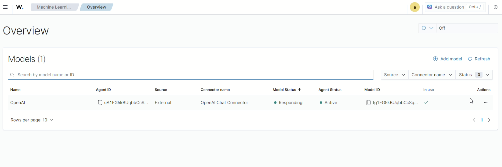

# Wazuh Dashboard AI Assistant

This guide will help you configure and manage AI models for the Wazuh Dashboard Assistant. You will learn how to create, configure, test, and delete models easily through the web interface.
The Dashboard Assistant is a tool that allows you to use artificial intelligence to analyze your security data. You can ask questions in natural language and get intelligent answers about your cybersecurity information.

## Model dashboard

When you access the "Opensearch plugins > Machine Learning" module from the side menu, you will see the main model table that includes:

### Table Columns:
- **Model Name**: Unique identifier for your AI model
- **Provider**: AI service used (OpenAI, Anthropic, Deepseek)
- **Status**: Indicates if the model is Active, Inactive, or has Errors
- **Active Nodes**: Number of servers where the model is running
- **Version**: Specific version of the configured model
- **Actions**: Buttons to Test, Edit, or Delete the model

### Available Functions:
- **"Add Model" Button**: To add a new AI model
- **Filters**: To search and filter models by status or provider
- **Actions per Model**: Each row has specific options to manage that model

## How to Use the Dashboard Assistant

### 1. Create a New AI Model

Configure the Dashboard Assistant for the first time, add new AI providers like OpenAI, Anthropic, or Deepseek, and establish specific models for your organization.

**Steps to create a model:**

1. **Access the module**
   - Go to the side menu
   - Click on "Opensearch plugins > Machine learning"
   - You will see the main model table

2. **Start registration**
   - Click the "AddModel" button (top right corner)
   - A configuration form will open

3. **Complete the model information**
   - **Provider**: Select from the list (OpenAI, Anthropic, Deepseek)
   - **Model**: Choose the specific model (e.g., GPT-4, Claude-3, etc.)
   - **API URL**: Enter the service address
   - **API Key**: Paste your provider access key

4. **Validate and deploy**
   - The system will automatically validate your configuration
   - If everything is correct, the installation process will begin
   - You will see a progress bar with 6 steps:
     - Initial configuration
     - Connector creation
     - Model registration
     - Connectivity test
     - Agent creation
     - Final activation

5. **Verify the result**
   - Once completed, the model will appear in the main table
   - The status should show "Active" and a green tick on the "In use" cell
   - You can now use the Dashboard Assistant

### 2. View and Manage Existing Models

Review all configured models, verify the current status of each one, and compare different configurations to optimize your implementation.

**How to interpret the table:**

- **Name**: The display name of the AI model
- **Agent ID**: Unique identifier of the agent associated with the model
- **Source**: Origin of the model (External, Internal, etc.)
- **Connector name**: Name of the connector used to communicate with the model
- **Model Status**: Current operational status (Responding, Not Responding, etc.)
- **Agent Status**: Current status of the associated agent (Active, Inactive, etc.)
- **Model ID**: Unique technical identifier of the model
- **In use**: Indicates whether the model is currently being used by the AI assistant
- **Actions**: Available operations (test, edit, delete) for each model

### 3. Test a Model

Verify that a model works correctly, diagnose connectivity problems, and validate newly configured models before putting them into production.

**Steps to test:**

1. **Select the model**
   - In the table, find the model you want to test
   - Click the "Test" button in the actions column

2. **Execute the test**
   - The system will automatically send a test query
   - You will see a "Testing..." indicator
   - The result will appear in a few seconds

3. **Interpret the results**
   - **Success**: The model responds correctly
   - **Error**: There is a configuration or connectivity problem
   - If there is an error, check the API key and URL

### 4. Delete a Model

Remove models that are no longer needed, clean up test configurations, and eliminate models with unsolvable problems to maintain an organized environment.

**Steps to delete:**

1. **Identify the model**
   - In the table, find the model you want to delete
   - Click the "Delete" button (trash icon)

2. **Confirm deletion**
   - A confirmation window will appear
   - Carefully read the warning message
   - Click "Confirm" if you are sure

3. **Automatic cleanup process**
   - The system will automatically delete:
     - The model and its configuration
     - Associated connectors
     - Related agents
     - All system resources
   - You will see a progress bar during the process

4. **Verify deletion**
   - The model will disappear from the table
   - You will receive a success confirmation

### 5. Chat with the active model

**Step to chat with the assistant**

1. ***Click on the "Ask a question"***
  - Go to the top right corner and click on the "Ask a question" section
  - Type a question to the assistant
  - Check the answer

### 6. Resolve Common Problems

**Permission Errors:**
If you see messages about insufficient permissions:

- You need specific roles to use machine learning API
- The message will tell you exactly which permissions are missing

**Installation Errors:**
If the installation process fails:

- Check your API key (it may have expired)
- Verify that the provider URL is correct
- Make sure you have sufficient credits in your provider account
- If the problem persists, try deleting and creating the model again

## Technical References

- [dashboard-assistant/README.md](https://github.com/wazuh/wazuh-dashboard-ml-commons/tree/4.14.0/public/dashboard-assistant/README.md) - Main documentation (644 lines)
- [dashboard-assistant/modules/README.md](https://github.com/wazuh/wazuh-dashboard-ml-commons/tree/4.14.0/public/dashboard-assistant/modules/README.md) - Module documentation
- [dashboard-assistant/components/README.md](https://github.com/wazuh/wazuh-dashboard-ml-commons/tree/4.14.0/public/dashboard-assistant/components/README.md) - Component documentation
- [dashboard-assistant/services/README.md](https://github.com/wazuh/wazuh-dashboard-ml-commons/tree/4.14.0/public/dashboard-assistant/services/README.md) - Service documentation

