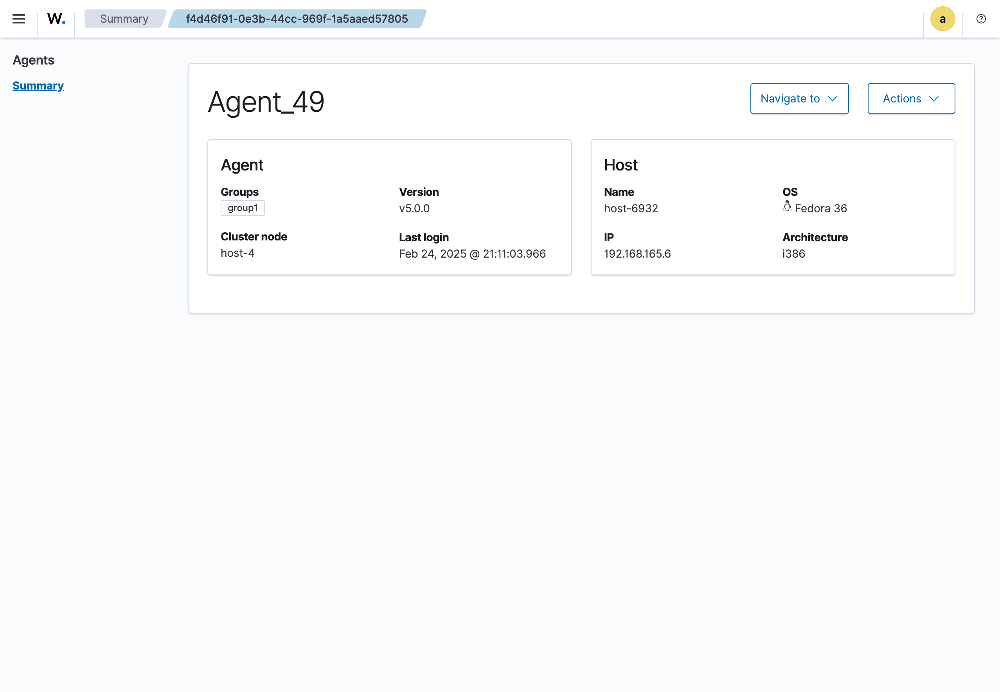

# Agent details

This view you can see the details of an agent and host agent information.

## Agent information

The agent information is displayed, including:

- **Name**: Name of the agent
- **Group**: Group assigned to the agent
- **Version**: Version of the agent
- **Cluster node**: Cluster node assigned to the agent
- **Last login date**: Date of the last login

## Host information

The host information is displayed, including:

- **Name**: Name of the host
- **IP**: IP address of the host
- **Operating system**: Operating system of the host
- **Architecture**: Architecture of the host

## Actions

The actions available are:

- **Edit name**: Edit the name of the agent
- **Edit groups**: Edit the group assigned to the agent
- **Upgrade**: Upgrade the agent to the latest version
- **Delete**: Delete the agent
- **Navigate to dashboard**: Navigate to the dashboard of the agent
