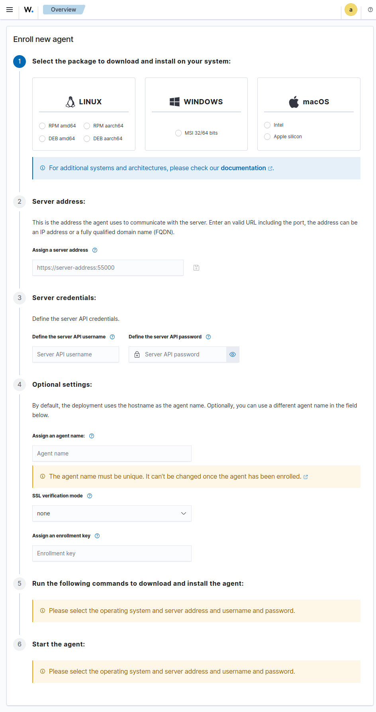

# Enrollment agent assistant

The enrollment agent assistant provides a guide to download, install, enroll and start the agent in a new host.

## Options:

The user can specify the required and optional parameters to enroll the agent through a form:

| Option                | Type     | Description                                                           | Default value | Allowed values                                                          |
| --------------------- | -------- | --------------------------------------------------------------------- | ------------- | ----------------------------------------------------------------------- |
| Operating system      | Required | Define the operating system of the host                               | -             | Any provided in the form                                                |
| Server address        | Required | Define the URL of the Wazuh server                                    | -             | Any valid URL string (protocol://address:port)                          |
| Username              | Required | Define the username of Wazuh server                                   | -             | Any string                                                              |
| Password              | Required | Define the passowrd of the Wazuh server user                          | -             | Any string                                                              |
| Agent name            | Optional | Define the agent name. If not defined, it will be used the hostname   | -             | Any string with 2 or more charecters. Allowed characters: A-Za-z0-9.-\_ |
| SSL verification mode | Optional | Define the verification mode of certificates against the Wazuh server | none          | none, certificate, full                                                 |
| Enrollment key        | Optional | Define the enrollment key                                             | -             | Any alphanumeric string of 32 characters                                |

> **_NOTE:_** The user to enroll the agent must have permissions to execute this operation.

The server address option is set with the `enrollment.dns` setting if this is defined that allows to the user avoids filling the input when accesing to this page.

Once the required and optionals parameters are provided without errors, the commands to enroll the agent will be displayed, allowing to the user to copy them and execute them in the host.

## Remember parameters

Ther server address can be saved to be remember the next time the user access to the page through set the `enrollment.dns` setting using the save icon near to the server address input or through Dashboard Management > Advanced settings.

> **_NOTE:_** Save the `enrollment.dns` setting requires write permissions in the tenant.

The rest of parameters should be specified each time the user access to the enrollment agent assistant.
