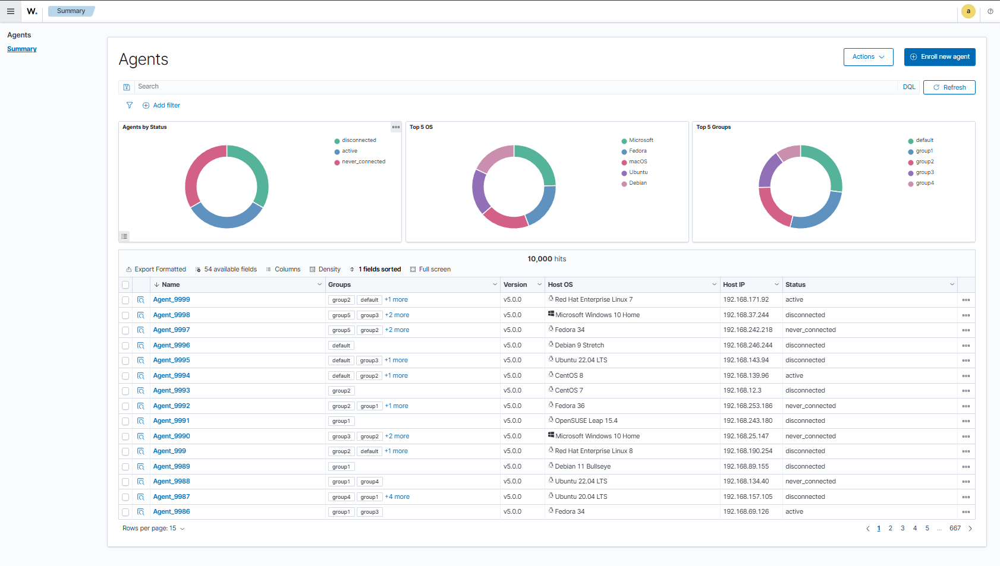

# Agent summary

The agent summary module provides a complete interface for managing and monitoring Wazuh agents. Allows essential operations such as deploying, updating, deleting and configuring agents.

## Visualizations

The interface includes informative graphs:

- Top 5 Operating Systems
- Top 5 Groups
- Agent Status

## Agent list

The main view displays a table with all agents registered in the system, including:

- Agent name and ID
- Assigned groups
- Agent version
- Operating system
- Host IP
- Agent status
- Actions

### Search

The search bar allows filtering the list of agents.

## Actions

The following actions are available for each agent or group of agents:

- **Deploy**: Deploy the agent to the selected hosts.
- **Delete**: Remove the agent from the system.
- **Upgrade**: Upgrade the agent to the latest version.
- **Manage groups**: Assign or remove agents from groups.
- **Change name**: Change the agent name.
- **Check information**: View detailed information about the agent.
- **Navigate to agent**: Open the agent details page.
