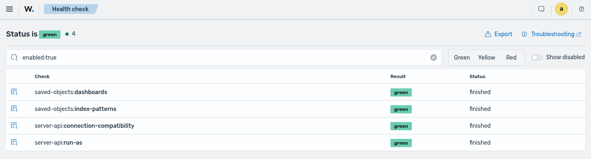
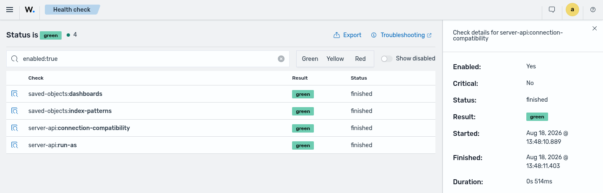
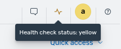

# Health check

The health check provides a mechanism to add and run checks that are needed for the different modules of the application.

The details of the overall status or checks can be seen through the **Dashboard management** > **Health Check** app.

The plugins can register task to be checked. These uses the context of the internal user of the dashboard, so this means the tasks related to saved objects such as index patterns are only checked in the `Global` tenant.

# Lifecycle

This defines a service that is integrated with the core lifecycle of the application.

## Server

1. Setup the health check using the provided or default configuration.
2. The plugins register the tasks to run
3. If the health check is enabled and there are some enabled checks (configurable with the `healthcheck.checks_enabled` setting), this runs an initial check. If some check fails, the enabled checks are retried if this is configured.
4. Once the health check pass, if this is enabled, this sets a scheduled task using the specified interval (configurable with the `healthcheck.interval` setting) to run and update the status of the enabled checks. This can be seen in the dashboard logs as:

```log
  server    log   [10:04:59.857] [info][healthcheck] Checks are ok
  server    log   [10:04:59.857] [info][healthcheck] Set scheduled checks each 300000ms
```

5. If some enabled and critical check fails in the initial check, this will avoid the application can correctly initialize until this is solved. In this case, the Wazuh dashboard server is not ready yet view should display information about the failing critical checks.

# Checks

The checks represents the unit to check and some could do some write actions such as creating index patterns.

## List

| Name                                          | Description                                                                                                                                                                                                                                                                     |
| --------------------------------------------- | ------------------------------------------------------------------------------------------------------------------------------------------------------------------------------------------------------------------------------------------------------------------------------- |
| `saved-objects:index-patterns`                | Validate (create if possible) the existence of the compatible index patterns used by the different modules (alerts, events, findings, metrics, states, active responses, etc.)                                                                                                  |
| `server-api:connection-compatibility`         | Validate the connection and compatibility with the server API hosts                                                                                                                                                                                                             |
| `server-api:run-as`                           | Validate that the the `run_as` setting is enabled in each host and is allowed to use by the configured user.                                                                                                                                                                    |
| `integrations:default-notifications-channels` | Validate the existence of the default Notifications channels (provisioned by `wazuh-indexer-notifications`) and create the sample Alerting monitors when missing (monitors are only created if their corresponding channels exist). See Notifications and Alerting for details. |
| `saved-objects:dashboards`                    | Provision saved visualizations and dashboards from the bundled NDJSON definitions so the UI can rely on saved-object references. See Saved Objects for Dashboards and Visualizations for details.                                                                               |

## Notifications and Alerting

For details about the default notification channels created by Health Check, the sample monitors it can provision, and the steps to finalize configuration, see [Notifications and Alerting](./notifications-alerting.md).

## Saved Objects for Dashboards and Visualizations

For details about the task that provisions dashboard and visualization saved objects from the repository definitions, see [Saved Objects for Dashboards and Visualizations](./saved-objects-dashboards.md).

## Execution results

The checks has the following properties as part of the execution:

- result: define the check result.

| Value  | Description                                            |
| ------ | ------------------------------------------------------ |
| gray   | Initial result value, check did not finish or disabled |
| yellow | Some was wrong and some features could not work        |
| red    | Critical error                                         |
| green  | Suscessful                                             |

- status: define the status lifecycle of the check.

| Value       | Description         |
| ----------- | ------------------- |
| not_started | Check did not start |
| running     | Check is running    |
| finished    | Check finished      |

- time references (start and finish the execution).
- error: any error causes in the check.
- data: the return information of the check.
- metadata (enabled, critical).

## Overall result

This represents the summary of the results:

- `green`: all the enabled checks are `green`.
- `yellow`: there is at least a `yellow` check (no `red` checks).
- `red`: there is at least a `red` check.

# Configuration

## Settings

The service has the following settings:

| setting                                             | description                                                                                                            | default value     | allowed values            |
| --------------------------------------------------- | ---------------------------------------------------------------------------------------------------------------------- | ----------------- | ------------------------- |
| `healthcheck.enabled`                               | define if the health check is enabled or not                                                                           | true              | true, false               |
| `healthcheck.checks_enabled`                        | define the checks that are enabled. This is a regular expression or a list of regular expressions (NodeJS compatibles) | `.*`              | string or list of strings |
| `healthcheck.interval`                              | define the interval to run the health check after the initial check                                                    | 15m               | 5m to 24h                 |
| `healthcheck.retries_delay`                         | define the wait time after a failed overall health check                                                               | 2.5s              | 0 to 1m                   |
| `healthcheck.max_retries`                           | define the maximum count of retries of the overall health check that can be executed                                   | 5                 | integer, minimum 1        |
| `healthcheck.server_not_ready_troubleshooting_link` | define the troubleshooting link in the not-ready server                                                                | URL to Wazuh docs | a valid URL               |

## Enabling checks

By default all the checks are enabled else the enabled checks are redefined through the `healthcheck.checks_enabled` setting.

The enabled checks can be seen in the application logs:

```log
server    log   [10:52:31.480] [info][healthcheck] Enabled checks [5]: [integrations:default-notifications-channels,server-api:connection-compatibility,server-api:run-as,saved-objects:dashboards,saved-objects:index-patterns]
```

This setting can be a string or a list of strings.

For example,

- Enable the check related to the index patterns:

```yml
healthcheck.checks_enabled: 'saved-objects:index-patterns'
```

- Enable the checks related to the index patterns and the dashboards saved objects:

```yml
healthcheck.checks_enabled:
  ['saved-objects:index-patterns', 'saved-objects:dashboards']
```

# Application

The health check data can be explored in the **Dashboard management** > **Health Check** app.

This displays information about the overall result and checks details. It allows to export the health check data to JSON to be shared for troubleshooting.

Overview:



Check details:



# Icon in the platform header

A pulse icon, colored based on the overall result, is present in the platform header to draw attention to a health check status that needs attention.

The icon is only displayed when the overall result is `yellow` or `red`. When the overall result is `green` (or `gray`), the icon is not rendered.

Hovering over the icon shows a tooltip with the overall status. Clicking it opens a popover listing the enabled checks whose result is `yellow` or `red`, each colored by its result and with a tooltip showing its error, followed by a link to the **Health Check** app for more details.

For example, when the status is `yellow`:



# Wazuh dashboard is not ready yet

This page can include information about failing checks (critical or non-critical).

Any failed critical checks avoid the Wazuh dashboard can correctly work and these should be solved to continue, non-critical checks can be passed as warnings and some features could not work.

The checks data can be exported to JSON to be shared for troubleshooting.

# Troubleshooting

- Review related logs to the health check service in the backend side:

```
journalctl -u wazuh-dashboard | grep -i healthcheck
```

- Review related logs as errors/warnings to the health check service in the backend side:

```
journalctl -u wazuh-dashboard | grep -i healthcheck | grep -iE 'err|warn'
```

- Wazuh dashboard server is not ready yet page

It displays information about the failing checks (critical and non-critical).

The checks data can be exported to JSON to be shared for troubleshooting.

- Health Check application

The application provides information about check details and overall and allow to export the checks data to JSON for troubleshooting.
