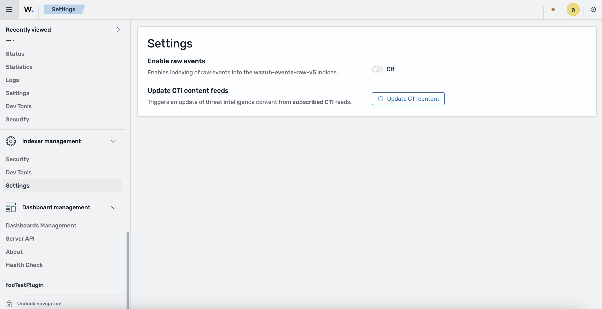

# Indexer Management Settings

## Overview

The **Settings** app, available under **Indexer management**, provides a single place to configure indexer related behavior of the Wazuh platform. From this page you can enable or disable the indexing of raw events and request an on demand update of the threat intelligence content provided by the subscribed CTI feeds.

These functions are part of the dashboard and may be available depending on the platform installation and configuration.

## Accessing the Settings app

Open the menu and go to **Indexer management > Settings**.

## Settings

The Settings page exposes the following configurable items.

### Enable raw events

Controls whether raw events are indexed.

- When enabled, raw events are indexed into the `wazuh-events-raw-v5` indices.
- Use the **On/Off** toggle to change the value.
- This change is applied as a draft and must be saved. See [Saving and discarding changes](#saving-and-discarding-changes).

> **Note:** This setting can be hidden from the UI through the platform configuration. If your deployment hides it, the **Enable raw events** control will not appear on the Settings page. For details on hiding settings, see [Configuration](../configuration.md).

### Update CTI content feeds

Triggers an update of the threat intelligence content from the subscribed CTI (Cyber Threat Intelligence) feeds.

- Click **Update CTI content** to request the update.
- The request is sent immediately and runs asynchronously; you do **not** need to save changes for this action.

## Saving and discarding changes

Changes to **Enable raw events** are tracked as unsaved changes until you save them.

When you modify the toggle, a bar appears at the bottom of the page with the message **You have unsaved changes** and two actions:

- **Save changes**: persists the new configuration to the indexer. On success, a confirmation notification _"Settings updated successfully."_ is displayed.
- **Cancel changes**: discards your edits and restores the last saved configuration.

## Troubleshooting

If the configuration cannot be retrieved, the page shows a **Could not load indexer settings** message together with the error details and a **Retry** button. Click **Retry** to attempt loading the settings again once the underlying issue (for example, indexer connectivity) is resolved.
