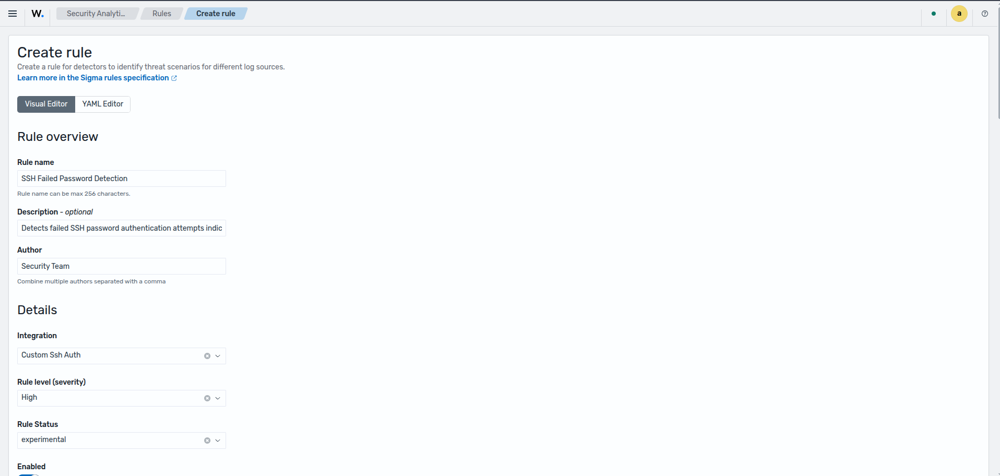
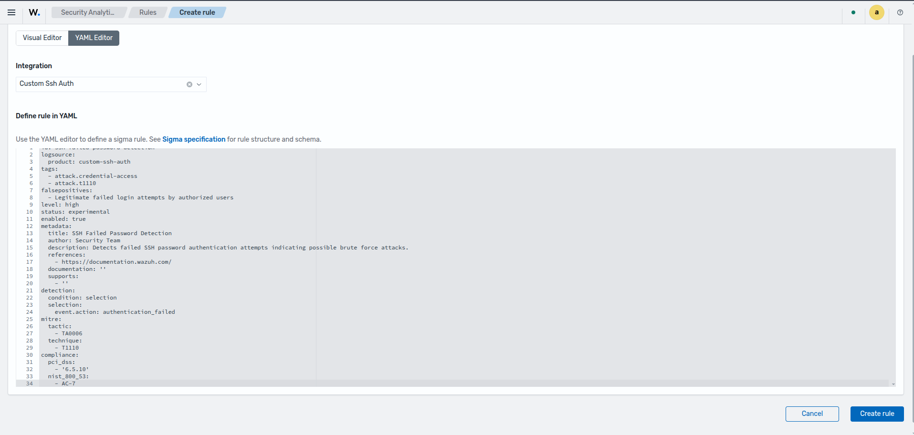
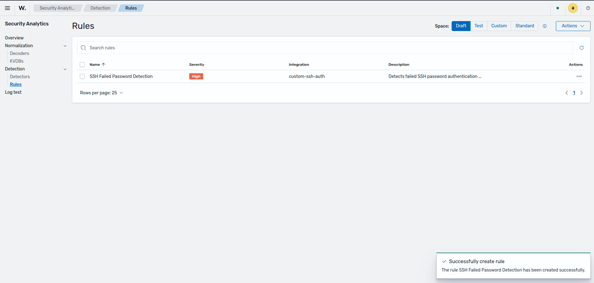
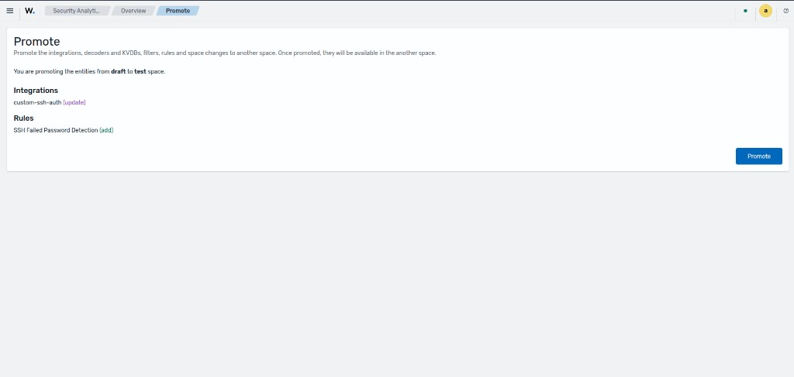
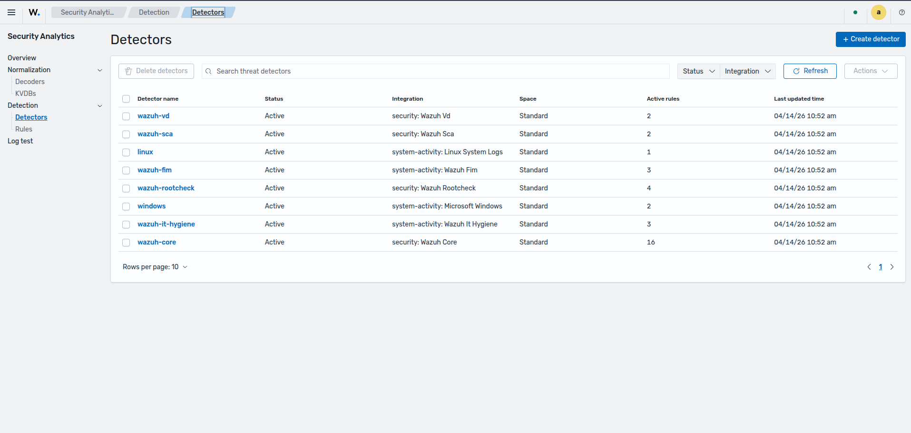
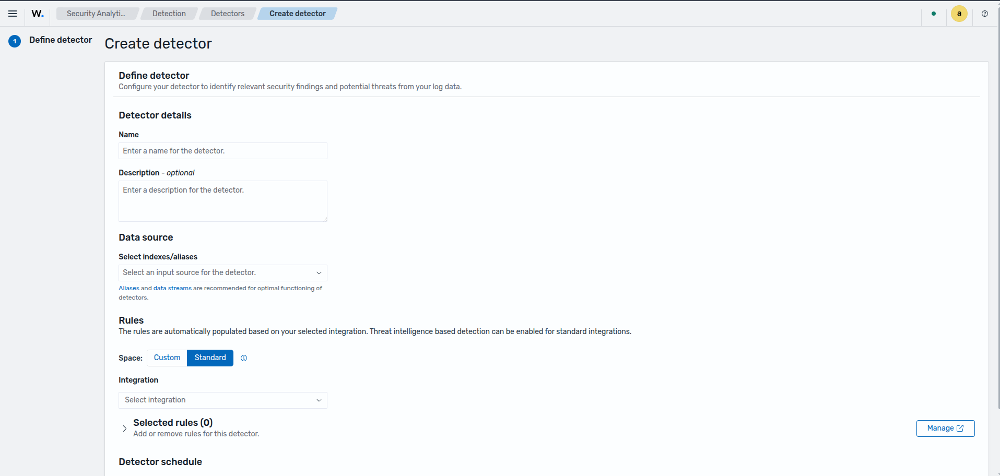
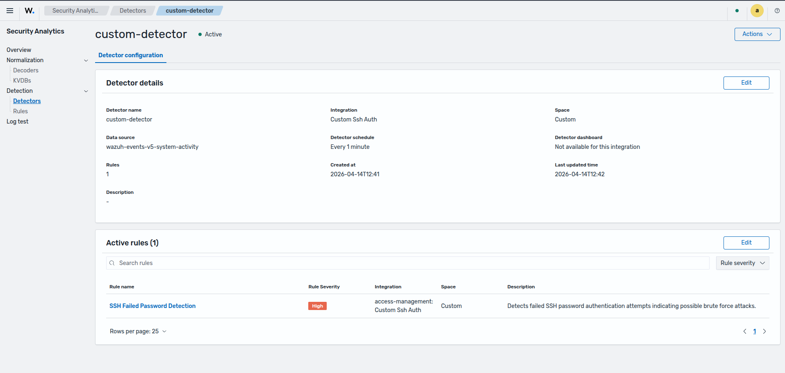

# Detection

The **Detection** module is part of the **Security Analytics** section in the Wazuh Dashboard. It provides visibility and management over the rules that govern alert generation based on normalized events processed by the Wazuh Engine.

This module exposes the following sections:

- **Overview** — Displays all integrations available across spaces, consistent with the Normalization view.
- **Rules** — Lists all detection rules across the active spaces, with filtering and inspection capabilities.
- **Detectors** — Allows creating and managing detectors that connect one or more rules to specific data sources (indexes or aliases) for continuous threat monitoring.

---

## Concepts

### Rules

A **detection rule** defines the conditions under which the Wazuh Engine generates a security alert. Rules operate on fields that have been previously normalized by decoders, and they support references to compliance frameworks and the MITRE ATT&CK matrix.

Rules are written in YAML and follow the same promotion lifecycle as integrations and decoders. Draft, Test, and Custom are user-managed; Standard is read-only:

| Space | Managed by | Description |
|-------|-----------|-------------|
| **Draft** | User | Working area where rules are created and edited. Not active in the engine. |
| **Test** | User | Validation area where rules are loaded into the engine alongside decoders for testing. |
| **Custom** | User | Production area. Rules are active and applied to all incoming normalized events. |
| **Standard** | Wazuh | Read-only. Contains the built-in rules shipped with Wazuh. |

**Lifecycle flow:**

```
Create Rule (Draft) → Promote to Test → Test → Promote to Custom
```

Rules are promoted as part of their parent integration. When an integration is promoted from Draft to Test, or from Test to Custom, all of its associated decoders and rules are promoted together.

### Rule Anatomy

A detection rule is composed of the following main blocks:

| Block | Description |
|-------|-------------|
| `id` | Unique identifier for the rule. |
| `logsource` | Binds the rule to a specific integration. The `product` field must match the integration title exactly. |
| `detection` | Defines the field conditions (`selection`) and the logical `condition` that triggers the alert. |
| `level` | Severity level of the alert (`informational`, `low`, `medium`, `high`, `critical`). |
| `tags` | Free-form tags, commonly used for MITRE ATT&CK technique references. |
| `mitre` | Explicit mapping to MITRE ATT&CK tactics and techniques. |
| `compliance` | Mapping to compliance framework controls (e.g., PCI DSS, NIST 800-53). |
| `metadata` | Descriptive information: title, author, description, and references. |
| `falsepositives` | Documents known conditions that may trigger the rule without indicating a real threat. |

---

## Use Case: Creating a Custom Detection Rule

The following walkthrough demonstrates how to create a detection rule for SSH brute force attempts in the **Draft** space, as part of the **Custom Ssh Auth** integration created in the [Normalization](./normalization.md) use case.

**Prerequisites:** The **Custom Ssh Auth** integration exists in the **Draft** space with its decoder already defined.

---

### Step 1: Navigate to the Rules List

Navigate to **Security Analytics → Detection → Rules** and ensure the **Draft** space is selected using the space selector (top right).

---

### Step 2: Create a Custom Rule

Select **Create rule**. In the creation form, choose between **Form editor** or  the **YAML Editor** mode and select the target integration — in this case, **Custom Ssh Auth**.

<!-- IMAGE: Create rule form with YAML Editor selected and integration chosen -->
<!-- Suggested filename: images/detection/01-create-rule-form.png -->



Provide the rule definition in the editor. The following is an example rule that detects failed SSH password authentication attempts:

<details>
<summary>Rule YAML</summary>

```yaml
id: ssh-failed-password-detection
logsource:
  product: custom-ssh-auth
tags:
  - attack.credential-access
  - attack.t1110
falsepositives:
  - Legitimate failed login attempts by authorized users
level: high
status: experimental
enabled: true
metadata:
  title: SSH Failed Password Detection
  author: Security Team
  description: Detects failed SSH password authentication attempts indicating possible brute force attacks.
  references:
    - https://documentation.wazuh.com/
  documentation: ''
  supports:
    - ''
detection:
  condition: selection
  selection:
    event.action: authentication_failed
mitre:
  tactic:
    - TA0006
  technique:
    - T1110
compliance:
  pci_dss:
    - '6.5.10'
  nist_800_53:
    - AC-7
```

</details>

> **Important:** The `logsource.product` value must match the integration title exactly, using lowercase and hyphens (e.g., `custom-ssh-auth`). A mismatch will prevent the rule from being associated with the correct integration.

<!-- IMAGE: YAML editor with the rule definition filled in -->
<!-- Suggested filename: images/detection/02-create-rule-yaml-filled.png -->



Click **Create rule**. The engine validates the definition automatically.

<!-- IMAGE: Rule successfully created confirmation -->
<!-- Suggested filename: images/detection/03-rule-created-success.png -->



---

### Step 3: Verify the Rule in the Draft List

After creation, the rule appears in the **Rules** list under the **Draft** space, associated with the **Custom Ssh Auth** integration.

---

### Step 4: Promote Draft → Test → Custom

The promotion flow is identical to the one described in [Normalization — Step 4](./normalization.md#step-4-promote-draft--test). Navigate to **Security Analytics → Detection → Overview**, ensure the **Draft** space is selected, and click **Actions → Promote** on the integration.

The promotion dialog lists all entities that will be synchronized. Because the integration already existed and the rule is new, each entity is labeled with the operation that will be applied:

- **Integrations** — `custom-ssh-auth (update)` — the integration metadata is refreshed.
- **Rules** — `SSH Failed Password Detection (add)` — the new rule is added for the first time.

<!-- IMAGE: Promotion dialog showing integration as (update) and rule as (add) -->



Click **Promote** to confirm. The integration and its rule are now available in the **Test** space. Follow the same steps to promote from **Test → Custom** once validation is complete.

After promotion to **Custom**, the rule is active in the engine. Any incoming event normalized by the **custom-ssh-auth** decoder that satisfies the `event.action: authentication_failed` condition will trigger an alert classified as **High** severity, mapped to MITRE ATT&CK technique **T1110** (Brute Force) and tactic **TA0006** (Credential Access).

---

## Use Case: Defining a Detector

A **detector** connects detection rules to a specific data source (an index or alias) and runs continuously to identify security findings. Detectors operate on top of rules that are already active in the **Custom** or **Standard** space.

**Prerequisites:** The **Custom Ssh Auth** integration and its rules are promoted to the **Custom** space.

---

### Step 1: Open the Detector Creation Form

Navigate to **Security Analytics → Detection → Detectors**.

<!-- IMAGE: Detectors list with Create detector button -->
<!-- Suggested filename: images/detection/05-detectors-list.png -->



---

### Step 2: Configure Detector Details

Click on **Create detector** to add a new detecor:

**Detector details**

- **Name** — Enter a descriptive name that identifies the detector (e.g., `SSH Brute Force Monitor`).
- **Description** *(optional)* — A brief explanation of the detector's purpose.

**Data source**

Select the index or alias that contains the log data to be monitored. Aliases and data streams are recommended for optimal functioning.

- **Select indexes/aliases** — Choose the index that receives the SSH authentication logs (e.g., `wazuh-events-v5-system-activity`).

**Rules**

Rules are automatically populated based on the selected integration. Choose the space and integration to filter the available rules:

- **Space** — Select `Custom` to use rules already promoted to production.
- **Integration** — Select `Custom Ssh Auth` to load its associated rules.

The **Selected rules** panel displays the rules that will be active for this detector. Use **Manage** to add or remove individual rules.

<!-- IMAGE: Detector creation form filled with SSH Brute Force Monitor config -->
<!-- Suggested filename: images/detection/06-define-detector-form.png -->



---

### Step 3: Review and Create

Review the detector configuration and click **Create detector**. The detector begins running immediately against the configured data source using the selected rules.

<!-- IMAGE: Detector created and visible in the detectors list -->
<!-- Suggested filename: images/detection/07-detector-created.png -->



---

## Related Sections

- [Normalization](./normalization.md) — Manage integrations, decoders, and KVDBs that prepare events for detection.
