# Normalization

The **Normalization** module is part of the **Security Analytics** section in the Wazuh Dashboard. It provides visibility and management over the components that govern how raw log data is parsed, enriched, and structured before it is used for detection and analysis.

This module exposes the following sections:

- **Overview** — Displays all integrations available across the active spaces (Draft, Test, and Custom), along with their status and associated metadata.
- **Decoders** — Lists all decoders defined within the normalization engine, with filtering and inspection capabilities.
- **KVDBs** — Lists all key-value databases (KVDBs) available for use in decoder and rule logic.
- **Log test** — Provides an interactive interface to validate that a specific log event is correctly parsed by the active decoders in a given space.

---

## Concepts

### Integrations

An **integration** is the top-level organizational unit in Security Analytics. It groups a set of related decoders and rules that together implement support for a specific log source or use case.

The following spaces are available. Draft, Test, and Custom are user-managed; Standard is read-only and contains the built-in content shipped with Wazuh:

| Space        | Managed by | Description                                                                            |
| ------------ | ---------- | -------------------------------------------------------------------------------------- |
| **Draft**    | User       | Working area where content is created and edited. Not active in the engine.            |
| **Test**     | User       | Validation area where content is loaded into the engine for testing.                   |
| **Custom**   | User       | Production area. Content is active and applied to all incoming events.                 |
| **Standard** | Wazuh      | Read-only. Contains the built-in integrations, decoders, and rules shipped with Wazuh. |

### Decoders

A **decoder** defines how a raw log event is parsed and mapped to normalized fields. Decoders are written in YAML and are validated against the Wazuh Engine schema. Each decoder belongs to an integration.

### KVDBs

A **KVDB** (Key-Value Database) is a lookup table that can be referenced in decoder or rule logic to enrich events with additional context (for example, mapping IP addresses to threat categories).

---

## Use Case: Creating a Custom Decoder

The following walkthrough demonstrates how to create a custom decoder for SSH authentication logs, validate it through the promotion lifecycle, and confirm it is working correctly via Log test.

**Lifecycle flow:**

```
Create Integration → Add Decoder → Enable → Promote to Test → Test → Promote to Custom
```

---

### Step 1: Create a Custom Integration

Navigate to **Security Analytics → Normalization → Overview**, then select **Create Integration** and complete the form with the integration name, description, and any relevant metadata.

<!-- IMAGE: Form to create a new integration -->
<!-- Suggested filename: images/normalization/01-create-integration-form.png -->

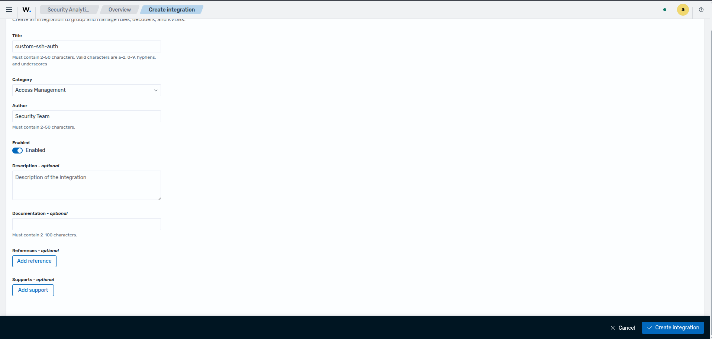

Once created, the new integration appears in the integrations list within the **Draft** space.

<!-- IMAGE: Integrations list showing the newly created integration -->
<!-- Suggested filename: images/normalization/02-integrations-list.png -->

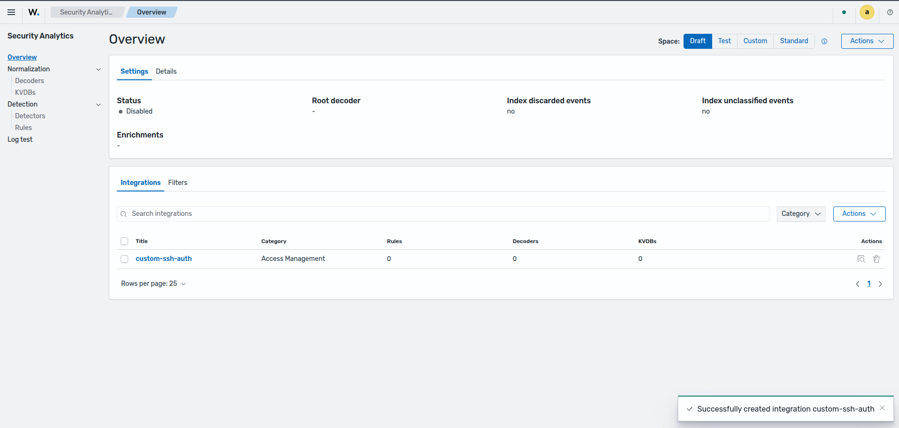

---

### Step 2: Create a Custom Decoder

Navigate to **Security Analytics → Normalization → Decoders**, then select **Create**. In the creation form, select the **YAML Editor** mode, choose the integration created in the previous step (e.g., **Custom Ssh Auth**), and provide the decoder definition.

<!-- IMAGE: Decoder creation form with YAML Editor selected and integration chosen -->
<!-- Suggested filename: images/normalization/03-create-decoder-yaml-editor.png -->

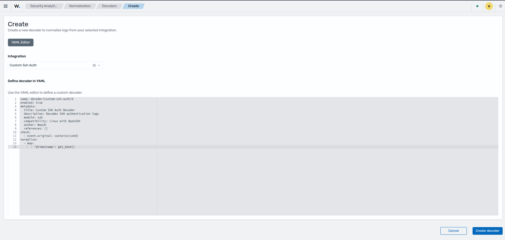

The following is an example decoder definition for SSH authentication logs:

<details>
<summary>Decoder YAML</summary>

```yaml
name: decoder/custom-ssh-auth/0
enabled: true
metadata:
  title: Custom SSH Auth Decoder
  description: Decodes SSH authentication logs
  module: ssh
  compatibility: Linux with OpenSSH
  author: Wazuh
  references: []
check:
  - event.original: contains(sshd)
normalize:
  - map:
      - '@timestamp': get_date()
```

</details>

The `check` block defines the condition that must be satisfied for this decoder to apply. The `normalize` block defines the field mappings applied when the condition matches.

Click **Create decoder**. The engine automatically validates the YAML definition.

<!-- IMAGE: Decoder successfully validated and created -->
<!-- Suggested filename: images/normalization/04-decoder-validation.png -->

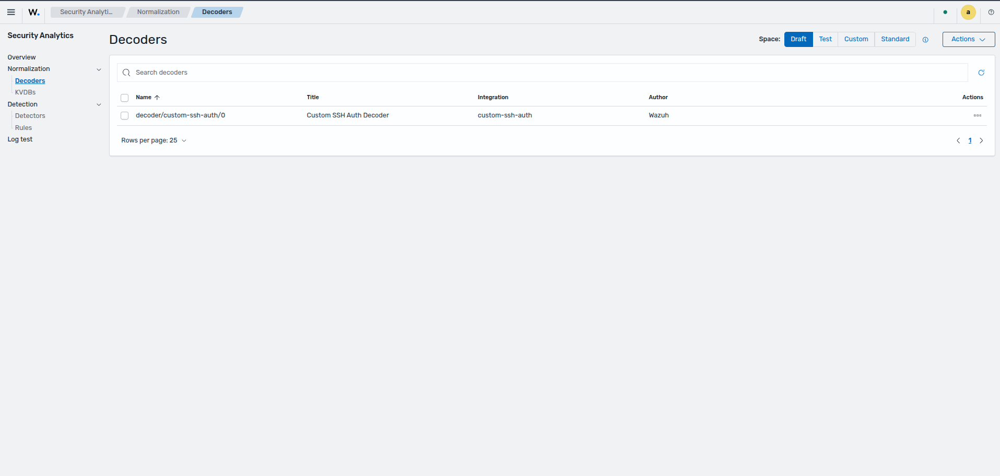

---

### Step 3: Enable the Integration and Assign a Root Decoder

Before an integration can be promoted, it must be **enabled** and have a **root decoder** assigned. The root decoder is the entry point that the engine uses to begin processing events for this integration.

1. Navigate to **Security Analytics → Normalization → Overview** and ensure the **Draft** space is selected (top-right space selector).
2. Locate the integration, click **Actions → Edit**.

<!-- IMAGE: Integration actions menu in the Draft space, Edit option highlighted -->
<!-- Suggested filename: images/normalization/05-enable-integration-edit.png -->

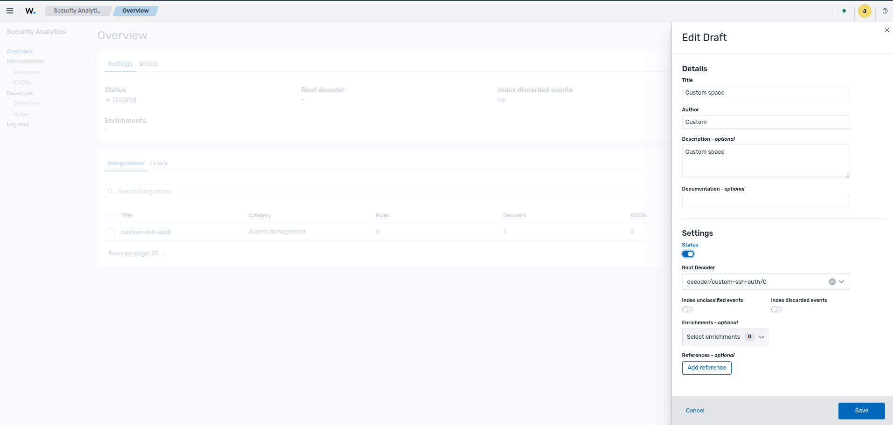

3. Set **Status** to **Enabled** and confirm the root decoder is assigned.

<!-- IMAGE: Integration edit form showing Status set to Enabled -->
<!-- Suggested filename: images/normalization/06-enable-integration-status.png -->

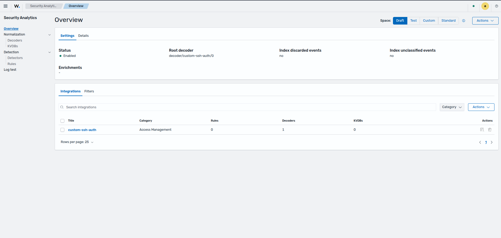

---

### Step 4: Promote Draft → Test

Once the integration is enabled, it can be promoted to the **Test** space so its decoders are loaded into the engine for validation.

1. In the **Draft** space click **Actions → Promote**.

<!-- IMAGE: Actions menu with Promote option highlighted in Draft space -->
<!-- Suggested filename: images/normalization/07-promote-draft-to-test.png -->


<!-- IMAGE: Promotion confirmation dialog -->
<!-- Suggested filename: images/normalization/09-promote-to-test-confirm.png -->


<!-- IMAGE: Success state after promoting to Test -->
<!-- Suggested filename: images/normalization/10-promote-to-test-success.png -->

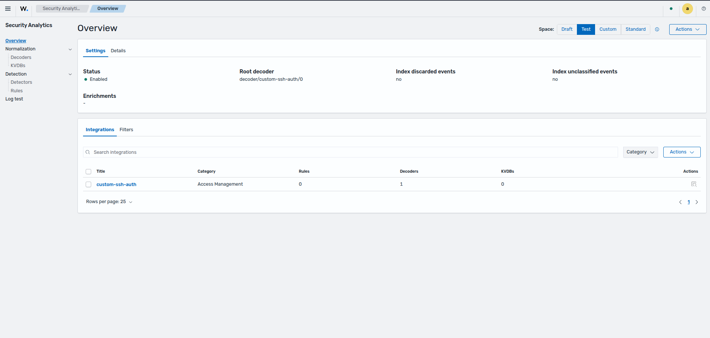

---

### Step 5: Validate with Log Test

With the integration active in the **Test** space, use the **Log test** tool to verify that events are correctly parsed.

Navigate to **Security Analytics → Normalization → Log test** and configure the following:

- **Space:** Test
- **Location:** `/var/log/auth.log`
- **Event:** Provide a representative log event, for example:

```
Dec 19 12:00:00 host sshd[123]: Failed password for root from 10.0.0.1 port 12345 ssh2
```

Click **Test**. The output should indicate **Success** for the decoder stage, along with the resulting normalized fields.

<!-- IMAGE: Log test form filled with the test event -->
<!-- Suggested filename: images/normalization/11-log-test-form.png -->

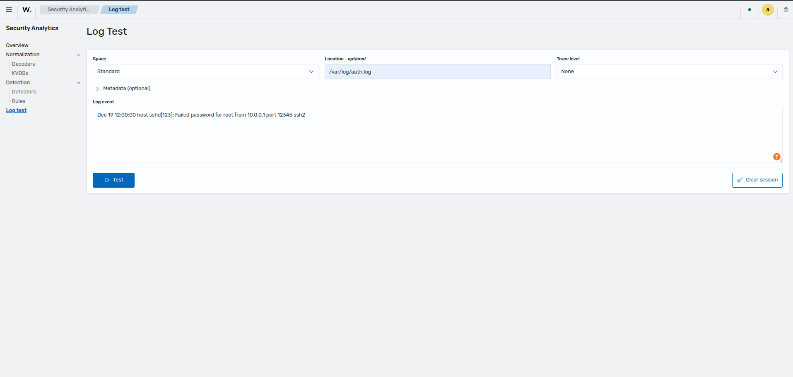

<!-- IMAGE: Log test result showing decoder Success and normalized output -->
<!-- Suggested filename: images/normalization/12-log-test-result.png -->

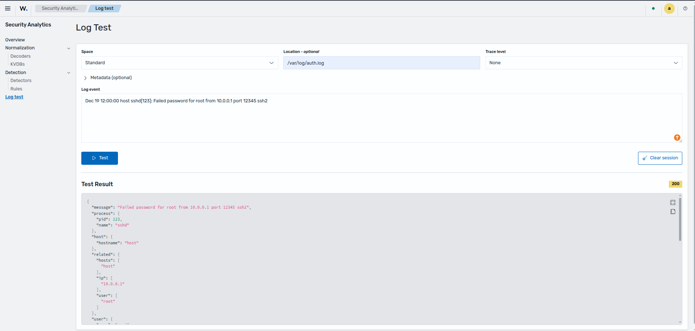

---

### Step 6: Promote Test → Custom

Once validation is complete, promote the integration to the **Custom** space to make it active in production.

1. Switch to the **Test** space using the space selector (top right).

<!-- IMAGE: Space selector showing the Test space selected -->
<!-- Suggested filename: images/normalization/13-switch-test-space.png -->


2. Locate the integration, click **Actions → Promote**, then confirm by clicking **Promote**.

<!-- IMAGE: Promotion dialog to promote from Test to Custom -->
<!-- Suggested filename: images/normalization/14-promote-test-to-custom.png -->

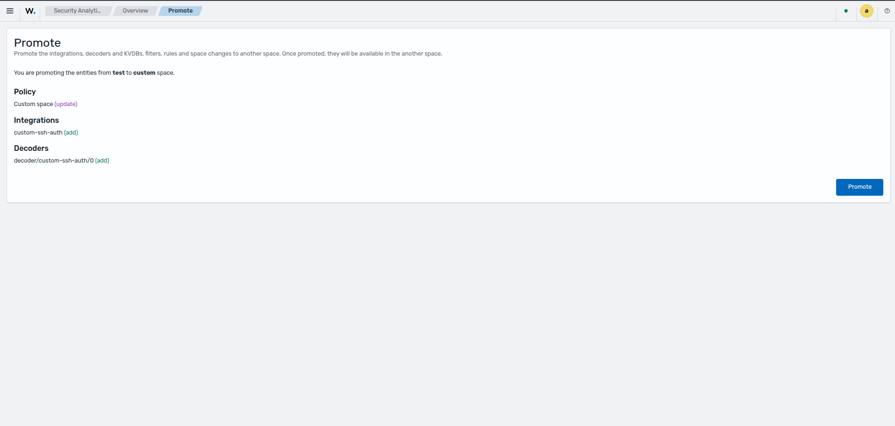

Once promoted, the integration is active in the **Custom** space and the engine applies its decoders to all incoming events that match the configured conditions.

3. Confirm promotion, check the entities that will be promoted to custom, and valitate because this action is irreversible.

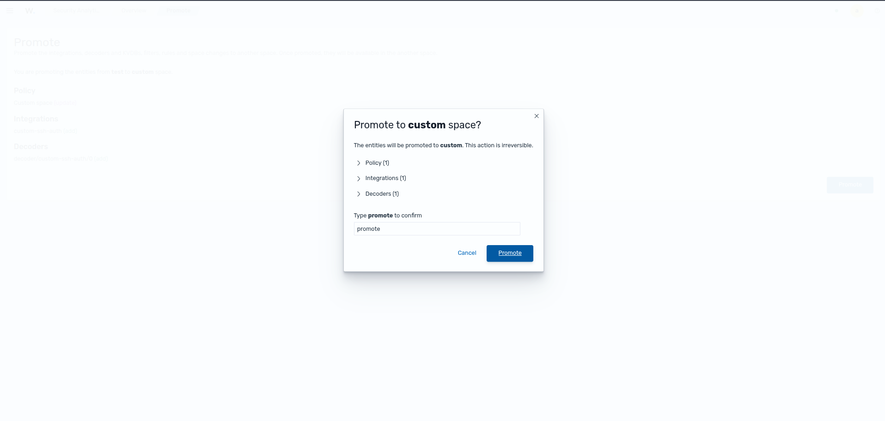

<!-- IMAGE: Custom space showing the integration as active -->
<!-- Suggested filename: images/normalization/15-custom-integration-active.png -->

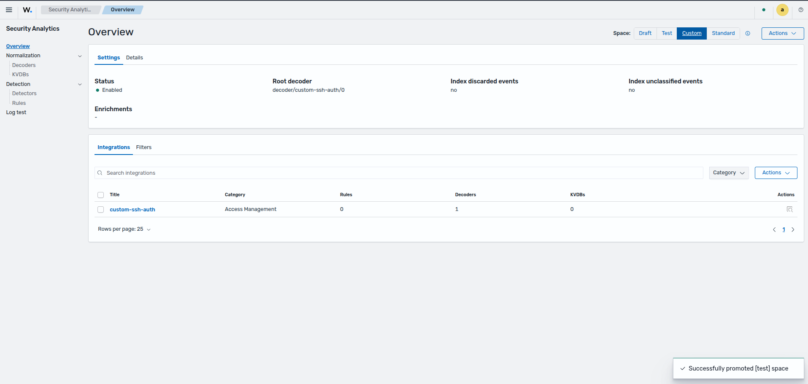

---

## Related Sections

- [Detection](./detection.md) — Manage and create rules that operate on normalized events.
