# Normalization

The **Normalization** module is part of the **Security Analytics** section in the Wazuh Dashboard. It provides visibility and management over the components that govern how raw log data is parsed, enriched, and structured before it is used for detection and analysis.

This module exposes the following sections:

- **Overview** — Displays all integrations available across the active spaces (Draft, Test, Custom, and Standard), along with their status and associated metadata.
- **Decoders** — Lists all decoders defined within the normalization engine, with filtering and inspection capabilities.
- **KVDBs** — Lists all key-value databases (KVDBs) available for use in decoder and rule logic.
- **Log test** — Provides an interactive interface to validate that a specific log event is correctly parsed by the active decoders in a given space.

---

## Concepts

### Integrations

An **integration** is the top-level organizational unit in Security Analytics. It groups a set of related decoders and rules that together implement support for a specific log source or use case.

In each space, the integration is configured through a **space policy**. That policy must be **enabled** before the integration can move forward in the promotion workflow for that space, and it defines the **root decoder**—the decoder the normalization engine uses as the entry point when processing events for this integration (in **Test** and **Custom**, where content is loaded into the engine).

For the full list of space-policy settings — including the **event-indexing** toggles for unclassified and discarded events — see [Space policy settings](#space-policy-settings).

The following spaces are available. Draft, Test, and Custom are user-managed; Standard is read-only and contains the built-in content shipped with Wazuh:

| Space        | Managed by | Description                                                                            |
| ------------ | ---------- | -------------------------------------------------------------------------------------- |
| **Draft**    | User       | Working area where content is created and edited. Not active in the engine.            |
| **Test**     | User       | Validation area where content is loaded into the engine for testing.                   |
| **Custom**   | User       | Production area. Content is active and applied to all incoming events.                 |
| **Standard** | Wazuh      | Read-only. Contains the built-in integrations, decoders, and rules shipped with Wazuh. |

### Decoders

A **decoder** defines how a raw log event is parsed and mapped to normalized fields. Decoders are written in YAML and are validated against the Wazuh Engine schema. Each decoder belongs to an integration.

### KVDBs

A **KVDB** (Key-Value Database) is a lookup table that can be referenced in decoder or rule logic to enrich events with additional context (for example, mapping IP addresses to threat categories).

---

## Use Case: Creating a Custom Decoder

The following walkthrough demonstrates how to create a custom decoder for SSH authentication logs, validate it through the promotion lifecycle, and confirm it is working correctly via Log test.

**Lifecycle flow:**

```
Create Integration → Add Decoder → Enable policy → Promote to Test → Test → Promote to Custom
```

---

### Step 1: Create a Custom Integration

Navigate to **Security Analytics → Overview** (space **Draft**), open the **Integrations** tab, and select **Actions → Create** to open the **Create integration** form. Complete it:

- **Title** _(required)_ — the integration identifier, e.g. `custom-ssh-auth`. Must be 2–50 characters using only lowercase letters, digits, hyphens, and underscores (no spaces or uppercase).
- **Category** _(required)_ — routes classified events to the `wazuh-events-v5-<category>` index.
- **Author** _(required)_.
- **Description**, **Documentation**, **References**, **Supports** — optional.

Leave **Enabled** on, then click **Create integration**.

<!-- IMAGE: Form to create a new integration -->
<!-- Suggested filename: images/normalization/01-create-integration-form.png -->

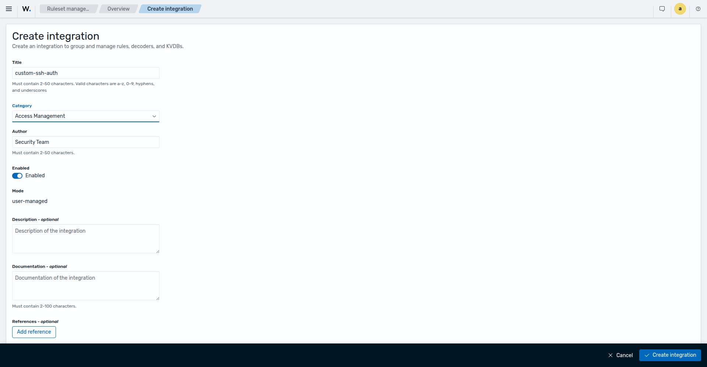

Once created, the new integration appears in the integrations list within the **Draft** space.

<!-- IMAGE: Integrations list showing the newly created integration -->
<!-- Suggested filename: images/normalization/02-integrations-list.png -->

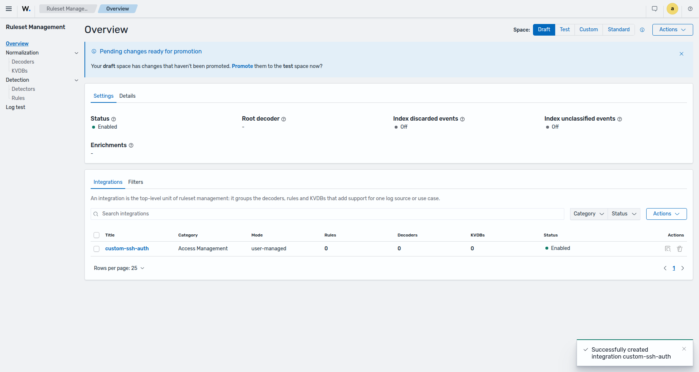

---

### Step 2: Create a Custom Decoder

Navigate to **Security Analytics → Normalization → Decoders**, then select **Actions → Create**. In the creation form, choose the integration created in the previous step (`custom-ssh-auth`), and provide the decoder definition.

<!-- IMAGE: Decoder creation form with integration chosen -->
<!-- Suggested filename: images/normalization/03-create-decoder-yaml-editor.png -->

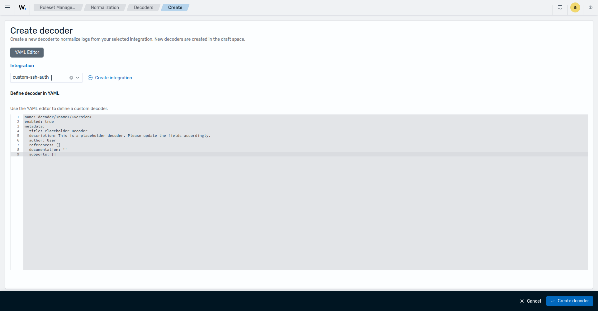

The following is an example decoder definition for SSH authentication logs:

<details>
<summary>Decoder YAML</summary>

```yaml
name: decoder/custom-ssh-auth/0
enabled: true
metadata:
  title: Custom SSH Auth Decoder
  description: Decodes SSH authentication logs
  compatibility:
    - Linux with OpenSSH
  author: Wazuh
  references: []
check:
  - event.original: contains(sshd)
normalize:
  - map:
      - '@timestamp': get_date()
```

</details>

The `check` block defines the condition that must be satisfied for this decoder to apply. The `normalize` block defines the field mappings applied when the condition matches.

Click **Create decoder**. The definition is validated against the decoder schema before it is saved — unrecognized keys or wrong types are rejected (for example, `compatibility` must be a list, and `metadata.module` is not a valid field). The form opens pre-filled with a placeholder decoder that must be replaced.

<!-- IMAGE: Schema validation rejecting an invalid decoder -->
<!-- Suggested filename: images/normalization/04-decoder-validation.png -->

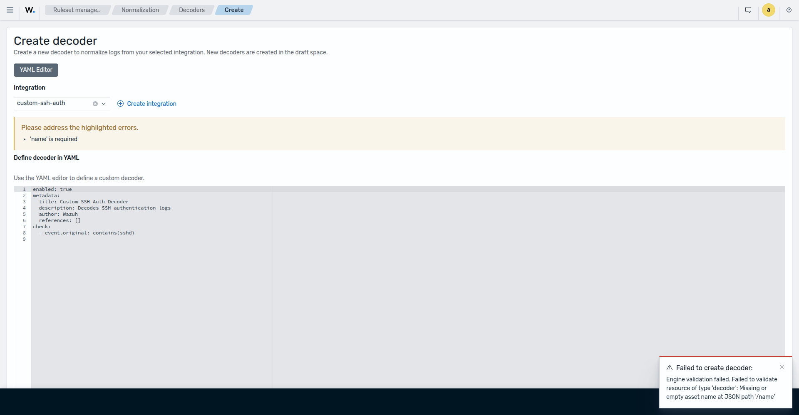

Once valid, the decoder is created and appears under **Normalization → Decoders**.

---

### Step 3: Enable the space policy and assign the root decoder

The space's **space policy** defines the **root decoder** — the decoder the engine uses as the entry point for event processing — and whether the space is active (the **Status** toggle). A root decoder must be set before the space's content can be promoted.

1. Navigate to **Security Analytics → Overview** and ensure the **Draft** space is selected (top-right space selector).
2. Open the space **Actions** menu (top-right) and select **Edit** to open the **Edit Draft** flyout.

<!-- IMAGE: Integration actions menu in the Draft space, Edit option highlighted -->
<!-- Suggested filename: images/normalization/05-enable-integration-edit.png -->

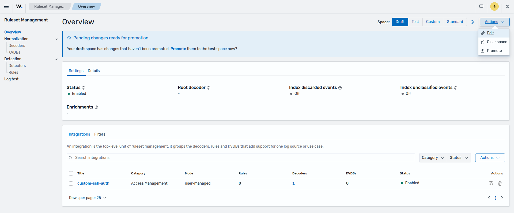

3. In the flyout's **Settings** group, enable **Status** and select the **Root Decoder**. See [Space policy settings](#space-policy-settings) for every field.

<!-- IMAGE: Space policy form showing Status set to Enabled and root decoder assigned -->
<!-- Suggested filename: images/normalization/06-enable-integration-status.png -->

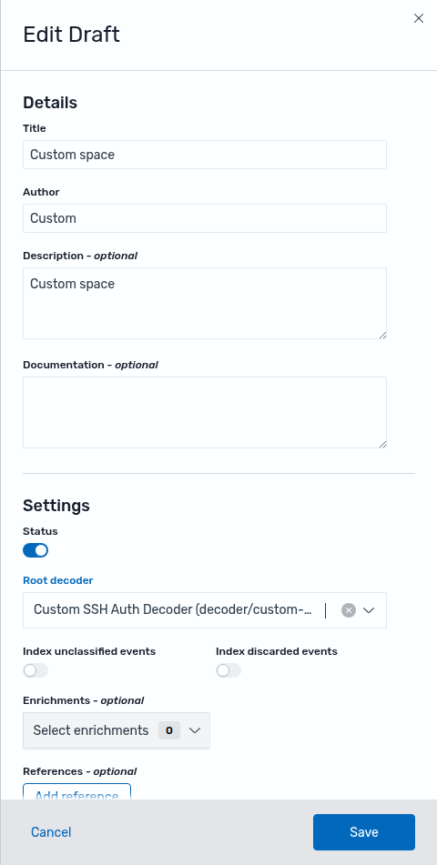

After **Save**, the **Settings** tab reflects the change — **Status: Enabled** and **Root decoder: decoder/custom-ssh-auth/0** — confirmed by a _Successfully updated [draft] space_ toast.

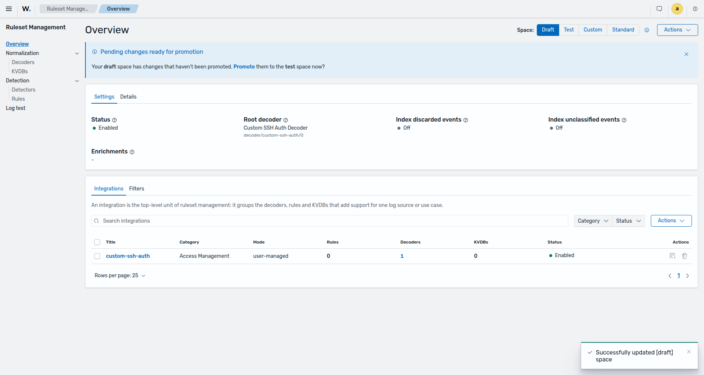

---

### Step 4: Promote Draft → Test

Once the **Draft** policy is **enabled** and the **root decoder** is set, the integration can be promoted to the **Test** space so its decoders are loaded into the engine for validation.

1. In the **Draft** space, open the **Actions** menu and click **Promote**.

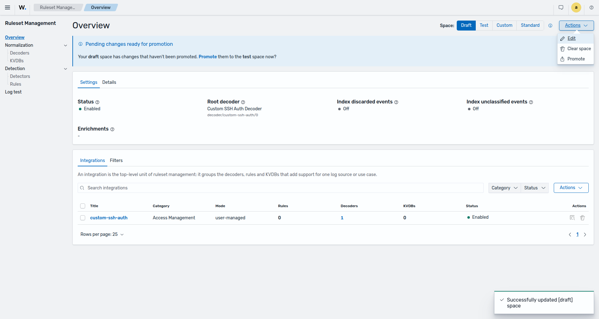

2. The **Promote** page lists the entities to be promoted — only those with pending changes — grouped by type (**Space**, **Integrations**, **Decoders**, **KVDBs**, **Filters**, **Rules**). Each entity shows the operation that will be applied — **`(add)`** if it does not yet exist in the **Test** space, or **`(update)`** if it already exists and will be refreshed.

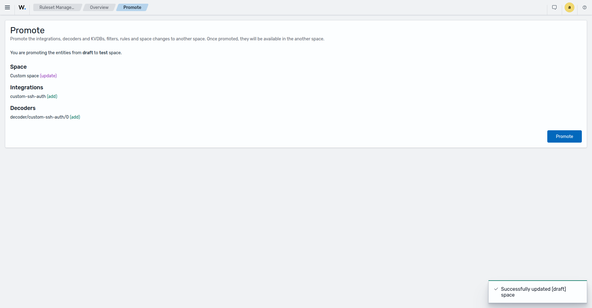

3. Click **Promote**. A confirmation dialog (**Promote to Test space?**) lists the entity counts and warns that the action is irreversible. Type `promote` to enable the button, then confirm.

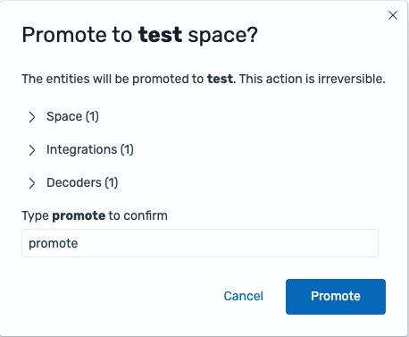

A _Successfully promoted [draft] space_ toast confirms it, and the integration is now available in the **Test** space.

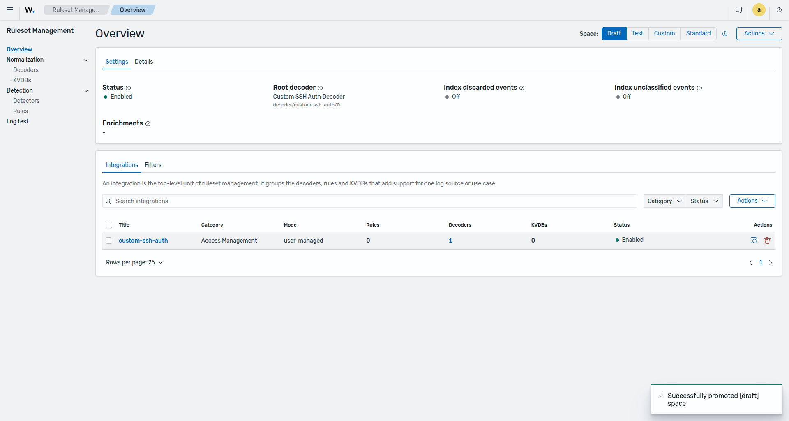

---

### Step 5: Validate with Log Test

With the integration promoted to the **Test** space, use **Log test** to verify that events are parsed correctly.

Navigate to **Security Analytics → Log test** and select the **Test** space (header space selector). Under **Normalization**, set **Location** to `/var/log/auth.log` _(optional)_ and paste a representative event in **Log event**:

```
Dec 19 12:00:00 host sshd[123]: Failed password for root from 10.0.0.1 port 12345 ssh2
```

Click **Test**.

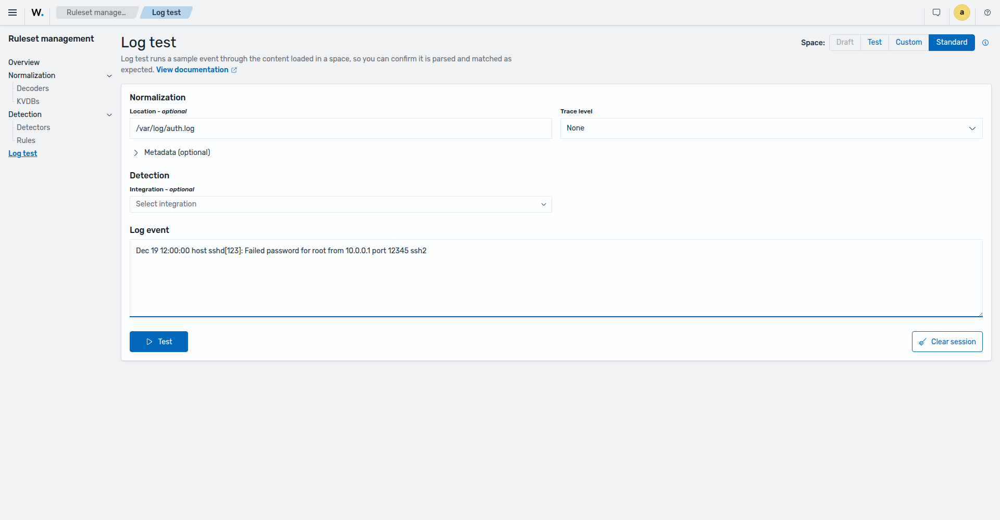

The **Test Result** panel shows a status badge (**200** on success) and two tabs. The **Normalization** tab shows the normalized event — including `wazuh.integration.decoders` (the decoder that matched, `decoder/custom-ssh-auth/0`), `wazuh.integration.name` (`custom-ssh-auth`), and `wazuh.integration.category` (`access-management`, from the integration's **Category**).

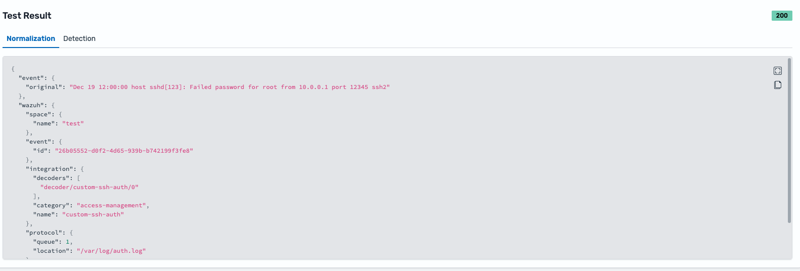

The **Detection** tab evaluates the rules of the integration selected under the form's **Detection** section. Until rules exist for `custom-ssh-auth`, it reports _0 rules evaluated_ — revisit it after creating a rule in [Detection](./detection.md).

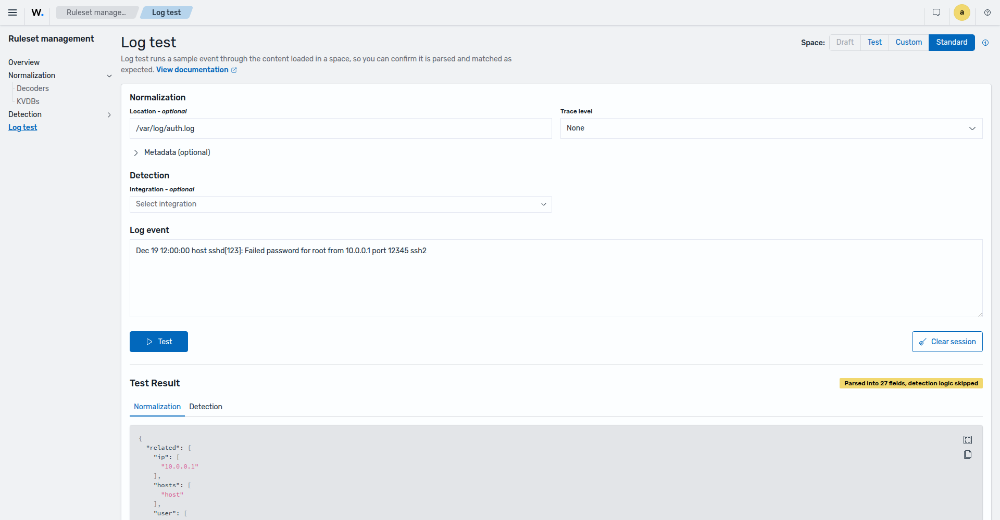

---

### Step 6: Promote Test → Custom

Once validation is complete, promote the integration to the **Custom** space to make it active in production.

1. Switch to the **Test** space using the space selector (top right).

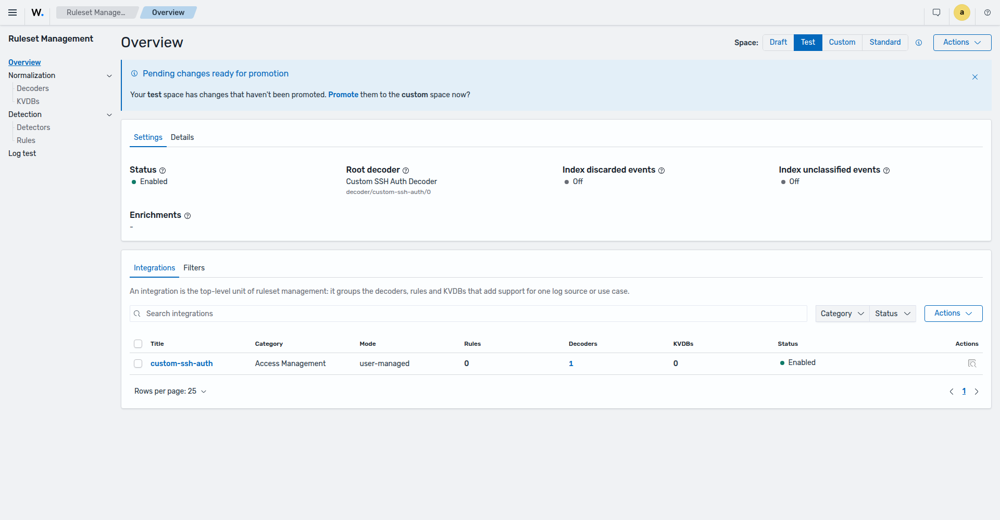

2. Open the space **Actions** menu and click **Promote**. The **Promote** page lists the entities to be promoted from **Test** to **Custom**, each tagged **`(add)`** or **`(update)`**.

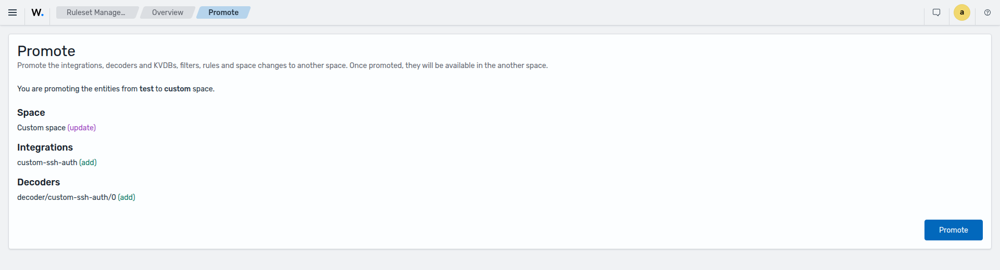

3. Click **Promote**, then type `promote` in the confirmation dialog (**Promote to Custom space?**) to confirm. This action is irreversible.

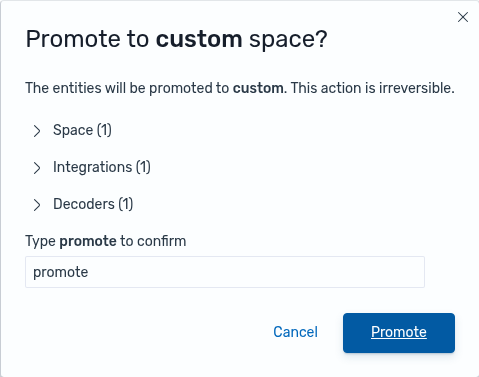

Once promoted, the integration is active in the **Custom** space and the engine applies its decoders to all incoming events that match the configured conditions.

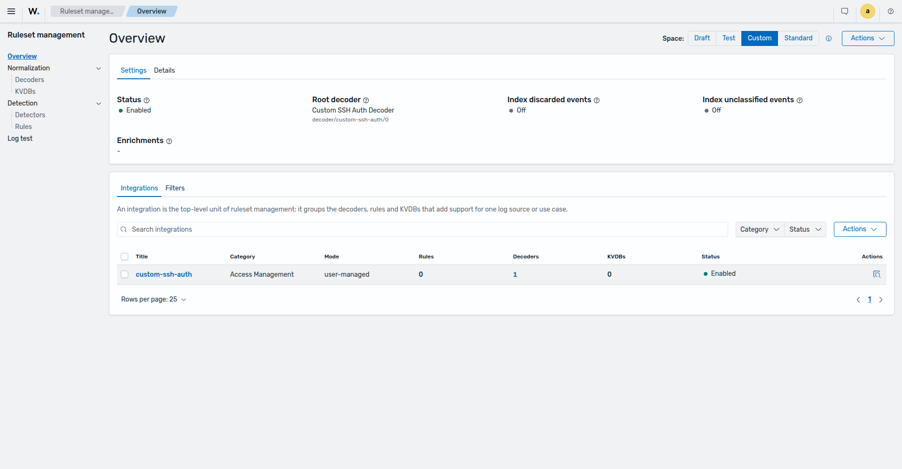

---

## Space policy settings

Every space has a **space policy**. Its current values are shown read-only on the **Settings** and **Details** tabs of the policy card in **Security Analytics → Overview** (in any space). To change them, select the space (top-right space selector) and choose **Actions → Edit** to open the **Edit &lt;space&gt;** flyout (titled, for example, **Edit Draft**).

**Where editing is available.** The **Actions → Edit** item is enabled only in **Draft** and **Standard**; in **Test** and **Custom** it is disabled. Which fields are editable also depends on the space:

| Space        | Actions → Edit | Editable fields                                                                                     |
| ------------ | -------------- | --------------------------------------------------------------------------------------------------- |
| **Draft**    | Enabled        | All fields (Details + Settings)                                                                     |
| **Standard** | Enabled        | Status, Index unclassified events, Index discarded events, Enrichments (all other fields read-only) |
| **Test**     | Disabled       | —                                                                                                   |
| **Custom**   | Disabled       | —                                                                                                   |

The flyout has two groups — **Details** (policy metadata) and **Settings** (policy behavior):

| Field                          | Group    | Control         | Sets                                                                                                               |
| ------------------------------ | -------- | --------------- | ------------------------------------------------------------------------------------------------------------------ |
| **Title**                      | Details  | text (required) | Policy title                                                                                                       |
| **Author**                     | Details  | text (required) | Policy author                                                                                                      |
| **Description** _(optional)_   | Details  | text area       | Policy description                                                                                                 |
| **Documentation** _(optional)_ | Details  | text area       | Policy documentation                                                                                               |
| **Status**                     | Settings | toggle          | Enables or disables the space policy                                                                               |
| **Root Decoder**               | Settings | single-select   | The policy's root decoder (see [Concepts → Integrations](#integrations))                                           |
| **Index unclassified events**  | Settings | toggle          | Indexing of unclassified events (see [Event indexing](#event-indexing-wazuh-50) below)                             |
| **Index discarded events**     | Settings | toggle          | Indexing of discarded events (see [Event indexing](#event-indexing-wazuh-50) below)                                |
| **Enrichments** _(optional)_   | Settings | multi-select    | Enrichments applied in this space: Geolocation, Connection, URL full, URL domain, Hash MD5, Hash SHA1, Hash SHA256 |
| **References** _(optional)_    | Settings | URL list        | Reference links                                                                                                    |

Apply changes with **Save**.

<!-- IMAGE: Edit <space> flyout showing the Details and Settings groups -->
<!-- Suggested filename: images/normalization/16-space-policy-settings.png -->

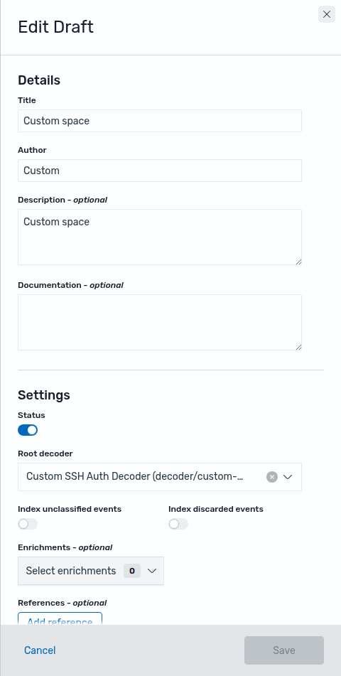

### Event indexing (Wazuh 5.0)

In Wazuh 5.0, events processed by the engine are **indexed** rather than archived to a file on the manager (the 4.x default). Two space-policy toggles control whether events that would not otherwise reach a category index are still indexed:

- **Index unclassified events** — **unclassified events** are those that only matched the root/unclassified integration and were not reclassified into a category (the 5.0 equivalent of 4.x events that matched no rule). When enabled, they are indexed into `wazuh-events-v5-unclassified`. For the routing logic, see the [engine reference](https://github.com/wazuh/wazuh/blob/5.0.0/docs/ref/modules/engine/README.md#unclassified-events).
- **Index discarded events** — events discarded by the engine during processing. When enabled, they are indexed.

Both toggles live in the space policy's **Settings** group (shown in the **Edit &lt;space&gt;** flyout screenshot above).

**Enable or disable unclassified / discarded events indexing — exact UI steps:**

1. Go to **Security Analytics → Overview**.
2. Select the space (top-right space selector). These toggles are editable in **Draft** and **Standard** only (see [Space policy settings](#space-policy-settings)).
3. Open the space **Actions** menu and select **Edit** to open the **Edit &lt;space&gt;** flyout.
4. Under **Settings**, toggle **Index unclassified events** and/or **Index discarded events**.
5. Click **Save**.

These settings can be hidden from the UI via the `opensearch_security_analytics.disabledSettings` option (`index-unclassified-events`, `index-discarded-events`). See [Configuration](../../configuration.md).

## Related Sections

- [Detection](./detection.md) — Manage and create rules that operate on normalized events.
