# Dashboard Assistant

## Domain Model Architecture

### Clean Architecture Implementation

This implementation follows Clean Architecture, SOLID principles, and design patterns to create a robust and maintainable solution for Dashboard Assistant installation.

#### Architecture Layers

```
┌─────────────────────────────────────────────────────────────┐
│                    Presentation Layer                       │
│  (React Components, UI State Management)                   │
└─────────────────────────────────────────────────────────────┘
                              │
┌─────────────────────────────────────────────────────────────┐
│                   Application Layer                         │
│  (Use Cases, Installation Manager)                         │
└─────────────────────────────────────────────────────────────┘
                              │
┌─────────────────────────────────────────────────────────────┐
│                    Domain Layer                             │
│  (Entities, Value Objects, Domain Services)                │
└─────────────────────────────────────────────────────────────┘
                              │
┌─────────────────────────────────────────────────────────────┐
│                 Infrastructure Layer                        │
│  (Repositories, HTTP Clients, External APIs)               │
└─────────────────────────────────────────────────────────────┘
```

## Domain Model Diagram

```mermaid
classDiagram
    %% Core Infrastructure Interfaces
    class IHttpClient {
        <<interface>>
        +get(url: string): Promise~T~
        +post(url: string, data: any): Promise~T~
        +put(url: string, data: any): Promise~T~
        +delete(url: string): Promise~T~
    }
    


    %% Domain Entities
    class ClusterSettings {
        -mlCommonsAgentFrameworkEnabled: boolean
        -onlyRunOnMlNode: boolean
        -ragPipelineFeatureEnabled: boolean
        -trustedConnectorEndpointsRegex: string[]
        +create(config): ClusterSettings
        +toApiPayload(): object
    }

    class ModelGroup {
        -id: string | null
        -name: string
        -description: string
        +create(name: string, description: string): ModelGroup
        +fromResponse(data): ModelGroup
        +getId(): string | null
        +toApiPayload(): object
    }

    class Connector {
        -id: string | null
        -name: string
        -description: string
        -version: number
        -protocol: string
        -parameters: ConnectorParameters
        -credential: ConnectorCredential
        -actions: ConnectorAction[]
        +create(config): Connector
        +getId(): string | null
        +toApiPayload(): object
    }

    class Model {
        -id: string | null
        -name: string
        -version: string
        -modelGroupId: string
        -connectorId: string
        -description: string
        -status: string
        -createdAt: string
        -apiUrl: string
        +create(config): Model
        +fromResponse(data): Model
        +getId(): string | null
        +getName(): string
        +getVersion(): string
        +getStatus(): string
        +toApiPayload(): object
        +toTableFormat(): object
    }

    class Agent {
        -id: string | null
        -name: string
        -type: string
        -description: string
        -llm: AgentLLM
        -memory: AgentMemory
        -tools: AgentTool[]
        +create(config): Agent
        +getId(): string | null
        +toApiPayload(): object
    }

    %% Value Objects
    class ConnectorParameters {
        -endpoint: string
        -model: string
        -messages: Array~object~
        +toObject(): object
    }

    class ConnectorCredential {
        -openAIKey: string
        +toObject(): object
    }

    class ConnectorAction {
        -actionType: string
        -method: string
        -url: string
        -headers: Record~string, string~
        -requestBody: string
        +toObject(): object
    }

    class AgentLLM {
        -modelId: string
        -parameters: object
        +toObject(): object
    }

    class AgentMemory {
        -type: string
        -windowSize: number
        +toObject(): object
    }

    class AgentTool {
        -type: string
        -name: string
        -parameters: object
        +toObject(): object
    }

    %% Repository Interfaces
    class IClusterSettingsRepository {
        <<interface>>
        +updateSettings(settings: ClusterSettings): Promise~void~
    }

    class IModelGroupRepository {
        <<interface>>
        +create(modelGroup: ModelGroup): Promise~string~
        +findById(id: string): Promise~ModelGroup | null~
        +update(id: string, modelGroup: ModelGroup): Promise~void~
        +delete(id: string): Promise~void~
    }

    class IConnectorRepository {
        <<interface>>
        +create(connector: Connector): Promise~string~
        +findById(id: string): Promise~Connector | null~
        +update(id: string, connector: Connector): Promise~void~
        +delete(id: string): Promise~void~
    }

    class IModelRepository {
        <<interface>>
        +create(model: Model): Promise~string~
        +findById(id: string): Promise~Model | null~
        +getAll(): Promise~Model[]~
        +update(id: string, model: Model): Promise~void~
        +delete(id: string): Promise~void~
        +testConnection(modelId: string): Promise~boolean~
    }

    class IAgentRepository {
        <<interface>>
        +create(agent: Agent): Promise~string~
        +findById(id: string): Promise~Agent | null~
        +update(id: string, agent: Agent): Promise~void~
        +delete(id: string): Promise~void~
        +register(agentId: string): Promise~void~
    }

    %% Installation Management
    class IInstallationManager {
        <<interface>>
        +execute(request: InstallDashboardAssistantRequest): Promise~InstallationResult~
    }

    class IInstallationStep {
        <<interface>>
        +getName(): string
        +execute(request, context): Promise~void~
    }

    class InstallationContext {
        -data: Map~string, any~
        +set(key: string, value: any): void
        +get(key: string): T | undefined
        +has(key: string): boolean
    }

    %% Relationships
    Connector --> ConnectorParameters
    Connector --> ConnectorCredential
    Connector --> ConnectorAction
    Agent --> AgentLLM
    Agent --> AgentMemory
    Agent --> AgentTool
    
    IInstallationManager --> IInstallationStep
    IInstallationStep --> InstallationContext
```



## Domain Interfaces and Signatures

### Core Infrastructure

```typescript
// Infrastructure interfaces
interface IHttpClient {
  get<T = any>(url: string, config?: any): Promise<T>;
  post<T = any>(url: string, data?: any, config?: any): Promise<T>;
  put<T = any>(url: string, data?: any, config?: any): Promise<T>;
  delete<T = any>(url: string, config?: any): Promise<T>;
}


```

### Domain Entity Signatures

```typescript
// Domain entities interface signatures
class ClusterSettings {
  static create(config: ClusterSettingsConfig): ClusterSettings;
  toApiPayload(): object;
}

class ModelGroup {
  static create(name: string, description: string): ModelGroup;
  static fromResponse(data: any): ModelGroup;
  getId(): string | null;
  toApiPayload(): object;
}

class Connector {
  static create(config: ConnectorConfig): Connector;
  getId(): string | null;
  toApiPayload(): object;
}

class Model {
  static create(config: ModelConfig): Model;
  static fromResponse(data: any): Model;
  getId(): string | null;
  getName(): string;
  getVersion(): string;
  getStatus(): 'active' | 'inactive' | 'error';
  toApiPayload(): object;
  toTableFormat(): ModelTableFormat;
}

class Agent {
  static create(config: AgentConfig): Agent;
  getId(): string | null;
  toApiPayload(): object;
}
```

### Repository Interfaces

```typescript
// Repository interfaces
interface IClusterSettingsRepository {
  updateSettings(settings: ClusterSettings): Promise<void>;
}

interface IModelGroupRepository {
  create(modelGroup: ModelGroup): Promise<string>;
  findById(id: string): Promise<ModelGroup | null>;
  update(id: string, modelGroup: ModelGroup): Promise<void>;
  delete(id: string): Promise<void>;
}

interface IConnectorRepository {
  create(connector: Connector): Promise<string>;
  findById(id: string): Promise<Connector | null>;
  update(id: string, connector: Connector): Promise<void>;
  delete(id: string): Promise<void>;
}

interface IModelRepository {
  create(model: Model): Promise<string>;
  findById(id: string): Promise<Model | null>;
  getAll(): Promise<Model[]>;
  update(id: string, model: Model): Promise<void>;
  delete(id: string): Promise<void>;
  testConnection(modelId: string): Promise<boolean>;
}

interface IAgentRepository {
  create(agent: Agent): Promise<string>;
  findById(id: string): Promise<Agent | null>;
  update(id: string, agent: Agent): Promise<void>;
  delete(id: string): Promise<void>;
  register(agentId: string): Promise<void>;
}
```

### Installation Management

```typescript
// Installation management interfaces
interface IInstallationManager {
  execute(request: InstallDashboardAssistantRequest): Promise<InstallationResult>;
}

interface IInstallationStep {
  getName(): string;
  execute(request: InstallDashboardAssistantRequest, context: InstallationContext): Promise<void>;
}
```

## Implemented Use Cases

The following use cases have been implemented in the `/common` directory:

### 🔧 **Core Installation Use Cases**
1. **InstallDashboardAssistantUseCase** - Main orchestrator for the complete installation process
2. **UpdateClusterSettingsUseCase** - Updates OpenSearch cluster settings for ML Commons
3. **CreateModelGroupUseCase** - Creates model groups for organizing models
4. **CreateConnectorUseCase** - Creates connectors for external AI services
5. **CreateModelUseCase** - Creates and registers AI models
6. **TestModelConnectionUseCase** - Tests connectivity and functionality of models
7. **CreateAgentUseCase** - Creates conversational agents
8. **RegisterAgentUseCase** - Registers agents in the indexer manager

## Installation Process via OSD API

### [ML Commons](https://github.com/opensearch-project/ml-commons/tree/2.19.2.0)

These are the steps you should follow:

<details><summary>Step 1: Settings</summary>
<p>

>  ```http
> PUT /_cluster/settings
> {
>    "persistent": {
>      "plugins.ml_commons.agent_framework_enabled": true,
>      "plugins.ml_commons.only_run_on_ml_node":"false",
>      "plugins.ml_commons.rag_pipeline_feature_enabled": true,
>      "plugins.ml_commons.trusted_connector_endpoints_regex": [
>        "^https://runtime\\.sagemaker\\..*[a-z0-9-]\\.amazonaws\\.com/.*$",
>        "^https://api\\.openai\\.com/.*$",
>        "^https://api\\.cohere\\.ai/.*$",
>        "^https://bedrock-runtime\\..*[a-z0-9-]\\.amazonaws\\.com/.*$"
>      ]
>    }
> }
> ```

</p>
</details> 

<details><summary>Step 2: Create a model group</summary>
<p>

> Create a model group with an example below ([reference doc](https://opensearch.org/docs/2.19/ml-commons-plugin/remote-models/index/)) and note the model group id.
>
>   ```http
> POST /_plugins/_ml/model_groups/_register
> {
>   "name": "test_model_group",
>   "description": "A model group for external models"
> }
>   ```

</p>
</details> 

<details><summary>Step 3: Create a connector</summary>
<p>
  
> Create a connector ([reference doc](https://docs.opensearch.org/docs/2.19/ml-commons-plugin/remote-models/index/)). Keep note of the connector id from the API response. (Ensure the credentials passed should have access to call the LLM model)
> 
> ```http
> POST /_plugins/_ml/connectors/_create
> {
>     "name": "OpenAI Chat Connector",
>     "description": "The connector to public OpenAI model service for GPT 4o mini",
>     "version": 1,
>     "protocol": "http",
>     "parameters": {
>         "endpoint": "api.openai.com",
>         "model": "gpt-4o-mini",
>         "messages": [
>           {
>             "role": "developer",
>             "content": "You are a helpful assistant."
>           },
>           {
>             "role": "user",
>             "content": "${parameters.prompt}"
>           }
>         ]
>     },
>     "credential": {
>         "openAI_key": "..."
>     },
>     "actions": [
>         {
>             "action_type": "predict",
>             "method": "POST",
>             "url": "https://${parameters.endpoint}/v1/chat/completions",
>             "headers": {
>                 "Authorization": "Bearer ${credential.openAI_key}"
>             },
>             "request_body": "{ \"model\": \"${parameters.model}\", \"messages\": ${parameters.messages} }"
>         }
>     ]
> }
> ```

</p>
</details>  

<details><summary>Step 4: Create a model</summary>
<p>

> Create a model and note the model id
>
>  ```http
>  POST /_plugins/_ml/models/_register?deploy=true
>   {
>     "name": "openAI-gpt-4o-mini",
>     "function_name": "remote",
>     "model_group_id": "<model group id from previous API call>",
>     "description": "test model",
>     "connector_id": "<connector id from previous API call>"
>   }
>  ```

</p>
</details> 

<details><summary>Step 5: Test connection with calling the Predict API</summary>
<p>

> Test connection with calling the Predict API
> 
> ```http
> POST /_plugins/_ml/models/<llm_model_id>/_predict
> {
>   "parameters": {
>     "messages": [
>       {
>         "role": "system",
>         "content": "You are a helpful assistant."
>       },
>       {
>         "role": "user",
>         "content": "Hello!"
>       }
>     ]
>   }
> }
> ```

</p>
</details> 

<details><summary>Step 6: Craete an Agent</summary>
<p>

> ```http
> POST /_plugins/_ml/agents/_register
> {
>   "name": "OpenAI_wazuh_agent_test",
>   "type": "conversational",
>   "description": "This is a GPT-4o-mini agent that acts as an AI cybersecurity analyst, capable of answering general security questions and retrieving specific Wazuh alert data from daily indices.",
>   "llm": {
>     "model_id": "mnEFM5gBiNWPInKRyWun",
>     "parameters": {
>       "max_iteration": 3,
>       "stop_when_no_tool_found": true,
>       "disable_trace": false,
>       "response_filter": "$.choices[0].message.content"
>     }
>   },
>   "memory": {
>     "type": "conversation_index"
>   },
>   "app_type": "chat_with_rag",
>   "tools": [
>     {
>       "type": "MLModelTool",
>       "name": "OpenAI_GPT_4o_mini_llm_model",
>       "description": "A general-purpose language model tool capable of answering broad questions, summarizing information, and providing analysis that doesn't require searching specific data. Use this when no other specialized tool is applicable.",
>       "parameters": {
>         "model_id": "mnEFM5gBiNWPInKRyWun",
>         "prompt": "Human: You're an Artificial intelligence analyst and you're going to help me with cybersecurity related tasks. Respond directly and concisely.\\n\\n${parameters.chat_history:-}\\n\\nHuman: ${parameters.question}\\n\\nAssistant:"
>       }
>     },
>     {
>       "type": "SearchIndexTool",
>       "name": "WazuhAlertSearchTool",
>       "description": "Use this tool ONLY when asked to search for specific Wazuh alert data or summarize trends (e.g., 'most frequent', 'top types'). This tool queries the 'wazuh-alerts-*' daily indices. Provide a JSON string for the 'input' parameter. This JSON string MUST always include 'index' and a 'query' field. The 'query' field's value must be a JSON object that itself contains the OpenSearch 'query' DSL. Parameters like 'size', 'sort', and 'aggs' (aggregations) must be at the top level, alongside 'index' and 'query'. Remember: for Wazuh, the timestamp field is 'timestamp' and severity is 'rule.level'. Examples: \\\"{\\\"index\\\": \\\"wazuh-alerts-*\\\", \\\"query\\\": {\\\"query\\\": {\\\"match_all\\\": {}}}} }\\\" --- For high-severity alerts (level 10 or higher) in the last 24 hours: \\\"{\\\"index\\\": \\\"wazuh-alerts-*\\\", \\\"query\\\": {\\\"query\\\": {\\\"bool\\\": {\\\"filter\\\": [{\\\"range\\\": {\\\"timestamp\\\": {\\\"gte\\\": \\\"now-24h/h\\\"}}}, {\\\"range\\\": {\\\"rule.level\\\": {\\\"gte\\\": 10}}}]}}}, \\\"size\\\": 10, \\\"sort\\\": [{\\\"rule.level\\\": {\\\"order\\\": \\\"desc\\\"}}, {\\\"timestamp\\\": {\\\"order\\\": \\\"desc\\\"}}] }\\\" --- To find the most frequent alert types in the last 24 hours, use this structure: \\\"{\\\"index\\\": \\\"wazuh-alerts-*\\\", \\\"query\\\": {\\\"query\\\": {\\\"range\\\": {\\\"timestamp\\\": {\\\"gte\\\": \\\"now-24h/h\\\"}}}}, \\\"size\\\": 0, \\\"aggs\\\": {\\\"alert_types\\\": {\\\"terms\\\": {\\\"field\\\": \\\"rule.description.keyword\\\", \\\"size\\\": 10}}}}} }\\\" If specific agent names or rule IDs are requested, use a 'match' or 'term' query within the 'bool' filter alongside other conditions.",
>       "parameters": {
>         "input": "${parameters.open_search_query}"
>       }
>     }
>   ]
> }
> ```

</p>
</details> 

<details><summary>Step 7: Execute a query</summary>
<p>

> ```http
> POST /_plugins/_ml/agents/<agent id>/_execute
> {
>   "parameters": {
>     "question": "What were the most frequent alert types in the last 24 hours?",
>     "verbose": true
>   }
> }
> ```

</p>
</details> 

<details><summary>Register the agent in the indexer manager</summary>
<p>

> ```bash
> DIR="/etc/wazuh-indexer/certs"; curl --cacert $DIR/root-ca.pem --cert $DIR/admin.pem --key $DIR/admin-key.pem \
> -X PUT https://127.0.0.1:9200/.plugins-ml-config/_doc/os_chat \
> -H 'Content-Type: application/json' \
> -d '{"type":"os_chat_root_agent","configuration":{"agent_id":"<agent id>"}}'
> ```

</p>
</details>