# Dashboard Assistant

A comprehensive AI-powered assistant integration for Wazuh dashboard that enables conversational AI capabilities for cybersecurity analysis and data querying through OpenSearch ML Commons.

## 📋 Overview

The Dashboard Assistant module provides a complete solution for integrating AI language models with Wazuh's security data, enabling users to interact with their security information through natural language queries and receive intelligent insights. It follows Clean Architecture principles with SOLID design patterns for maintainability and extensibility.

## 🏗️ Domain Model Architecture

### Clean Architecture Implementation

This implementation follows Clean Architecture, SOLID principles, and design patterns to create a robust and maintainable solution for the dashboard assistant installation.

#### Architecture Layers

```
┌─────────────────────────────────────────────────────────────┐
│                    Presentation Layer                 │
│  (React Components, Hooks, UI State Management)       │
│  - ModelRegister, ModelsTable, ModelForm              │
│  - DeploymentStatus, ModelTestResult                  │
│  - useAssistantInstallation, useModels, useModelTest  │
└─────────────────────────────────────────────────────────────┘
                              │
┌─────────────────────────────────────────────────────────────┐
│                   Application Layer                   │
│  (Use Cases, Installation Manager, Business Logic)    │
│  - installDashboardAssistantUseCase                   │
│  - createModelUseCase, createConnectorUseCase         │
│  - InstallationManager, Installation Steps            │
└─────────────────────────────────────────────────────────────┘
                              │
┌─────────────────────────────────────────────────────────────┐
│                    Domain Layer                       │
│  (Entities, Value Objects, Domain Services)           │
│  - Model, Connector, Agent, ModelGroup                │
│  - Installation Types, Prediction Types               │
└─────────────────────────────────────────────────────────────┘
                              │
┌───────────────────────────────────────────────────────────────────┐
│                 Infrastructure Layer                        │
│  (Repositories, HTTP Clients, External APIs)                │
│  - ModelOpenSearchRepository, ConnectorOpenSearchRepository │
│  - HttpWithProxyClient, AgentOpenSearchRepository           │
│  - MLCommonsSettingsHttpClientRepository                    │
└───────────────────────────────────────────────────────────────────┘
```

## 📊 Domain Model Diagram

```mermaid
classDiagram
    %% Core Infrastructure
    class HttpWithProxyClient {
        +get(url: string): Promise~T~
        +post(url: string, data: any): Promise~T~
        +put(url: string, data: any): Promise~T~
        +delete(url: string): Promise~T~
    }

    %% Repository Interfaces
    class ModelRepository {
        <<interface>>
        +create(dto: CreateModelDto): Promise~string~
        +findById(id: string): Promise~Model | null~
        +getAll(): Promise~Model[]~
        +delete(id: string): Promise~void~
        +testConnection(modelId: string): Promise~ModelPredictResponse~
        +deploy(modelId: string, deploy: boolean): Promise~void~
    }

    class ConnectorRepository {
        <<interface>>
        +create(connector: Connector): Promise~string~
        +findById(id: string): Promise~Connector | null~
        +update(id: string, connector: Connector): Promise~void~
        +delete(id: string): Promise~void~
    }

    class AgentRepository {
        <<interface>>
        +create(agent: Agent): Promise~string~
        +findById(id: string): Promise~Agent | null~
        +update(id: string, agent: Agent): Promise~void~
        +delete(id: string): Promise~void~
        +register(agentId: string): Promise~void~
    }

    class ModelGroupRepository {
        <<interface>>
        +create(modelGroup: ModelGroup): Promise~string~
        +findById(id: string): Promise~ModelGroup | null~
        +update(id: string, modelGroup: ModelGroup): Promise~void~
        +delete(id: string): Promise~void~
    }

    class MLCommonsSettingsRepository {
        <<interface>>
        +updateSettings(settings): Promise~void~
    }

    %% Installation Management
    class IInstallationManager {
        <<interface>>
        +execute(request: InstallAIDashboardAssistantDto): Promise~InstallationResult~
    }

    class InstallationAIAssistantStep {
        <<abstract>>
        #name: string
        +getName(): string
        +execute(request, context): Promise~void~
        +getSuccessMessage(): string
        +getFailureMessage(): string
    }

    class InstallationContext {
        -data: Map~string, any~
        +set(key: string, value: any): void
        +get(key: string): T | undefined
        +has(key: string): boolean
        +toObject(): object
    }

    %% Installation Steps
    class UpdateMlCommonsSettingsStep {
        +execute(request, context): Promise~void~
    }

    class CreateConnectorStep {
        +execute(request, context): Promise~void~
    }

    class CreateModelStep {
        +execute(request, context): Promise~void~
    }

    class TestModelConnectionStep {
        +execute(request, context): Promise~void~
    }

    class CreateAgentStep {
        +execute(request, context): Promise~void~
    }

    class RegisterAgentStep {
        +execute(request, context): Promise~void~
    }

    %% Model State Management
    class ModelStateMapper {
        +toStatus(state: string, defaultStatus): ModelStatus
    }

    %% Relationships
    IInstallationManager --> InstallationAIAssistantStep
    InstallationAIAssistantStep --> InstallationContext
    InstallationAIAssistantStep <|-- UpdateMlCommonsSettingsStep
    InstallationAIAssistantStep <|-- CreateConnectorStep
    InstallationAIAssistantStep <|-- CreateModelStep
    InstallationAIAssistantStep <|-- TestModelConnectionStep
    InstallationAIAssistantStep <|-- CreateAgentStep
    InstallationAIAssistantStep <|-- RegisterAgentStep
```



## 🔧 Current Implementation

### Setup Configuration (`setup.ts`)

The main setup file configures dependency injection with repositories and use cases:

```typescript
// HTTP Client
export const httpClient = new HttpWithProxyClient();

// Repositories (Dependency Injection)
export class Repositories {
  static mlCommonsSettingsRepository: MLCommonsSettingsRepository;
  static modelGroupRepository: ModelGroupRepository;
  static connectorRepository: ConnectorRepository;
  static modelRepository: ModelRepository;
  static agentRepository: AgentRepository;
}

// Use Cases (Business Logic Layer)
export class UseCases {
  static persistMlCommonsSettings;
  static createConnector;
  static createModel;
  static createAgent;
  static registerAgent;
  static getModels;
  static deleteModel;
  static deleteModelWithRelatedEntities;
  static testModelConnection;
  static useAgentByModelId;
  static installDashboardAssistant;
}
```

### 🎯 Key Components

#### 1. **ModelRegister Component** (`model-register.tsx`)

- **Purpose**: Main registration interface for AI models
- **Features**:
  - Model provider selection (OpenAI, Cohere, etc.)
  - Configuration form with real-time validation
  - Deployment progress tracking via flyout
  - Integration with installation manager
  - Form state management and validation

```tsx
// Key functionality
const {
  install,
  setModel,
  isLoading: isInstalling,
  error: installError,
  result,
  progress,
  isSuccess,
} = useAssistantInstallation();
```

#### 2. **ModelsTable Component** (`models-table.tsx`)

- **Purpose**: Display and manage registered models
- **Features**:
  - Model listing with status indicators (active/inactive/error)
  - Actions: View, Test, Use, Delete
  - Real-time status updates
  - Model details flyout
  - Test results display in separate flyout
  - Integrated with model hooks for data management

```tsx
// Model management actions
const handleUseModel = async (agentId: string) => {
  await UseCases.useAgentByModelId(agentId);
};

const handleTestModel = async (model: Model) => {
  await testModel(model.id);
};
```

#### 3. **ModelForm Component** (`model-form.tsx`)

- **Purpose**: Form for model configuration
- **Features**:
  - Provider selection with dynamic model options
  - Model selection based on provider configuration
  - API URL and key configuration with validation
  - Real-time form validation using schema
  - Integration with `modelProviderConfigs`

#### 4. **DeploymentStatus Component**

- **Purpose**: Real-time installation progress display
- **Features**:
  - Step-by-step progress tracking
  - Success/failure indicators
  - Detailed error reporting
  - Progress state management

#### 5. **ModelTestResult Component**

- **Purpose**: Display model connectivity test results
- **Features**:
  - Loading states
  - Response formatting
  - Error handling and display

## 🎯 Domain Interfaces and Signatures

## 🔄 Implemented Use Cases

The following use cases have been implemented:

### 🔧 **Core Installation Use Cases**

1. **installDashboardAssistantUseCase** - Main orchestrator for the complete installation process
2. **persistMLCommonsSettingsUseCase** - Updates OpenSearch cluster settings for ML Commons
3. **createModelGroupUseCase** - Creates model groups for organizing models
4. **createConnectorUseCase** - Creates connectors for external AI services
5. **createModelUseCase** - Creates and registers AI models
6. **testModelConnectionUseCase** - Tests connectivity and functionality of models
7. **createAgentUseCase** - Creates conversational agents with specialized tools
8. **registerAgentUseCase** - Registers agents in the indexer manager

### 📊 **Model Management Use Cases**

9. **getModelsUseCase** - Retrieves all registered models
10. **deleteModelUseCase** - Removes individual models
11. **deleteModelWithRelatedEntitiesUseCase** - Removes models and associated entities
12. **useAgentByModelIdUseCase** - Activates agent for dashboard use

## 🚀 Installation Manager

The `InstallationManager` orchestrates the complete installation process through sequential steps:

```typescript
const steps: InstallationAIAssistantStep[] = [
  new UpdateMlCommonsSettingsStep(), // Configure cluster settings
  new CreateConnectorStep(), // Create AI service connector
  new CreateModelStep(), // Register and deploy model
  new TestModelConnectionStep(), // Verify model functionality
  new CreateAgentStep(), // Create conversational agent
  new RegisterAgentStep(), // Register agent in indexer
];
```

### Installation Steps Details

#### 1. **UpdateMlCommonsSettingsStep**

- Configures OpenSearch cluster for ML Commons
- Enables agent framework and RAG pipeline features
- Sets trusted connector endpoints

#### 2. **CreateConnectorStep**

- Creates connector to external AI service
- Configures authentication and endpoints
- Sets up request/response formatting

#### 3. **CreateModelStep**

- Registers model with OpenSearch ML Commons
- Links model to connector
- Enables automatic deployment

#### 4. **TestModelConnectionStep**

- Executes test prediction request
- Validates model response format
- Ensures connectivity and functionality

#### 5. **CreateAgentStep**

- Creates conversational agent with specialized tools
- Configures ML Model Tool for general queries
- Sets up Wazuh Alert Search Tool for security data

#### 6. **RegisterAgentStep**

- Registers agent in indexer manager
- Makes agent available for dashboard use

## 🚀 Installation Process via OpenSearch API

### [ML Commons](https://github.com/opensearch-project/ml-commons/tree/2.19.3.0)

The Dashboard Assistant follows this step-by-step installation process:

<details><summary>Step 1: Cluster Settings Configuration</summary>
<p>

Configure OpenSearch cluster for ML Commons:

```http
PUT /_cluster/settings
{
  "persistent": {
    "plugins.ml_commons.agent_framework_enabled": true,
    "plugins.ml_commons.only_run_on_ml_node":"false",
    "plugins.ml_commons.rag_pipeline_feature_enabled": true,
    "plugins.ml_commons.trusted_connector_endpoints_regex": [
      "^https://runtime\\.sagemaker\\..*[a-z0-9-]\\.amazonaws\\.com/.*$",
      "^https://api\\.openai\\.com/.*$",
      "^https://api\\.cohere\\.ai/.*$",
      "^https://bedrock-runtime\\..*[a-z0-9-]\\.amazonaws\\.com/.*$"
    ]
  }
}
```

</p>
</details>

<details><summary>Step 2: Create Model Group</summary>
<p>

Create a model group for organization:

```http
POST /_plugins/_ml/model_groups/_register
{
"name": "test_model_group",
"description": "A model group for external models"
}
```

</p>
</details>

<details><summary>Step 3: Create Connector</summary>
<p>

Create a connector for external AI service:

```http
POST /_plugins/_ml/connectors/_create
{
    "name": "OpenAI Chat Connector",
    "description": "The connector to public OpenAI model service for GPT 4o mini",
    "version": 1,
    "protocol": "http",
    "parameters": {
        "endpoint": "api.openai.com",
        "model": "gpt-4o-mini",
        "messages": [
          {
            "role": "developer",
            "content": "You are a helpful assistant."
          },
          {
            "role": "user",
            "content": "${parameters.prompt}"
          }
        ]
    },
    "credential": {
        "openAI_key": "..."
    },
    "actions": [
        {
            "action_type": "predict",
            "method": "POST",
            "url": "https://${parameters.endpoint}/v1/chat/completions",
            "headers": {
                "Authorization": "Bearer ${credential.openAI_key}"
            },
            "request_body": "{ \"model\": \"${parameters.model}\", \"messages\": ${parameters.messages} }"
        }
    ]
}
```

</p>
</details>

<details><summary>Step 4: Register Model</summary>
<p>

Register and deploy the model:

```http
POST /_plugins/_ml/models/_register?deploy=true
 {
   "name": "openAI-gpt-4o-mini",
   "function_name": "remote",
   "model_group_id": "<model group id from previous API call>",
   "description": "test model",
   "connector_id": "<connector id from previous API call>"
 }
```

</p>
</details>

<details><summary>Step 5: Test Model Connection</summary>
<p>

Verify model functionality:

```http
POST /_plugins/_ml/models/<llm_model_id>/_predict
{
  "parameters": {
    "messages": [
      {
        "role": "system",
        "content": "You are a helpful assistant."
      },
      {
        "role": "user",
        "content": "Hello!"
      }
    ]
  }
}
```

</p>
</details>

<details><summary>Step 6: Create Agent</summary>
<p>

Create conversational agent with specialized tools:

```http
POST /_plugins/_ml/agents/_register
{
  "name": "OpenAI_wazuh_agent_test",
  "type": "conversational",
  "description": "This is a GPT-4o-mini agent that acts as an AI cybersecurity analyst, capable of answering general security questions and retrieving specific Wazuh alert data from daily indices.",
  "llm": {
    "model_id": "mnEFM5gBiNWPInKRyWun",
    "parameters": {
      "max_iteration": 3,
      "stop_when_no_tool_found": true,
      "disable_trace": false,
      "response_filter": "$.choices[0].message.content"
    }
  },
  "memory": {
    "type": "conversation_index"
  },
  "app_type": "chat_with_rag",
  "tools": [
    {
      "type": "MLModelTool",
      "name": "OpenAI_GPT_4o_mini_llm_model",
      "description": "A general-purpose language model tool capable of answering broad questions, summarizing information, and providing analysis that doesn't require searching specific data. Use this when no other specialized tool is applicable.",
      "parameters": {
        "model_id": "mnEFM5gBiNWPInKRyWun",
        "prompt": "Human: You're an Artificial intelligence analyst and you're going to help me with cybersecurity related tasks. Respond directly and concisely.\\n\\n${parameters.chat_history:-}\\n\\nHuman: ${parameters.question}\\n\\nAssistant:"
      }
    },
    {
      "type": "SearchIndexTool",
      "name": "WazuhAlertSearchTool",
      "description": "Use this tool ONLY when asked to search for specific Wazuh alert data or summarize trends (e.g., 'most frequent', 'top types'). This tool queries the 'wazuh-alerts-*' daily indices. Provide a JSON string for the 'input' parameter. This JSON string MUST always include 'index' and a 'query' field. The 'query' field's value must be a JSON object that itself contains the OpenSearch 'query' DSL. Parameters like 'size', 'sort', and 'aggs' (aggregations) must be at the top level, alongside 'index' and 'query'. Remember: for Wazuh, the timestamp field is 'timestamp' and severity is 'rule.level'. Examples: \\\"{\\\"index\\\": \\\"wazuh-alerts-*\\\", \\\"query\\\": {\\\"query\\\": {\\\"match_all\\\": {}}}} }\\\" --- For high-severity alerts (level 10 or higher) in the last 24 hours: \\\"{\\\"index\\\": \\\"wazuh-alerts-*\\\", \\\"query\\\": {\\\"query\\\": {\\\"bool\\\": {\\\"filter\\\": [{\\\"range\\\": {\\\"timestamp\\\": {\\\"gte\\\": \\\"now-24h/h\\\"}}}, {\\\"range\\\": {\\\"rule.level\\\": {\\\"gte\\\": 10}}}]}}}, \\\"size\\\": 10, \\\"sort\\\": [{\\\"rule.level\\\": {\\\"order\\\": \\\"desc\\\"}}, {\\\"timestamp\\\": {\\\"order\\\": \\\"desc\\\"}}] }\\\" --- To find the most frequent alert types in the last 24 hours, use this structure: \\\"{\\\"index\\\": \\\"wazuh-alerts-*\\\", \\\"query\\\": {\\\"query\\\": {\\\"range\\\": {\\\"timestamp\\\": {\\\"gte\\\": \\\"now-24h/h\\\"}}}}, \\\"size\\\": 0, \\\"aggs\\\": {\\\"alert_types\\\": {\\\"terms\\\": {\\\"field\\\": \\\"rule.description.keyword\\\", \\\"size\\\": 10}}}}} }\\\" If specific agent names or rule IDs are requested, use a 'match' or 'term' query within the 'bool' filter alongside other conditions.",
      "parameters": {
        "input": "${parameters.input}"
      }
    }
  ]
}
```

</p>
</details>

<details><summary>Step 7: Test Agent</summary>
<p>

Execute test query:

```http
POST /_plugins/_ml/agents/<agent id>/_execute
{
  "parameters": {
    "question": "What were the most frequent alert types in the last 24 hours?",
    "verbose": true
  }
}
```

</p>
</details>

<details><summary>Step 8: Register Agent in Indexer Manager</summary>
<p>

Final registration step:

```bash
DIR="/etc/wazuh-indexer/certs"; curl --cacert $DIR/root-ca.pem --cert $DIR/admin.pem --key $DIR/admin-key.pem \
-X PUT https://127.0.0.1:9200/.plugins-ml-config/_doc/os_chat \
-H 'Content-Type: application/json' \
-d '{"type":"os_chat_root_agent","configuration":{"agent_id":"<agent id>"}}'
```

</p>
</details>

## 🔀 Module Structure

```
dashboard-assistant/
├── components/                 # React components
│   ├── model-form.tsx         # Model configuration form
│   ├── models-table.tsx       # Models management table
│   ├── deployment-status.tsx  # Installation progress
│   ├── model-test-result.tsx  # Test results display
│   ├── model-form-schema.ts   # Form validation schema
│   ├── types/                 # Component type definitions
│   └── utils/                 # Utility functions
├── modules/                   # Domain modules
│   ├── agent/                 # Agent management
│   │   ├── application/       # Use cases and ports
│   │   ├── domain/           # Entities and enums
│   │   └── infrastructure/   # Repositories
│   ├── connector/            # Connector management
│   ├── model/                # Model management
│   │   ├── application/      # Use cases, DTOs, mappers
│   │   ├── domain/          # Entities, enums, types
│   │   ├── hooks/           # React hooks
│   │   └── infrastructure/ # OpenSearch repositories
│   ├── model-group/         # Model group management
│   ├── ml-commons-settings/ # ML Commons configuration
│   ├── installation-manager/ # Installation orchestration
│   │   ├── application/     # Use cases
│   │   ├── domain/         # Types and entities
│   │   ├── hooks/          # Installation hooks
│   │   └── infrastructure/ # Installation steps
│   └── common/             # Shared infrastructure
├── hooks/                  # Custom React hooks
├── provider-model-config.ts # AI provider configurations
├── setup.ts               # Dependency injection setup
├── model-register.tsx     # Main registration component
└── README.md             # This documentation
```

## 🚀 Getting Started

### 1. **Import the main component**:

```tsx
import { ModelRegister } from './dashboard-assistant/model-register';
```

### 2. **Use the registration component**:

```tsx
<ModelRegister
  onClickDeploy={() => console.log('Deployment started')}
  disabled={false}
  formConfig={{
    title: 'Custom title',
    description: 'Custom description',
    // ... other config
  }}
/>
```

### 3. **Manage models with table**:

```tsx
import { ModelsTable } from './dashboard-assistant/components/models-table';

<ModelsTable onAddModel={true} />;
```

### 4. **Use installation hook directly**:

```tsx
import { useAssistantInstallation } from './dashboard-assistant/modules/installation-manager/hooks/use-assistant-installation';

const MyComponent = () => {
  const { install, setModel, isLoading, progress } = useAssistantInstallation();

  const handleInstall = async () => {
    setModel({
      model_provider: 'openai',
      model_id: 'gpt-4o-mini',
      api_url: 'https://api.openai.com',
      api_key: 'your-api-key',
    });
    await install();
  };

  return (
    <button onClick={handleInstall} disabled={isLoading}>
      {isLoading ? 'Installing...' : 'Install Assistant'}
    </button>
  );
};
```

## 🛠️ Development and Contribution

### Adding New AI Providers

1. Update `provider-model-config.ts` with new provider configuration
2. Add provider-specific validation in `model-form-schema.ts`
3. Test integration with the installation process
4. Update documentation

### Adding New Installation Steps

1. Extend `InstallationAIAssistantStep` abstract class
2. Implement required methods (`execute`, `getSuccessMessage`, `getFailureMessage`)
3. Add step to `InstallationManager` steps array
4. Update progress tracking
