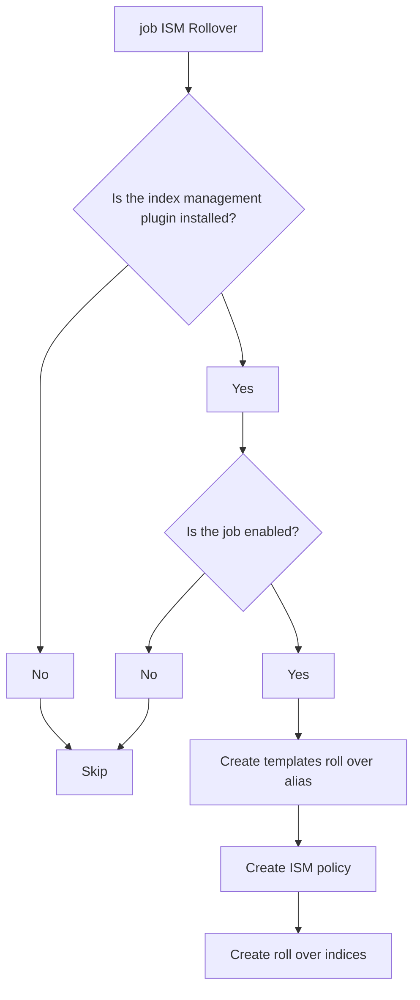
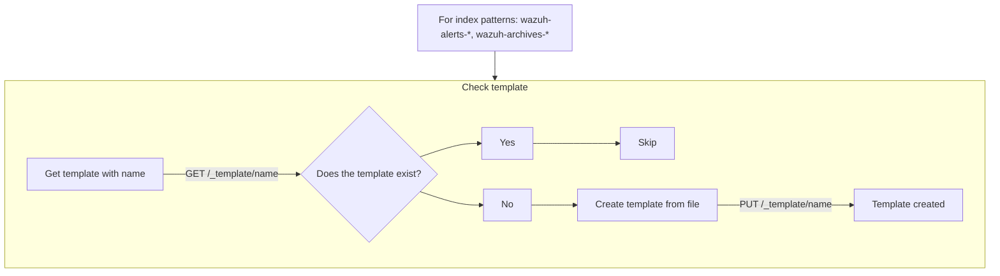
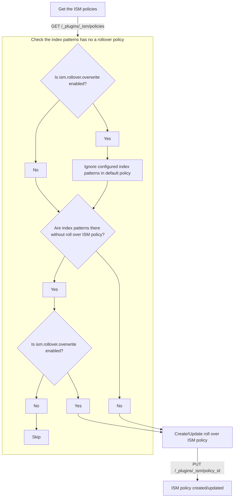
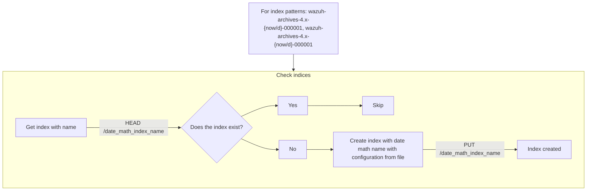

# Description

This task is run when the plugin starts on the server side.

The objetive is:

- create templates for `wazuh-alerts-*` and `wazuh-archives-*` with configuration related to the rollover alias.
- create a ISM policy with rollover action for the configured indices (related to alerts/archives).
- create the indices to roll over related to `<wazuh-archives-4.x-{now/d}-000001>` and `<wazuh-archives-4.x-{now/d}-000001>`.

# Job settings

This job is managed by the following settings:

| key                                   | allowed values             | default value                                                      | description                                                                                                                                     |
| ------------------------------------- | -------------------------- | ------------------------------------------------------------------ | ----------------------------------------------------------------------------------------------------------------------------------------------- |
| `ism.rollover.enabled`                | boolean ( `true`/`false` ) | `true`                                                             | Enable or disable the task to adding a roll over ISM policy, alias templates and create the rollover indices.                                   |
| `ism.rollover.index_patterns`         | string[]                   | `['wazuh-alerts-*','wazuh-archives-*''-wazuh-alerts-4.x-sample*']` | Index patterns to apply the roll over ISM policy.                                                                                               |
| `ism.rollover.min_doc_count`          | number                     | `200000000`                                                        | Define the minimum documents count required to roll over the index. This value is the results of docs_by_shard \* number_of_shards.             |
| `ism.rollover.min_index_age`          | string: number + unit time | `7d`                                                               | Define the minimum age required to roll over the index.                                                                                         |
| `ism.rollover.min_primary_shard_size` | number                     | `25`                                                               | Define the minimum storage size in (GiB) of a single primary shard required to roll over the index. Recommended size should be greater than 10. |
| `ism.rollover.overwrite`              | boolean (`true`/`false`)   | `false`                                                            | Overwrite the ${ISM_ROLLOVER_POLICY_NAME} ISM policy with the current configuration. This requires to restart ${PLUGIN_PLATFORM_NAME}.          |
| `ism.rollover.priority`               | number                     | `50`                                                               | Define the priority of the ISM policy template.                                                                                                 |

# Tasks

Flow:



The job is executed if the index management plugin is installed and the job is enabled through the `ism.rollover.enabled` setting. This condition is used to ensure the ISM plugins in Wazuh dashboard and Wazuh indexer are installed. This could mitigate some problems related to custom configuration of Wazuh dashboard if the plugin is not installed.

## Create the template with roll over alias

This task creates the templates with roll over alias for the index patterns:

- `wazuh-alerts-*`
- `wazuh-archives-*`

Flow:



## Create the roll over ISM policy

This task creates a roll over ISM policy with the following configuration:

- `ism.rollover.index_patterns`: Index patterns to apply the roll over ISM policy.
- `ism.rollover.min_index_age`: Define the minimum age required to roll over the index.
- `ism.rollover.min_doc_count`: Define the minimum documents count required to roll over the index. This value depends on number of shards and the documents by shards. The maximum documents by shard is 2^31.
  > This value is the result of:
  >
  > ```
  > min_doc_count = docs_by_shard * number_of_shards
  > ```
  >
  > :warning: The `docs_by_shard` is limited to 2^31.
- `ism.rollover.min_primary_shard_size`: Define the minimum storage size in (GiB) of a single primary shard required to roll over the index. Recommended size should be greater than 10.
- `ism.rollover.overwrite`: Overwrite the roll over default ISM policy with the current configuration. This requires to restart the platform.
- `ism.rollover.priority`: Define the priority of the ISM policy template.

Flow:



## Create the roll over indices

This task creates the roll over indices with the alias configuration from files for the index patterns:

Flow:



## Logging

The job logs information to the platform and plugin.

A service was created to wrap these logging systems and reduce the logic in the job.

These logs can be filtered by `ism-rollover`.
