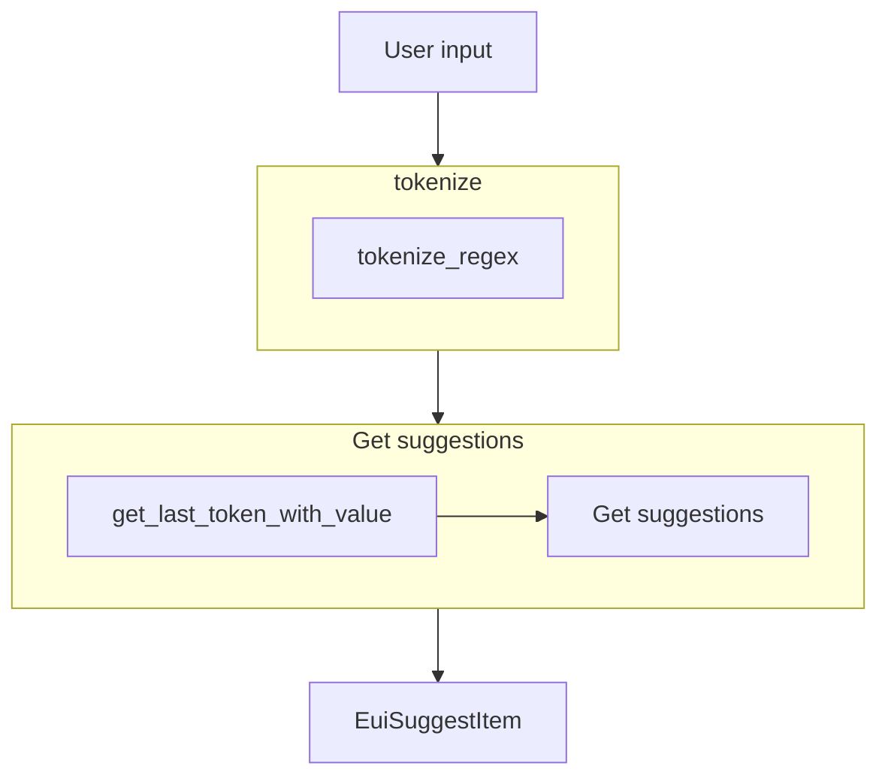

# Query Language - AQL

AQL (API Query Language) is a query language based in the `q` query parameters of the Wazuh API
endpoints.

Documentation: https://wazuh.com/<major_version>.<minor_version>/user-manual/api/queries.html

The implementation is adapted to work with the search bar component defined 
`public/components/search-bar/index.tsx`.

## Features
- Suggestions for `fields` (configurable), `operators` and `values` (configurable)
- Support implicit query

## Options

- `implicitQuery`: add an implicit query that is added to the user input. This can't be changed by
the user. If this is defined, will be displayed as a prepend of the search bar.

```ts
// language options
implicitQuery: 'id!=000;' // ID is not 000 and <user input>
```

- `suggestions`: define the suggestion handlers. This is required.

  - `field`: method that returns the suggestions for the fields
  
  ```ts
  // language options
  field(currentValue) {
    return [
      { label: 'configSum', description: 'Config sum' },
      { label: 'dateAdd', description: 'Date add' },
      { label: 'id', description: 'ID' },
      { label: 'ip', description: 'IP address' },
      { label: 'group', description: 'Group' },
      { label: 'group_config_status', description: 'Synced configuration status' },
      { label: 'lastKeepAline', description: 'Date add' },
      { label: 'manager', description: 'Manager' },
      { label: 'mergedSum', description: 'Merged sum' },
      { label: 'name', description: 'Agent name' },
      { label: 'node_name', description: 'Node name' },
      { label: 'os.platform', description: 'Operating system platform' },
      { label: 'status', description: 'Status' },
      { label: 'version', description: 'Version' },
    ]
    .map(field => ({ type: 'field', ...field }));
  }
  ```

  - `value`: method that returns the suggestion for the values
  ```ts
  // language options
  value: async (currentValue, { previousField }) => {
    switch (previousField) {
      case 'configSum':
        return await getAgentFilterValuesMapToSearchBarSuggestion(
          previousField,
          currentValue,
          {q: 'id!=000'}
        );
        break;
      case 'dateAdd':
        return await getAgentFilterValuesMapToSearchBarSuggestion(
          previousField,
          currentValue,
          {q: 'id!=000'}
        );
        break;
      case 'id':
        return await getAgentFilterValuesMapToSearchBarSuggestion(
          previousField,
          currentValue,
          {q: 'id!=000'}
        );
        break;
      case 'ip':
        return await getAgentFilterValuesMapToSearchBarSuggestion(
          previousField,
          currentValue,
          {q: 'id!=000'}
        );
        break;
      case 'group':
        return await getAgentFilterValuesMapToSearchBarSuggestion(
          previousField,
          currentValue,
          {q: 'id!=000'}
        );
        break;
      case 'group_config_status':
        return [AGENT_SYNCED_STATUS.SYNCED, AGENT_SYNCED_STATUS.NOT_SYNCED].map(
          (status) => ({
            type: 'value',
            label: status,
          }),
        );
        break;
      case 'lastKeepAline':
        return await getAgentFilterValuesMapToSearchBarSuggestion(
          previousField,
          currentValue,
          {q: 'id!=000'}
        );
        break;
      case 'manager':
        return await getAgentFilterValuesMapToSearchBarSuggestion(
          previousField,
          currentValue,
          {q: 'id!=000'}
        );
        break;
      case 'mergedSum':
        return await getAgentFilterValuesMapToSearchBarSuggestion(
          previousField,
          currentValue,
          {q: 'id!=000'}
        );
        break;
      case 'name':
        return await getAgentFilterValuesMapToSearchBarSuggestion(
          previousField,
          currentValue,
          {q: 'id!=000'}
        );
        break;
      case 'node_name':
        return await getAgentFilterValuesMapToSearchBarSuggestion(
          previousField,
          currentValue,
          {q: 'id!=000'}
        );
        break;
      case 'os.platform':
        return await getAgentFilterValuesMapToSearchBarSuggestion(
          previousField,
          currentValue,
          {q: 'id!=000'}
        );
        break;
      case 'status':
        return UI_ORDER_AGENT_STATUS.map(
          (status) => ({
            type: 'value',
            label: status,
          }),
        );
        break;
      case 'version':
        return await getAgentFilterValuesMapToSearchBarSuggestion(
          previousField,
          currentValue,
          {q: 'id!=000'}
        );
        break;
      default:
        return [];
        break;
    }
  }
  ```

## How to get the suggestions

