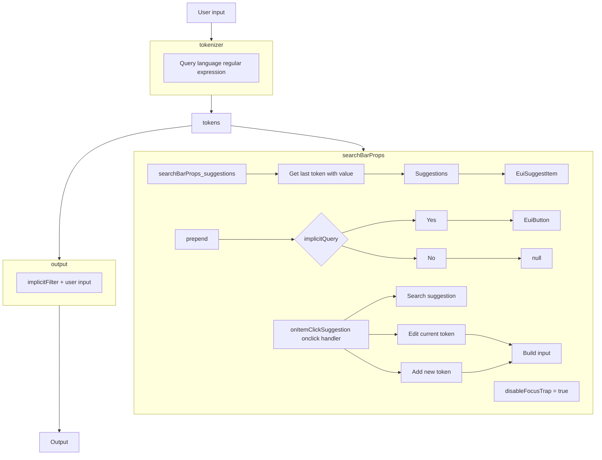

# Query Language - WQL

WQL (Wazuh Query Language) is a query language based in the `q` query parameters of the Wazuh API
endpoints.

Documentation: https://wazuh.com/<major_version>.<minor_version>/user-manual/api/queries.html

The implementation is adapted to work with the search bar component defined 
`public/components/search-bar/index.tsx`.

## Features
- Suggestions for `fields` (configurable), `operators` and `values` (configurable)
- Support implicit query

# Language syntax

## Schema

```
<operator_group>?<whitespace>?<field>?<whitespace>?<operator_compare>?<whitespace>?<value>?<whitespace>?<operator_conjunction>?<whitespace>?<operator_group>?<whitespace>?
```

## Fields

Regular expression: /[\\w.]+/

Examples:

```
field
field.custom
```

## Operators

### Compare

- `=` equal to
- `!=` not equal to
- `>` bigger
- `<` smaller
- `~` like

### Group

- `(` open
- `)` close

### Conjunction (logical)

- `and` intersection
- `or` union

### Values

- Value without spaces can be literal
- Value with spaces should be wrapped by `"`. The `"` can be escaped using `\"`.

Examples:
```
value
"custom value"
"custom \" value"
```

### Notes

- The entities can be separated by whitespaces.

### Examples

- Simple query

```
id=001
id = 001
```

- Complex query
```
status=active and os.platform~linux
status = active and os.platform ~ linux
```

```
status!=never_connected and ip~240 or os.platform~linux
status != never_connected and ip ~ 240 or os.platform ~ linux
```

- Complex query with group operator
```
(status!=never_connected and ip~240) or id=001
( status != never_connected and ip ~ 240 ) or id = 001
```

## Developer notes

## Options

- `implicitQuery`: add an implicit query that is added to the user input. Optional.
Use UQL (Unified Query Language).
This can't be changed by the user. If this is defined, will be displayed as a prepend of the search bar. 

```ts
// language options
// ID is not equal to 000 and <user input>. This is defined in UQL that is transformed internally to
// the specific query language.
implicitQuery: 'id!=000;'
```

- `suggestions`: define the suggestion handlers. This is required.

  - `field`: method that returns the suggestions for the fields
  
  ```ts
  // language options
  field(currentValue) {
    return [
      { label: 'configSum', description: 'Config sum' },
      { label: 'dateAdd', description: 'Date add' },
      { label: 'id', description: 'ID' },
      { label: 'ip', description: 'IP address' },
      { label: 'group', description: 'Group' },
      { label: 'group_config_status', description: 'Synced configuration status' },
      { label: 'lastKeepAline', description: 'Date add' },
      { label: 'manager', description: 'Manager' },
      { label: 'mergedSum', description: 'Merged sum' },
      { label: 'name', description: 'Agent name' },
      { label: 'node_name', description: 'Node name' },
      { label: 'os.platform', description: 'Operating system platform' },
      { label: 'status', description: 'Status' },
      { label: 'version', description: 'Version' },
    ];
  }
  ```

  - `value`: method that returns the suggestion for the values
  ```ts
  // language options
  value: async (currentValue, { previousField }) => {
    switch (previousField) {
      case 'configSum':
        return await getAgentFilterValuesMapToSearchBarSuggestion(
          previousField,
          currentValue,
          {q: 'id!=000'}
        );
        break;
      case 'dateAdd':
        return await getAgentFilterValuesMapToSearchBarSuggestion(
          previousField,
          currentValue,
          {q: 'id!=000'}
        );
        break;
      case 'id':
        return await getAgentFilterValuesMapToSearchBarSuggestion(
          previousField,
          currentValue,
          {q: 'id!=000'}
        );
        break;
      case 'ip':
        return await getAgentFilterValuesMapToSearchBarSuggestion(
          previousField,
          currentValue,
          {q: 'id!=000'}
        );
        break;
      case 'group':
        return await getAgentFilterValuesMapToSearchBarSuggestion(
          previousField,
          currentValue,
          {q: 'id!=000'}
        );
        break;
      case 'group_config_status':
        return [AGENT_SYNCED_STATUS.SYNCED, AGENT_SYNCED_STATUS.NOT_SYNCED].map(
          (status) => ({
            type: 'value',
            label: status,
          }),
        );
        break;
      case 'lastKeepAline':
        return await getAgentFilterValuesMapToSearchBarSuggestion(
          previousField,
          currentValue,
          {q: 'id!=000'}
        );
        break;
      case 'manager':
        return await getAgentFilterValuesMapToSearchBarSuggestion(
          previousField,
          currentValue,
          {q: 'id!=000'}
        );
        break;
      case 'mergedSum':
        return await getAgentFilterValuesMapToSearchBarSuggestion(
          previousField,
          currentValue,
          {q: 'id!=000'}
        );
        break;
      case 'name':
        return await getAgentFilterValuesMapToSearchBarSuggestion(
          previousField,
          currentValue,
          {q: 'id!=000'}
        );
        break;
      case 'node_name':
        return await getAgentFilterValuesMapToSearchBarSuggestion(
          previousField,
          currentValue,
          {q: 'id!=000'}
        );
        break;
      case 'os.platform':
        return await getAgentFilterValuesMapToSearchBarSuggestion(
          previousField,
          currentValue,
          {q: 'id!=000'}
        );
        break;
      case 'status':
        return UI_ORDER_AGENT_STATUS.map(
          (status) => ({
            type: 'value',
            label: status,
          }),
        );
        break;
      case 'version':
        return await getAgentFilterValuesMapToSearchBarSuggestion(
          previousField,
          currentValue,
          {q: 'id!=000'}
        );
        break;
      default:
        return [];
        break;
    }
  }
  ```

## Language workflow



## Notes

- The value that contains the following characters: `!`, `~` are not supported by the AQL and this
could cause problems when do the request to the API.
- The value with spaces are wrapped with `"`. If the value contains the `\"` sequence this is
replaced by `"`. This could cause a problem with values that are intended to have the mentioned
sequence.