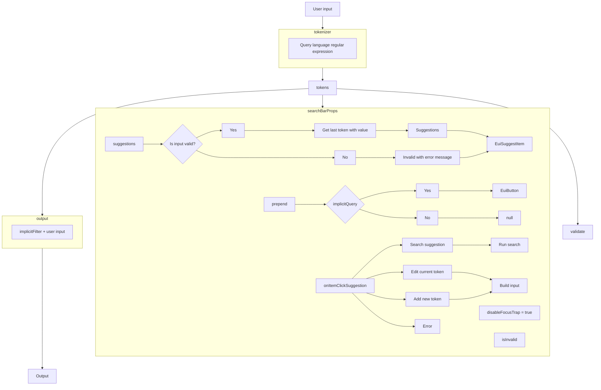

# Query Language - WQL

WQL (Wazuh Query Language) is a query language based in the `q` query parameter of the Wazuh API
endpoints.

Documentation: https://wazuh.com/<major_version>.<minor_version>/user-manual/api/queries.html

The implementation is adapted to work with the search bar component defined 
`public/components/search-bar/index.tsx`.

# Language syntax

It supports 2 modes:

- `explicit`: define the field, operator and value
- `search term`: use a term to search in the available fields

Theses modes can not be combined.

`explicit` mode is enabled when it finds a field and operator tokens.

## Mode: explicit

### Schema

```
<operator_group>?<whitespace>?<field>?<whitespace>?<operator_compare>?<whitespace>?<value>?<whitespace>?<operator_conjunction>?<whitespace>?<operator_group>?<whitespace>?
```

### Fields

Regular expression: /[\\w.]+/

Examples:

```
field
field.custom
```

### Operators

#### Compare

- `=` equal to
- `!=` not equal to
- `>` bigger
- `<` smaller
- `~` like

#### Group

- `(` open
- `)` close

#### Conjunction (logical)

- `and` intersection
- `or` union

#### Values

- Value without spaces can be literal
- Value with spaces should be wrapped by `"`. The `"` can be escaped using `\"`.

Examples:
```
value_without_whitespace
"value with whitespaces"
"value with whitespaces and escaped \"quotes\""
```

### Notes

- The tokens can be separated by whitespaces.

### Examples

- Simple query

```
id=001
id = 001
```

- Complex query (logical operator)
```
status=active and os.platform~linux
status = active and os.platform ~ linux
```

```
status!=never_connected and ip~240 or os.platform~linux
status != never_connected and ip ~ 240 or os.platform ~ linux
```

- Complex query (logical operators and group operator)
```
(status!=never_connected and ip~240) or id=001
( status != never_connected and ip ~ 240 ) or id = 001
```

## Mode: search term

Search the term in the available fields.

This mode is used when there is no a `field` and `operator` according to the regular expression
of the **explicit** mode.

### Examples:

```
linux
```

If the available fields are `id` and `ip`, then the input will be translated under the hood to the
following UQL syntax:

```
id~linux,ip~linux
```

## Developer notes

## Features
- Support suggestions for each token entity. `fields` and `values` are customizable.
- Support implicit query.
- Support for search term mode. It enables to search a term in multiple fields.
  The query is built under the hoods. This mode requires there are `field` and `operator_compare`.

### Implicit query

This a query that can't be added, edited or removed by the user. It is added to the user input.

### Search term mode

This mode enables to search in multiple fields using a search term. The fields to use must be defined.

Use an union expression of each field with the like as operation `~`.

The user input is transformed to something as:
```
field1~user_input,field2~user_input,field3~user_input
```

## Options

- `implicitQuery`: add an implicit query that is added to the user input. Optional.
  This can't be changed by the user. If this is defined, will be displayed as a prepend of the search bar.
  - `query`: query string in UQL (Unified Query Language)
Use UQL (Unified Query Language).
  - `conjunction`: query string of the conjunction in UQL (Unified Query Language)
 

```ts
// language options
// ID is not equal to 000 and <user input>. This is defined in UQL that is transformed internally to
// the specific query language.
implicitQuery: {
  query: 'id!=000',
  conjunction: ';'
}
```

- `searchTermFields`: define the fields used to build the query for the search term mode

```ts
// language options
searchTermFields: ['id', 'ip']
```

- `suggestions`: define the suggestion handlers. This is required.

  - `field`: method that returns the suggestions for the fields
  
  ```ts
  // language options
  field(currentValue) {
    // static or async fetching is allowed
    return [
      { label: 'field1', description: 'Description' },
      { label: 'field2', description: 'Description' }
    ];
  }
  ```

  - `value`: method that returns the suggestion for the values
  ```ts
  // language options
  value: async (currentValue, { previousField }) => {
    // static or async fetching is allowed
    // async fetching data
    // const response = await fetchData();
    return [
      { label: 'value1' },
      { label: 'value2' }
    ]
  }
  ```

## Language workflow



## Notes

- The value that contains the following characters: `!`, `~` are not supported by the AQL and this
could cause problems when do the request to the API.
- The value with spaces are wrapped with `"`. If the value contains the `\"` sequence this is
replaced by `"`. This could cause a problem with values that are intended to have the mentioned
sequence.