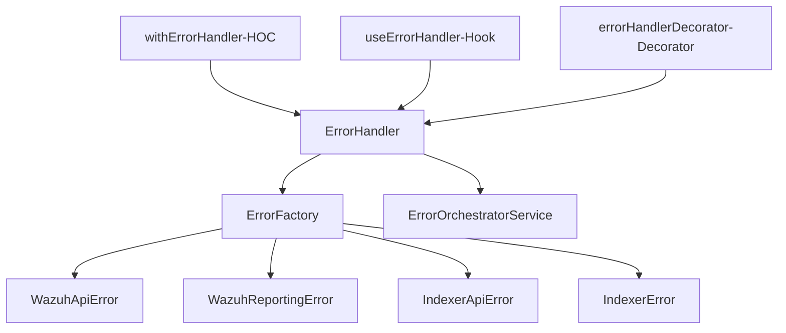
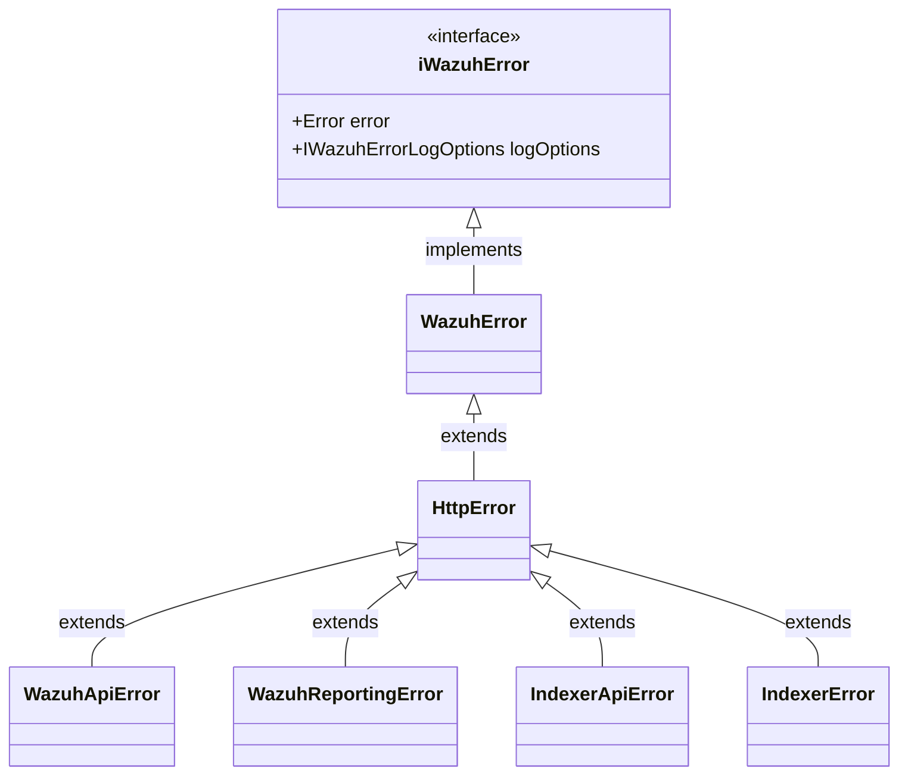

# Content

- [Scope](#scope)
- [Error sources](#error-sources)
- [Architecture](#architecture)
- [Components](#components)
  - [Error handler](#error-handler)
  - [Error orchestrator](#error-orchestrator)
  - [React patterns](#react-patterns)
  - [Error factory](#error-factory)
  - [Error classes](#error-classes)
  - [Error types treatment](#error-types-treatment)
- [How to use the Error Management](#how-to-use-the-error-management)
  - [How to use Class](#how-to-use-class)
  - [How to use Hook](#how-to-use-hook)
  - [How to use HOC](#how-to-use-hoc)
  - [How to use Decorator](#how-to-use-decorator)
- [React patterns artefact use cases](#react-patterns-artefact-use-cases)

# Scope

This solution try to simplify the error management in the wazuh-kibana-app plugin.
The main goal is to create a standard way to manage the errors in the plugin.
By this way, the developer must be abstracted to the error management.

The error handler must receive and treat differents types of errors.
Exists the following error sources:
# Error sources

- Operational errors (development) - Native javascript errors
- Wazuh API errors
- Indexer Error
- Http errors
- Etc


Our frontend server-side have a intermedial layer between the frontend and the backend APIs like Indexer and wazuh.
This layer catch the error and categorize them by type and add a custom error code.

 ### Error codes: code
 * wazuh-api-Indexer 20XX
 * wazuh-api         30XX
 * wazuh-Indexer     40XX
 * wazuh-reporting   50XX
 * unknown           1000
 

Also, exists the native https response status codes.
### HTTP status code
- 200 = OK
- 201 = Created
- 202 = Accepted
- 204 = No Content
- 400 = Bad Request
- 401 = unauthorized
- 403 = forbidden
- 404 = not found
- 405 = method not allowed
- 500 = internal server error
- 501 = not implemented

# Architecture

The actual Error Management solution have the next architecture:



# Components

The error management solution is composed by some components, these components are:

## Error handler

The `error handler` is responsible to receive the errors (or strings) and define what type of error will be returned.
After identifying and classifying the parameters received the error factory returns a new error instance.
Always will return an error instance.

## Error orchestrator

The error orchestrator have the responsability to receive and error and showing it by the following ways:

- Showing the error in a toast message `(Bussiness)`
- Showing the error in browser console.log `(UI)`
- Showing the error and render critical error page in the UI `(Blank-screen)`

The current error handler tells the error orchestrator how the error will be shown to the user/developer. It sends the error and the showing options to the error orchestrator.

For more details about the error orchestrator see the [Error Orchestrator documentation](https://github.com/wazuh/wazuh-kibana-app/blob/ef071e55fd310bdb4cecb7d490ea83372bb07b01/public/react-services/error-orchestrator/README.md)

## React patterns

The error handler can be implemented using react patterns:

- ### HOC (Higher order component)
- ### Hook
- ### Decorator

## Error factory

The `error factory` is responsible to create different instances of error depending on the parameters received.

**The error factory can receive:**
- A `string`
- An `error instance`
- An `error type`: this param defines the error type returned

The errors returned are defined as the `error type` received.

- WazuhApiError
- WazuhReportingError
- IndexerApiError
- HttpError

## Error Classes

The differents error classes make easier the error categorization and management. Every error class has a specific error treatment defined inside the class.
Via Poliformism and Interface contract the error handler and the error factory can handle all the error types defined.


The next diagram shows how is the relationship between the different types of errors created.



By this way, the current solution allows to create new error types and add new error treatment without modify the error handler or the error factory. Each error type can have its own error treatment. This is a good practice and allow the scalability of the error management solution.

# Error types treatment

For every error type handled we have defined how the error will be showed or not to the user/developer.
In the next table we have defined how the will be treated.

| Error type          | show                                          | store | display |
|---------------------|-----------------------------------------------|-------|---------|
| WazuhApiError       | [toast\|blank-screen\|log(info\|warn\|error)] |       |         |
| WazuhReportingError | [toast\|blank-screen\|log(info\|warn\|error)] |       |         |
| IndexerApiError     | [toast\|blank-screen\|log(info\|warn\|error)] |       |         |
| HttpError           | [toast\|blank-screen\|log(info\|warn\|error)] |       |         |
| Error               | [toast\|blank-screen\|log(info\|warn\|error)] |       |         |
| TypeError           | [toast\|blank-screen\|log(info\|warn\|error)] |       |         |
| EvalError           | [toast\|blank-screen\|log(info\|warn\|error)] |       |         |
| ReferenceError      | [toast\|blank-screen\|log(info\|warn\|error)] |       |         |
| SyntaxError         | [toast\|blank-screen\|log(info\|warn\|error)] |       |         |
| URIError            | [toast\|blank-screen\|log(info\|warn\|error)] |       |         |


# How to use the Error Management

Exists 4 artefacts implemented to use the error handler.

- using javascript class `errorHandler`
- use a react hook called `useErrorHanlder`
- use a react HOC called `withErrorHandler`
- use a react decorator called `errorHandlerDecorator`

These types of error handlers were created to give flexibility to the error management implementation.
All these implementations encapsulate the error handler class.

## How to use Class

The recommended use of the Error Handler is in `javascript methods (not react component)`.
This handler will receive an Error instance or error message and it will classify and categorize the error by its structure and create and return the corresponding Error instance.

### Example

```javascript
import ErrorHandler from 'error-handler';

// the handlerError is a static method
const newErrorCreated = ErrorHandler.handleError(errorResponse);
// the newErrorCreated var could be anyone error type defined in the graph above
```

## How to use Hook

The recommended use of the Error handler hook is when we have any method inside a component that `makes an API call` that can fail. In this case, will pass the async method like a javascript callback.

### Example

```tsx

import { useErrorHandler } from 'useErrorHandler'

const anyAsyncFunction = async () => {
      // this method could return an error or not
};

const [res, error] = useErrorHandler(anyAsyncFunction);

if(error){
   // treat the error
}
  
// the res var store the method response (API response)
```

**Important**
In this way, using the useErrorHandler hook we can omit the use of try-catch and do the code clear.

## How to use HOC

The recommended use of the Error Handler HOC is to catch all the errors produced in the `component lifecycle`.
This HOC will wrap the react component and will catch all the errors and treat them by the error handler class

The HOC will recognize the errors in the following lyficlycle methods:

- `ComponentDidMount`
- `ComponentDidUpdate`

The HOC will not catch the errors in the render method.

### Example
```tsx

import { withErrorHandler } from 'withErrorHandler'

const Component = (props) => {
      useEffect(() => {
        // Component did mount
        functionWithError();
      }, []);
      return <div>Example Component</div>;
};

const ComponentWrapped = withErrorHandler(Component);
```

In this way, using the errorHandler HOC we can catch all the errors by the error handler class

## How to use Decorator

The recommended use of the Error Handler Decorator is to catch all the errors produced in the `component user events methods`.
This Decorator will wrap the react component and will catch all the errors after the method is called.


```tsx

import { errorHandlerDecorator } from 'error-handler-decorator'

const Component = (props) => {
    
    // the method will be wrapped by the decorator
    const onClickEvent = errorHandlerComponent(() => {
      // this method could return an error or not
      throw new Error('Error on click event');
    })
    
    return <button onClick={() => onClickEvent()}>Button</button>;
};

const ComponentWrapped = withErrorHandler(Component);
```
# React patterns artefact use cases


| Artefact  | When to use                              |
|-----------|------------------------------------------|
| HOC       | On react lyfecicles methods              |
| Hook      | On functional component methods called after render (like react custom hook) |
| Decorator | On component user event methods          |


For more details about the usage you can check the `unit tests` files for every artefact implemented in the error management solution.