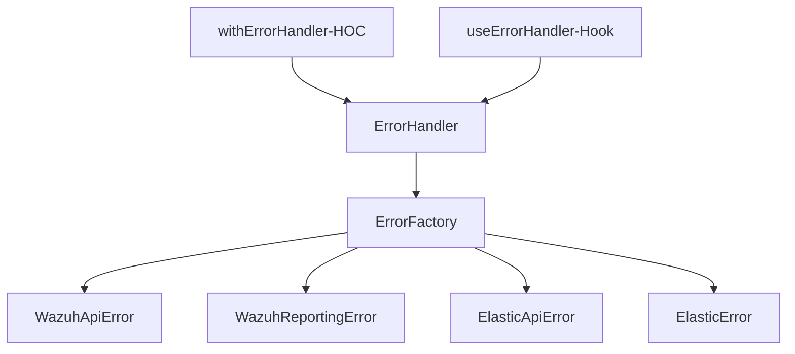

## How to use Error handler

Exists 3 ways to implement the error handler

- using javascript class `errorHandler`
- use a react hook called `useErrorHanlder`
- use a react HOC called `withErrorHandler`

These types of error handlers were created to give flexibility to the error management implementation.
All these implementations encapsulate the error handler class.

## Error management architecture



## How to use `Error Handler (class)`

The recommended use of the Error Handler is in `javascript methods (not react component)`.
This handler will receive an Error instance or error message and it will classify and categorize the error by its structure and create and return the corresponding Error instance.

### Example

```javascript
import ErrorHandler from 'error-handler';

// the handlerError is a static method
const newErrorCreated = ErrorHandler.handleError(errorResponse);
// the newErrorCreated var could be anyone error type defined in the graph above
```

## How to use `Error Handler (Hook)`

The recommended use of the Error handler hook is when we have any method inside a component that `makes an API call` that can fail. In this case, will pass the async method like a javascript callback.

### Example

```javascript

import { useErrorHandler } from 'useErrorHandler'

const anyAsyncFunction = async () => {
      // this method could return an error or not
};

const [res, error] = useErrorHandler(anyAsyncFunction);

if(error){
   // treat the error
}
  
// the res var store the method response (API response)
```

**Important**
In this way, using the useErrorHandler hook we can omit the use of try-catch and do the code clear.


## How to use `Error Handler (HOC)`

The recommended use of the Error Handler HOC is to catch all the errors produced in the `component lifecycle`.
This HOC will wrap the react component and will catch all the errors and treat them by the error handler class

The HOC will recognize the errors in the following lyficlycle methods:

- `ComponentDidMount`
- `ComponentDidUpdate`

The HOC will not catch the errors in the render method.

### Example
```javascript

import { withErrorHandler } from 'withErrorHandler'

const Component = (props) => {
      useEffect(() => {
        // Component did mount
        functionWithError();
      }, []);
      return <div>Example Component</div>;
};

const ComponentWrapped = withErrorHandler(Component);
```

In this way, using the errorHandler HOC we can catch all the errors by the error handler class


## How to use `Error Handler (Decorator)`


## Error sources

- Wazuh API errors
- Elasticsearch Error
- Operational errors (development)
- Axios errors


 ### Error codes: code
 * wazuh-api-elastic 20XX
 * wazuh-api         30XX
 * wazuh-elastic     40XX
 * wazuh-reporting   50XX
 * unknown           1000
 
### HTTP status code
- 200 = OK
- 201 = Created
- 202 = Accepted
- 204 = No Content
- 400 = Bad Request
- 401 = unauthorized
- 403 = forbidden
- 404 = not found
- 405 = method not allowed
- 500 = internal server error
- 501 = not implemented

# Error management components

## Error factory

The `error factory` is responsible to create different instances of error depending on the parameters received.

**The error factory can receive:**
- A `string`
- An `error instance`
- An `error type`: this param defines the error type returned

 The errors returned are defined as the `error type` received.

- ElasticError
- WazuhApiError
- UIError

## Error handler

The `error handler` is responsible to receive the errors (or strings) and define what type of error will be returned.
After identifying and classifying the parameters received the error factory returns a new error instance.
Always will return an error instance.

# React patterns

The error handler can be implemented using react patterns:

- ### HOC (Higher order component)
- ### Hook
- ### Decorator


# Errors Classes

The next diagram shows how is the relationship between the different types of errors created.

